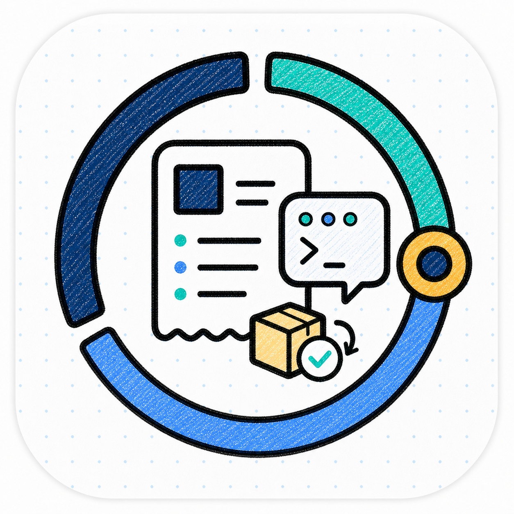

<p align="center">
  
</p>

<p align="center">
  <a href="./README.md"><strong>English</strong></a> | <a href="./README.zh-CN.md">中文</a>
</p>

<h1 align="center">One Person Lab App</h1>

<p align="center"><strong>A local-first AI workbench for complex knowledge work</strong></p>
<p align="center">Start research, grants, presentations, books, and general tasks from the desktop or browser; track progress, resume long-running work, and inspect deliverables.</p>

<!--
Owner: `one-person-lab-app`
Purpose: `public_app_entry`
State: `active_public_entry`
Machine boundary: Human-readable product overview. Machine truth lives in `contracts/`, source, release artifacts, updater metadata, validation outputs, and OPL Framework/domain projections consumed by the App.
-->

<p align="center">
  
</p>

## Why It Exists

AI is already strong at answering questions and generating content. The harder part begins when the work becomes a paper, a grant proposal, a presentation package, or a long-running project. Users need to know:

- Where do I start, and what should happen next?
- How far did the previous task get?
- Which files were produced, and what still needs review?
- Is the background work still running, and where did it stop if it failed?
- Can research, grant, presentation, and book-writing agents live behind one clear entry point?

**One Person Lab App is that entry point.** It packages One Person Lab, professional agents, and companion tools into a desktop app for complex knowledge work.

It does not reduce research, grants, presentations, and books to a row of buttons. It brings start, resume, progress, files, and blockers into one product experience. Users do not need to know which professional agent is working behind the scenes; they need to see where the task stands, what was produced, what is missing, and how to continue.

OPL App is not limited to a single local Mac. Its released product is Desktop,
with Standard and Full payload densities. macOS and Linux Desktop can run on a
headless host and expose the same built-in WebUI in a browser. Docker WebUI is a
separate container product line, not a Desktop follower or another App Release.
Exact public and installed availability still comes only from release readback.
The first-party successor target is one DSH-derived WebUI and shared Node host core:
Electron is the thin macOS/Windows/Linux desktop carrier, while standalone
headless WebUI and Docker use HTTP/SSE without Electron. This is a target topology,
not a claim that those successor carriers have been adopted or released.
Hosted OPL Workspace is a conditional X0-03 route
that appears only after account, storage, isolation, backend, and owner policy
are available; it is not a current ordinary product promise.

## Core Highlights

**One entry point for professional AI work**<br/>
Enter general work, medical research, grant writing, presentation preparation, and book writing from the desktop app instead of jumping across commands, repositories, and tools.

**Desktop and browser share one workbench**<br/>
Use the same OPL task, artifact, progress, and receipt language in a Desktop
window or through the WebUI packaged in macOS/Linux Desktop. Docker WebUI is a
separately versioned container product line for server and isolated deployment.
A hosted Workspace may reuse this surface only after its X0 owner/backend gates
are met.

**Visible progress for long tasks**<br/>
The app shows task progress, files, runtime status, and recoverable work context. When you come back, you can see what happened, what was produced, and whether anything needs human attention.

**First install feels like a product**<br/>
New macOS users can start with the complete first-install package, open the App first, and let background maintenance prepare the framework, professional agents, skills, and tool payloads.

**Professional agents with clear roles**<br/>
Research Foundry, Grant Foundry, Presentation Foundry, and Book Foundry focus on different deliverables. Users get one interface while each agent keeps its own professional boundary.

**Professional AI keeps professional room**<br/>
The App makes entries, progress, files, and delivery usable. Medical research, grant writing, visual-delivery, and book-writing judgment remain with the corresponding professional agents. When work enters a professional stage, users can watch AI read material, compare options, accept review, keep revising, and produce the next deliverable version.

**Built for daily use and long-running work**<br/>
The app is not just for one chat. It supports work that needs multiple rounds, background maintenance, recovery after failure, remote access, and continuing delivery.

## Design Rationale

Read the [OPL App whitepaper (HTML)](https://gaofeng21cn.github.io/one-person-lab-app/latest/whitepapers/opl-app-whitepaper.html) or [PDF edition](https://gaofeng21cn.github.io/one-person-lab-app/latest/whitepapers/opl-app-whitepaper.pdf) to understand why the App starts from the user's purpose, keeps results traceable, and reveals internal diagnostics only when they help a decision.

## Download And Install

The maintained distribution and installation matrix is in the
[OPL App distribution and install SSOT](docs/delivery/distribution-and-install-ssot.md).
The user-first source guide is
[One Person Lab installation](docs/delivery/install/README.md): choose a Desktop
platform, the built-in macOS/Linux browser mode, or the independent Docker
WebUI route. Standard and Full are Desktop payload densities; Full is currently
available only for macOS arm64. Headless installs Framework Base only and is not
an App product. The short list below contains only current ordinary-user paths;
historical, transitional, and planned paths are not presented as supported.

### Homebrew

For macOS arm64 users who already use Homebrew, this is the shortest terminal
path:

```bash
brew install --cask gaofeng21cn/one-person-lab/one-person-lab
open -a "One Person Lab"
```

Update with the standard Homebrew flow:

```bash
brew update
brew upgrade --cask one-person-lab
```

Homebrew is an App cask distribution path. After installation, open
`One Person Lab.app`; first launch uses the shared App setup flow, then the App
continues any required maintenance in the background. If the App reports that
setup or repair is needed, follow the in-app prompt. Terminal diagnostics remain
available when needed:

```bash
opl system initialize --json
```

Homebrew itself also runs on Linux. The `opl` Formula is a Base/CLI carrier and
the Cask is a Desktop carrier. Docker WebUI remains an independently versioned
GHCR product line and does not derive authority from Desktop Stable.

Full is an optional post-Standard module. Standard is published and becomes
Latest first; a successful Full operation later adds only the Full DMG and
`opl-release-manifest.json` to that same Standard Release and tag. It creates no
parallel Full Release or tag and cannot change Standard assets, the release
body, updater metadata, or Latest. The Full Homebrew follower consumes only that
same-tag, digest-bound result. Nightly means an Automated Preview, not a third
quality level or a payload density. The current scheduled Nightly publication
uses Standard density and does not move the updater Latest pointer by default.
A separate, protected single-use pointer operation may temporarily select an exact
published Preview without promoting its quality; the next qualified Stable
reclaims Latest by default. Nightly publication and its digest-bound Homebrew
follower automation are implemented, but the first public publication and
follower readbacks are still required before the channel can be called
production-verified.

### Verified Install Paths

The current Latest Release provides one public installer entry for macOS and
Linux. Download the installer and component manifest through the stable Latest
URLs, verify the installer digest, then run it. The installer resolves Latest to
one exact Release before downloading or changing an App target:

```bash
BASE="https://github.com/gaofeng21cn/one-person-lab-app/releases/latest/download"
curl -fLO "${BASE}/opl-install.sh"
curl -fLO "${BASE}/opl-app-component-manifest.json"
EXPECTED="$(jq -r '.artifacts[] | select(.name == "opl-install.sh") | .digest | sub("^sha256:"; "")' opl-app-component-manifest.json)"
if command -v shasum >/dev/null 2>&1; then
  ACTUAL="$(shasum -a 256 opl-install.sh | awk '{print $1}')"
else
  ACTUAL="$(sha256sum opl-install.sh | awk '{print $1}')"
fi
test "$ACTUAL" = "$EXPECTED"
chmod 0755 opl-install.sh
./opl-install.sh
```

Use `--desktop` to install the App. The current macOS Stable installer exposes
`--standard`/`--full`; Linux installs the same-tag Desktop package and can serve
its built-in WebUI on a headless host. `--headless` installs Framework Base only.

Homebrew users can install the current Standard App through the digest-bound
cask:

```bash
brew install --cask gaofeng21cn/one-person-lab/one-person-lab
```

Without Homebrew, download the DMG from the Latest GitHub Release linked below.
Do not pipe a mutable branch copy of `install.sh` directly into a shell. The
Release-hosted `opl-install.sh` is the only public installer and verifies the
resolved Release, component manifest, and DMG before any App target mutation:

```bash
curl -fLO https://github.com/gaofeng21cn/one-person-lab-app/releases/latest/download/opl-install.sh
chmod 0755 opl-install.sh
./opl-install.sh --stable-macos-install --standard --yes
```

The repository script remains available as `./install.sh` for developers
working from a reviewed source checkout.

### Direct Download

You can also download the current desktop package from the App repository releases:

[Download One Person Lab App](https://github.com/gaofeng21cn/one-person-lab-app/releases/latest)

For a first-time macOS arm64 install without Homebrew, choose
`One-Person-Lab-Full-<version>-mac-arm64.dmg` when it is present on the same
Standard Release page. Its later availability does not change which Standard
release is Latest.

The next Stable Standard uses an owner-controlled GitHub repository setting
window: repository release immutability is disabled before that Release is
created, then restored immediately after Standard publication and Latest
readback. Restoring the setting protects future releases; it does not
retroactively lock this Standard. Its trust boundary is exact asset
name/size/digest CAS plus the unified `opl-release-attestation.json`. Existing
immutable r5 releases are historical evidence and are not migrated or unsealed.

The supported App product is Desktop Standard/Full. DMG, Homebrew and platform
packages are Desktop carriers; Docker WebUI is independently released through
GHCR. The matrix does not assert that an exact platform asset is public or
installed; check the selected Release manifest, digest, qualification, and
installation readback. For a screenshot-based first-run walkthrough, start
from the [macOS App install user guide](https://gaofeng21cn.github.io/one-person-lab-app/latest/macos-app-install/macos-app-install.html).
The same guide is also available as generated latest
[PDF](https://gaofeng21cn.github.io/one-person-lab-app/latest/macos-app-install/macos-app-install-slides.pdf) and
[PPTX](https://gaofeng21cn.github.io/one-person-lab-app/latest/macos-app-install/macos-app-install-slides.pptx), plus a
[detailed PDF](https://gaofeng21cn.github.io/one-person-lab-app/latest/macos-app-install/macos-app-install-detailed-guide.pdf).

The App binary is updated by its installation carrier, such as the in-app
updater or Homebrew. After every supported carrier's first launch or version
change, the running App requests the same Framework-owned OPL Base and OPL
Packages reconciliation. Clean OPL-managed targets may update silently; dirty,
developer, user-managed, and global tool sources are reported without being
overwritten. See [the three-layer managed update model](docs/product/managed-update-three-layer.md).

### Install And Update Objects

Full-density packages are preloaded macOS Desktop payloads for clean or offline
use, not a long-term update channel. After install, App maintenance exposes
exactly three software objects. Runtime, integration, Codex projection, and
profile migration details stay nested under their owning object instead of
becoming separate updaters:

| Object | What it means |
| --- | --- |
| OPL Base | The Framework-owned headless prerequisite. Runtime substrate, the isolated embedded Codex CLI, Temporal, native helpers, and companion-tool integration are dependency or integration details under Base. Homebrew Formula `opl` and the Framework installer are carrier adapters for this same object. |
| OPL App | The GUI and control plane. The standard updater, Homebrew Cask, and signed installer update only the App carrier; they do not mutate Base or Packages. |
| OPL Packages | Agent, capability, and workflow packages, including MAS/MAG/RCA/OMA/OBF, MAS Scholar Skills, and OPL Flow. Each owner defines identity and publication; the configured native carrier owns physical lifecycle and installed readback; Framework aggregates installed/callable status and generic actions. Codex Surface readiness and workflow-profile migration remain nested details, not separate software objects or update channels. |

Install sources provide bytes only. Framework owns Base reconciliation and
aggregates Package state/actions from configured native carriers, while the App
projects five user states: current, updating in background, restart to finish,
refresh Codex recommended, or attention required. Package actions complete only
after carrier-native readback; staged Base runtime and App carrier changes switch
on App restart and retain their owner-defined rollback evidence.

User Data / Artifacts is a separate storage, retention, and cleanup boundary. It
is not installable software and never becomes a fourth updater object.

Windows 11 x64 users should open the
[current Latest Release](https://github.com/gaofeng21cn/one-person-lab-app/releases/latest)
and select its Windows x64 EXE. The platform manifest on that same Release owns
the current filename, size, and SHA-256; the guide does not copy version-specific
release data. The public asset and digest do not prove WSL2 runtime acceptance, installed
behavior, signing, supported-platform completion, or release-wide readiness.
Use the public
[Windows x64 install guide](https://gaofeng21cn.github.io/one-person-lab-app/latest/windows-app-install/windows-app-install.html)
for download, digest verification, first launch, WSL2 boundaries, and updates.

Linux x64 users install the Latest Release `.deb` through
`opl-install.sh --desktop --standard`. The installer binds the selected Latest
Release to one exact tag before downloading. `--webui` starts that Desktop
package in browser mode; it does not restore the retired standalone Native
WebUI carrier. Asset publication and installed/runtime acceptance remain
separate claims.

For Docker or server deployment, Windows, macOS, server, and cloud-VM users
should start from the Docker/WebUI one-click installer path in the
[Docker/WebUI install guide](https://gaofeng21cn.github.io/one-person-lab-app/latest/docker-webui-install/docker-webui-install.html). The
same guide is also available as a
[detailed PDF](https://gaofeng21cn.github.io/one-person-lab-app/latest/docker-webui-install/docker-webui-install-detailed-guide.pdf).
This path is separate from the desktop App GUI shell, does not put API keys in
CLI commands, and keeps manual `docker run` / Compose commands as advanced
troubleshooting references.

### Security And Code Signing

Read the [privacy policy](docs/security/privacy-policy.md) for the exact local
data, external-service, update, support, and crash-reporting boundaries. The
[code signing policy](docs/security/code-signing-policy.md) defines build
provenance, approvers, signature scope, verification, and fail-closed identity
rules. Authenticode is an optional trust enhancement and is not a publication
gate. The project may use [SignPath.io](https://about.signpath.io/) with a
certificate from [SignPath Foundation](https://signpath.org/), or another
verifiable HSM-backed provider, after approval. Provider review never blocks a
release; every artifact must state its actual signing status, and an unsigned
artifact must not be represented as signed.

## What The App Does

One Person Lab App is the daily chat-first desktop entry point for users:

- Enter general work, medical research, grant writing, presentation preparation, and book writing from one desktop interface.
- Keep the same workbench semantics across the macOS App and local/server browser WebUI; hosted Workspace remains conditional X0-03.
- Enter Research Foundry, Grant Foundry, Presentation Foundry, and Book Foundry.
- View progress, files, runtime status, and recoverable work context for continuing long tasks and inspecting deliverables.
- Complete the minimum first-run setup before the user starts, then let fuller runtime and professional-agent payloads continue as background maintenance.
- Offer Homebrew, direct download, and complete first-install package paths.
- Present One Person Lab and domain agents as a usable product experience.

## User Path

1. Download the App package from Releases.
2. Open `One Person Lab.app`.
3. Let first launch complete the basic setup; the app shows preparation progress and the next step.
4. Choose a workspace directory.
5. Start general work or enter Research, Grant, Presentation, or Book Foundry.
6. Use progress, files, and runtime status views to continue work and inspect deliverables.

## Product Boundaries

One Person Lab App owns the desktop product experience: packaging, releases, updates, first-run setup, GUI state, screenshots, and user documentation. It proves whether a user can install, open, start work, see progress, and inspect files. Medical research, grant writing, visual-delivery quality, and book-writing quality remain with the corresponding professional agents and human decisions.

Public role map:

- App is the ordinary-user product entry and GUI product truth. It owns product navigation, page-state expectations, user documentation, screenshots, and the agent package-management UI that makes OPL usable without knowing the underlying repositories.
- Agent package management is an App product surface. Each Package owner defines identity and publication, the configured carrier owns physical lifecycle and installed readback, and Framework/root aggregates installed/callable status plus generic actions. The App renders that dynamic projection; shell-local state cannot become install authority.
- One Person Lab Framework/root owns runtime state, action execution, package/runtime projections, provider/domain projections, and domain routes behind the App views.
- AionUI remains the mainline shell implementation carrier. The internal `opl-studio` candidate implements the first-party cross-platform App successor; it remains non-mainline until it satisfies the minimum-complete and release-admission gates and the App explicitly switches carriers. Both consume App/root canonical state and do not own product, runtime, package, or domain truth.

The App decides what users see during install, first launch, task entry, and settings. One Person Lab Framework provides the runtime, initialization, and progress data behind those views, while MAS, MAG, RCA, and BookForge keep their professional judgment and deliverables. The App turns those capabilities into a desktop product experience without replacing professional-agent judgment.

The current OPL App workbench is released as Desktop Standard or Full. Its
built-in WebUI can be used from a browser on macOS and Linux, including
headless hosts. Docker WebUI is a separate container product line. Hosted OPL
Workspace is X0-03 and may reuse that language only
when its real account, storage, isolation, backend, and owner policy exist; no
placeholder state or default release obligation follows from this repository.

OPL Book Forge is admitted into the App-owned default Home and Codex-visible skill surface through product contracts and active-shell validation. That default visibility supports the user entry point; it does not authorize production-ready book-writing, publication approval, owner acceptance, or hosted runtime parity claims.

GUI product truth is App-owned as well. The current GUI mainline is the OPL-branded AionUI shell. The internal `opl-studio` candidate is the first-party App successor under active development and the only foreground alternative; it does not become mainline until minimum completion, release admission, and an explicit App carrier switch. Hermes Desktop is retained as a prior-candidate reference. `agui-codex`, PilotDeck, and similar references are archived technical verification or inspiration material; they are not routine implementation, validation, or polish lanes. The user-facing interface, default behavior, and release experience are governed by this App repository's product docs, contracts, and validation.

Need framework, runtime, or contract details? Go to [`gaofeng21cn/one-person-lab`](https://github.com/gaofeng21cn/one-person-lab).

## Technical Entry

<details>
  <summary><strong>Developer and release notes</strong></summary>

### Repository Layout

```text
one-person-lab-app/
  assets/               App README and product visual assets
  docs/                 App product, release, testing, screenshot, and user docs
  contracts/            App-level machine-readable contracts
  scripts/              App-level validation and release wrappers
  shells/
    aionui/             External checkout of gaofeng21cn/opl-aion-shell
```

`shells/aionui/` is intentionally not tracked by this repository. It is checked out from `gaofeng21cn/opl-aion-shell` for builds and validation, keeping AionUI history and contributors outside the clean App product repository. The first-party successor follows the same external-checkout rule under its internal `opl-studio` repo/candidate id at `shells/opl-studio`; Hermes Desktop / `hermes-codex` is retained as a prior-candidate reference. `shells/agui-codex/` remains an archived technical-proof link to `gaofeng21cn/opl-agui-codex-shell` and is selected only when AGUI replay is explicitly requested.

### Validation Commands

```bash
npm run ensure:shell
bun install --cwd shells/aionui --frozen-lockfile
bun run validate:active-shell
npm run validate:gui-shell
bun run i18n:types
bun run test
bun run build-mac
```

`hygiene:fallow` intentionally covers only App-root wrappers and contracts. The
active GUI shell remains validated and compiled through `validate:gui-shell`.

Release asset normalization and validation are exposed from the App root:

```bash
bun run prepare-release-assets -- build-artifacts release-assets
bun run validate-release -- release-assets
```

The active shell is declared in [`contracts/app-shell-adapter.json`](contracts/app-shell-adapter.json):

- active shell: `aionui`
- shell root: `shells/aionui`
- runtime bridge contract: `contracts/app-runtime-bridge.json`
- upstream family: `AionUI`
- shell source: `gaofeng21cn/opl-aion-shell`
- shell history policy: external checkout, not merged into App default branch

The first-party successor candidate (`opl-studio`) can be selected without changing the default release adapter:

```bash
OPL_APP_SHELL_ADAPTER_CONTRACT=contracts/shell-adapters/opl-studio.json npm run package
```

Hermes Desktop remains an explicit prior-candidate reference:

```bash
OPL_APP_SHELL_ADAPTER_CONTRACT=contracts/shell-adapters/hermes-codex.json npm run package
```

The archived AGUI technical proof remains replayable only when explicitly requested; it is not part of the normal GUI development path:

```bash
OPL_APP_SHELL_ADAPTER_CONTRACT=contracts/shell-adapters/agui-codex.json npm run package
```

Explicit replay package validation requires the manifest to declare `candidate_app_bundle_ready`, `explicit_candidate_app_bundle`, and a relative `.app` bundle path with `Contents/Info.plist` plus a `Contents/MacOS` executable. Text-only smoke artifacts are not accepted as replayable App packages.

See [`docs/status.md`](docs/status.md) for the current migration and release state.

### Product And Installation Contracts

App-owned product defaults are declared in
[`contracts/app-product-profile.json`](contracts/app-product-profile.json).
Installation and Codex-visible exposure policy is declared in
[`contracts/app-install-exposure-policy.json`](contracts/app-install-exposure-policy.json),
runtime bridge policy is declared in
[`contracts/app-runtime-bridge.json`](contracts/app-runtime-bridge.json), and
release-channel policy is declared in
[`contracts/app-release-channel.json`](contracts/app-release-channel.json).
Those contracts own user-facing install surfaces, standard versus Full package
boundaries, the three software objects and their nested status details, updater visibility, Homebrew
cask policy, the conditionally retained X0-01 Runtime bridge behavior, App-managed Codex exposure, Workflow
Profile merge boundaries, and release validation gates.

The OPL Framework still produces install/sync/read-model surfaces, runtime
state, and action execution. MAS/MAG/RCA/BookForge/OMA keep domain skill semantics,
quality/export/publication judgment, artifact authority, and owner receipts. Release scripts
sync App-owned product contracts into the active shell before packaging so the
shell consumes App truth instead of defining it.

For current release operations, Full package policy, macOS trust diagnostics,
updater metadata, and evidence gates, read the
[App release guide](docs/delivery/release/README.md). For current App product state and
remaining gaps, read [`docs/status.md`](docs/status.md) and
[`docs/active/app-ideal-state-gap-plan.md`](docs/active/app-ideal-state-gap-plan.md).

The GUI definition stack starts with the shell-independent ideal interaction spec in [`docs/product/gui/ideal-interaction-spec.md`](docs/product/gui/ideal-interaction-spec.md), then the Codex-to-OPL product delta in [`docs/product/gui/codex-to-opl-app-delta.md`](docs/product/gui/codex-to-opl-app-delta.md), then the cross-shell capability inventory in [`docs/product/gui/feature-inventory.md`](docs/product/gui/feature-inventory.md). Local GUI launch selection, candidate roles, shared control-plane boundaries, and release adoption are defined separately in [`docs/product/gui/gui-shell-candidates.md`](docs/product/gui/gui-shell-candidates.md). Use them in that order when designing or reviewing a GUI shell.

### Agent / Framework Boundary

- The App displays next steps, blockers, files, and status from OPL route and progress projections, but those views are not MAS/MAG/RCA/BookForge domain verdicts.
- Foundry Agent work still happens inside each agent's stage attempts. The App does not prescribe which tools a professional agent must use or in what order it must think.
- Tool and skill entries are capability entries from the App's perspective. Permission, credential, write-scope, and quality-judgment boundaries remain governed by Framework and domain-agent contracts and receipts.

</details>
