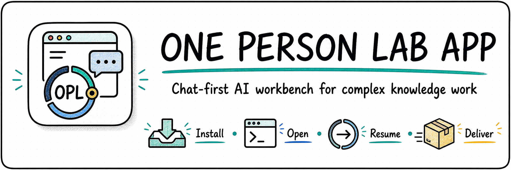
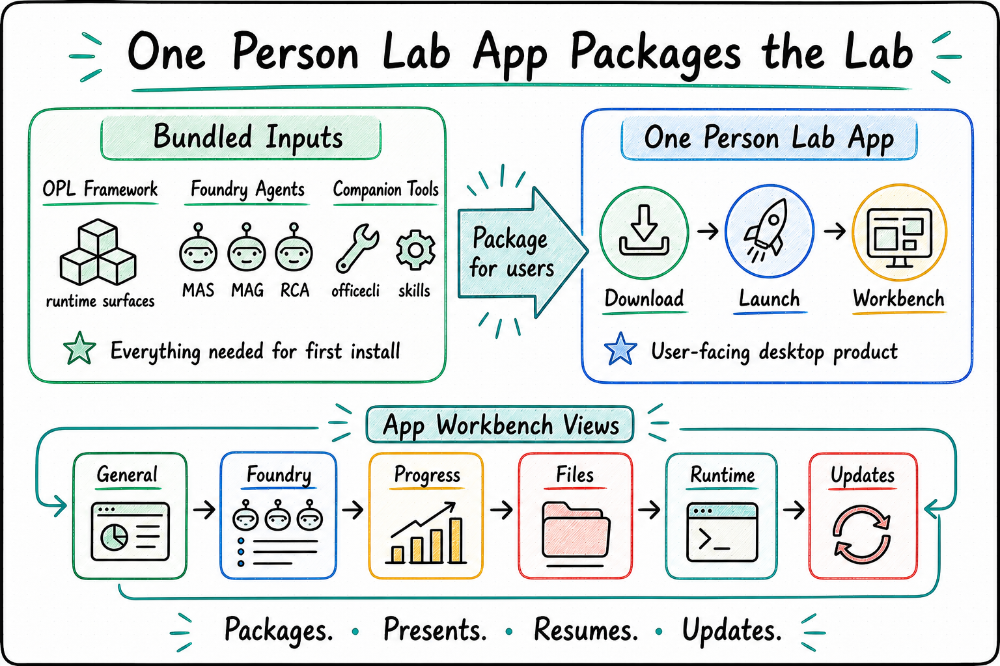

<p align="center">
  
</p>

<p align="center">
  <a href="./README.md">English</a> | <a href="./README.zh-CN.md"><strong>中文</strong></a>
</p>

<h1 align="center">One Person Lab App</h1>

<p align="center"><strong>面向复杂知识工作的 chat-first 桌面 AI 应用</strong></p>
<p align="center">从一个应用进入研究、基金、汇报和通用任务，查看进度、继续长任务、检查交付物</p>

<p align="center">
  
</p>

## 为什么需要它

AI 已经很擅长回答问题和生成内容，但当工作变成一篇论文、一个基金本子、一套汇报材料或一个长期项目时，用户真正关心的是：

- 从哪里开始，下一步该做什么？
- 之前跑过的任务进展到哪一步了？
- 生成了哪些文件，哪些还需要检查？
- 后台任务是否还在运行，失败时卡在哪里？
- 研究、基金、汇报这些专业 Agent 能不能放在一个统一入口里使用？

**One Person Lab App 就是这个入口。** 它把 One Person Lab、专业 Agent 和常用工具打包成桌面应用，让用户用一个界面进入复杂知识工作。

## 核心亮点

**一个入口进入多类专业 AI 工作**<br/>
从桌面应用进入通用工作、医学研究、基金写作和汇报材料准备，不需要在多个命令、仓库和工具之间切换。

**看得见长任务进度**<br/>
应用展示任务进展、文件、运行状态和可继续的上下文。用户回来时可以直接看到做到了哪一步、有哪些结果、是否需要人工处理。

**把首次安装做成产品体验**<br/>
macOS 新用户可以使用完整首次安装包，先打开 App，再让后台继续准备框架、专业 Agent、技能和工具载荷。

**专业 Agent 保持清晰分工**<br/>
Research Foundry、Grant Foundry、Presentation Foundry 面向不同类型成果。用户看到统一入口，背后仍保留各自专业判断和交付边界。

**适合从日常使用走向长期托管**<br/>
它不只服务一次对话，也面向需要多轮推进、后台维护、失败恢复和持续交付的工作。

## 下载与安装

macOS 用户可以使用一键安装入口。它会准备 One Person Lab 运行环境，并安装或打开桌面应用：

```bash
curl -fsSL https://raw.githubusercontent.com/gaofeng21cn/one-person-lab-app/main/install.sh | bash
```

该入口默认采用 App-first 安装，让全新 Mac 可以先打开 App，Git-backed 模块维护随后由 App 继续处理。需要从终端执行完整框架/模块安装时，可显式追加 `--complete`。

也可以从发布页下载当前桌面包：

[下载 One Person Lab App](https://github.com/gaofeng21cn/one-person-lab-app/releases/latest)

macOS arm64 新用户优先选择 `One-Person-Lab-Full-<version>-mac-arm64.dmg`。完整首次安装包包含桌面应用、One Person Lab、研究/基金/汇报智能体、当前运行载荷、`officecli` 和推荐技能载荷。

首次启动图文教程以 [macOS App install slides PDF](docs/user-guides/macos-app-install-slides.pdf) 为主入口；更详细的长文补充见 [macOS App install detailed PDF](docs/user-guides/macos-app-install-detailed-guide.pdf)。

日常更新由应用内更新通道完成。发布页保留标准应用包和更新元数据，完整首次安装包作为独立安装资产发布。

Docker 或服务器部署请参考 [Docker/WebUI 安装说明](https://github.com/gaofeng21cn/one-person-lab/blob/main/docs/references/current-support/opl-docker-webui-deployment.md)。

## 应用能做什么

One Person Lab App 是面向用户的日常 chat-first 桌面入口：

- 从一个桌面界面进入通用工作、医学研究、基金写作和汇报材料准备。
- 提供研究工坊、基金工坊、汇报工坊入口。
- 展示进度、文件、运行状态和可恢复的工作上下文，帮助用户继续长任务和检查交付物。
- 运行状态页以 `opl app state --profile fast --json` 作为摘要和刷新来源，`opl app state --profile full --json` 只用于显式 full-state 诊断或发布证据，并只在需要时按需加载完整 Framework drilldown。该页面是多任务运行基座视角：展示行动队列、纵向动态地图、单任务 drilldown、MAS paper lens refs、summary-first/full-detail-on-demand 控制、5-10 秒轻量轮询兜底、refs-only dry-run/execute 动作、回执/计数刷新和明确的 non-authority boundary 字段。
- 首次启动在进入 `/guid` 前完成 `ready_to_launch`：只要求工作目录、Codex CLI 和 Codex config。领域模块、family runtime provider、推荐技能、native helpers、repo sync、CLT 和生态更新属于 Full readiness 或后台维护。
- 首次启动界面从共享的 `opl system initialize --json` 模型展示当前阶段、Core 进度、Full readiness 进度、后台维护计数、阻塞项和下一步，不为不同安装形态维护各自的进度真相。
- Foundry Agents 只暴露一条公共语义路径：domain skill 是 ABI。Codex App 可以通过 plugin-packaged skill 暴露 MAS/MAG/RCA，CLI 和 direct Codex 仍消费同一套 skill/action/stage metadata；plugin 只是分发壳，不能生成第二套语义，也不能把 MAS/MAG/RCA 再镜像成裸 `~/.codex/skills/{mas,mag,rca}`。
- 把 One Person Lab 和领域智能体呈现为可直接使用的产品体验。

## 用户路径

1. 从发布页下载应用包。
2. 打开 `One Person Lab.app`。
3. 让首次启动在进入 `/guid` 前完成 Core readiness：工作目录、Codex CLI 和 Codex config；界面进度条和步骤列表来自 OPL Framework 初始化状态。
4. 选择工作目录。
5. 开始通用工作，或进入研究工坊、基金工坊、汇报工坊。
6. 通过进度、文件和运行状态视图继续任务、检查交付物。

## 产品边界

One Person Lab App 负责桌面产品体验：打包、发布资产、更新元数据、首次启动检查、界面状态测试、截图和用户文档。

App 产品默认策略由 [`contracts/app-product-profile.json`](contracts/app-product-profile.json) 声明。安装与 Codex 可见暴露策略由 [`contracts/app-install-exposure-policy.json`](contracts/app-install-exposure-policy.json) 声明：App 决定用户看到的安装形态和默认入口，OPL Framework 生产 install/sync/read-model surface，domain 仓继续持有 skill 语义。发布脚本会在标准包和 Full 包构建前把该合同同步到活动 shell，让 Codex 默认模型/推理强度、默认打包 skill 白名单、首次启动维护行为和 Settings 用户文案由 App 仓统一配置，而不是分散写死在 AionUI fork 中。

GUI 产品事实也由 App 仓拥有。默认发布界面仍由 [`contracts/app-shell-adapter.json`](contracts/app-shell-adapter.json) 指向 `shells/aionui`；技术验证界面可以通过 `OPL_APP_SHELL_ADAPTER_CONTRACT=contracts/shell-adapters/<candidate>.json` 显式选择，复用同一套 App 包装脚本同步 product profile，并为候选 shell 编译出可启动的 `.app` bundle 与 package manifest。

One Person Lab 提供命令行、激活、阶段控制、运行时提供者、队列、合同、模块发现、技能同步、运行快照和进度投影。MAS、MAG、RCA 承载各自领域的专业判断、质量裁决、阶段语义和交付物。

需要框架、运行时和合同信息时，请进入 [`gaofeng21cn/one-person-lab`](https://github.com/gaofeng21cn/one-person-lab)。

## 技术入口

<details>
  <summary><strong>展开开发者与发布说明</strong></summary>

### 仓库结构

```text
one-person-lab-app/
  assets/               应用首页和产品视觉资产
  docs/                 应用产品、发布、测试、截图和用户文档
  contracts/            应用层机器可读合同
  scripts/              应用层验证和发布包装脚本
  shells/
    aionui/             gaofeng21cn/opl-aion-shell 的外部检出目录
```

`shells/aionui/` 不纳入本仓跟踪。构建和验证时从 `gaofeng21cn/opl-aion-shell` 检出，AionUI 历史和贡献者记录保留在独立 shell 仓库中。候选 shell 也遵循同样的外部检出规则；例如 `shells/agui-codex/` 链接到 `gaofeng21cn/opl-agui-codex-shell`，只在显式技术验证构建时使用。

### 常用验证命令

```bash
npm run ensure:shell
bun install --cwd shells/aionui --frozen-lockfile
bun run validate:active-shell
bun run i18n:types
bun run test
bun run build-mac
```

发布资产归一化和验证从应用根目录暴露：

```bash
bun run prepare-release-assets -- build-artifacts release-assets
bun run validate-release -- release-assets
```

当前活动界面由 [`contracts/app-shell-adapter.json`](contracts/app-shell-adapter.json) 声明：

- 活动界面：`aionui`
- 界面目录：`shells/aionui`
- 上游家族：`AionUI`
- 界面来源：`gaofeng21cn/opl-aion-shell`
- 历史策略：外部检出，不合并进 App 默认分支

不改变默认发布 adapter 的情况下，可以显式选择实验 shell：

```bash
OPL_APP_SHELL_ADAPTER_CONTRACT=contracts/shell-adapters/agui-codex.json npm run package
```

候选 package validation 要求 manifest 声明 `candidate_app_bundle_ready`、`explicit_candidate_app_bundle`，以及相对路径形式的 `.app` bundle；该 bundle 必须包含 `Contents/Info.plist` 和 `Contents/MacOS` 可执行文件。纯文本 smoke artifact 不算候选 App package。

App 产品默认策略由 [`contracts/app-product-profile.json`](contracts/app-product-profile.json) 声明，并在发布准备阶段生成到 [`contracts/app-shell-adapter.json`](contracts/app-shell-adapter.json) 声明的当前 shell 路径。

当前迁移与发布状态见 [`docs/status.md`](docs/status.md)。

</details>
