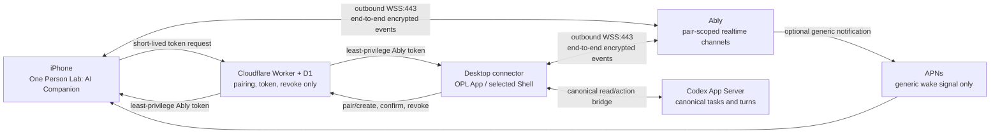

# One Person Lab: AI Companion 落地计划

Owner: `one-person-lab-app`
Purpose: `opl_ai_companion_implementation_plan`
State: `approved_plan_source_not_implemented`
Machine boundary: 本文组织产品、Shell、Cloud 与 iOS 的实施顺序。机器 truth 归
`contracts/app-remote-companion.json`、App contracts、各 owner source/tests、安装包、
TestFlight 与运行时回读；本文不证明任何客户端、Broker、推送或公开发布已经完成。

## 结论

对外产品名固定为 **One Person Lab: AI Companion**，主屏幕短名为 **OPL**，应用内品牌为
**One Person Lab**。`remote_companion` 只保留为内部 capability/protocol ID，不作为面向用户的
产品名。

首期使用 **Ably Free + Cloudflare Workers/D1**：电脑和 iPhone 都主动建立 `WSS:443`
出站连接，用户不需要公网 IP、端口转发、VPN、Tailscale 或局域网配置。电脑继续拥有 Codex
App Server、任务历史、执行、权限与 App action authority；iPhone 只投影任务和提交有限动作。

这是一条原生 iOS 伴侣端路径，不是把桌面 WebUI 暴露到公网，也不建立第二套 OPL runtime、
任务库、命令队列或云工作区。

## 为什么选择这条路线

| 方案 | 开发与维护 | 用户认知 | 当前决定 |
| --- | --- | --- | --- |
| Ably + 极薄 Worker/D1 | Realtime、重连、token capability 和 push bridge 由托管服务承担；OPL 只实现协议与 Broker | 扫一次 QR，之后自动连接 | **MVP 采用**。十几个用户先用 Free，达到真实配额再升级。 |
| Cloudflare Tunnel / Zero Trust mesh | 适合暴露 HTTP 服务，但仍要管理 tunnel、hostname、Access 策略和桌面 daemon；把 WebUI 放公网还扩大攻击面 | 可能引入账户、Access 或网络配置概念 | 不作为普通用户主路，可保留为开发/自托管高级路径。 |
| Cloudflare 自建 WebSocket relay / Durable Objects | 能内置，但 OPL 自己承担 fan-out、断线恢复、presence、限流、push、运营和故障处理 | 用户可无感，开发者成本高 | 当前用户规模不值得自建；Ably 成本或可达性出现真实问题后再评估。 |
| Tailscale / Headscale | 网络层成熟，但要求电脑和 iPhone 安装、登录并理解 tailnet/VPN | 认知与自动化成本最高 | 只适合技术用户的可选自托管方式，不是产品默认。 |
| 公网 WebUI / 端口转发 | 代码复用多，但需要公网入口、TLS、认证和持续暴露桌面服务 | 配置复杂且容易误用 | 明确拒绝作为 iOS 产品路径。 |

Cloudflare 继续承担它擅长的无状态鉴权和小型 registry，不承担 realtime 业务面。这样既保留
未来替换 Ably 的 `opl_remote_transport.v1` 边界，也不为尚未出现的规模问题提前自建消息平台。

## 产品身份

| Surface | 最终值 | 理由 |
| --- | --- | --- |
| App Store 名称 | `One Person Lab: AI Companion` | 同时表达母品牌、AI 品类和伴侣关系，且不把传输方式当产品价值。 |
| 主屏幕名称 | `OPL` | 图标下足够短，和桌面品牌一致。 |
| 应用内品牌 | `One Person Lab` | 首屏先建立完整品牌识别。 |
| 英文副标题 | `Your AI workbench, anywhere` | 说明它连接既有 AI 工作台，不暗示手机本地运行 runtime。 |
| 中文副标题 | `随时连接你的桌面 AI 工作台` | 明确桌面 canonical owner。 |
| 内部 ID | `remote_companion` | 稳定表达工程角色，不暴露为市场名称。 |

未采用的名称：

- `OPL Remote` 只描述远程链路，品牌、AI 品类和产品关系都弱。
- `OPL Link` 更有科技感，但无法说明连接的是什么，也不利于 App Store 品类识别。
- `OPL AI Companion` 可作为 App Store 名称无法预留时的首选备选，但完整母品牌更适合首次发布。
- `OPL Pocket` 容易暗示手机版完整工作台，与实际能力边界不符。

2026-08-16 的美区/中国区 Apple Search API 没有发现明显完全同名应用，不等于名称已经预留。Phase 0 必须在 App Store
Connect 实际创建记录，并完成 Bundle ID 与基础商标检查后，才允许声明名称可发布。

## 系统边界

Cloudflare 只保存 opaque pairing/device 标识、短码与设备凭证的哈希、公开密钥、过期和撤销状态。
Ably 只传输 pair-scoped 密文。两者都不保存或读取任务历史、任务正文、workspace 路径、文件、
pair master key 或明文长期凭证。

## MVP 范围

首期包含：

- 扫描桌面一次性 QR，比较同一确认码并在桌面本地确认。
- 查看 canonical 任务列表、任务详情、当前状态与流式输出。
- 使用桌面默认 workspace、模型、权限与 Agent 配置创建任务。
- 向 canonical task 发送文本，停止当前 turn。
- 响应桌面 owner 投影的低/中影响审批，高影响审批仍只在桌面处理。
- 从电脑或 iPhone 撤销设备。
- 可选通用 APNs 提醒，回到前台后从电脑重新同步。

首期不包含：

- 任意 Shell/终端、任意文件读取或写入、文件上传。
- 模型、provider、reasoning、权限策略或 Package 生命周期编辑。
- 手机本地 Codex/OPL runtime、第二任务历史库或多用户云工作区。
- 离线命令队列、后台常驻 WebSocket、Ably History 作为任务 truth。
- 将旧 LAN WebUI、`http://host:port` QR 登录或 `ws://host:port` 作为公网自动 fallback。

## Owner 与交付物

| Owner | 负责 | 不负责 |
| --- | --- | --- |
| `one-person-lab-app` | 产品名、MVP、page state、动作 allowlist、隐私和发布门槛 | Ably 实现、Codex runtime、Shell 私有状态 |
| `opl-aion-shell` 或后续 selected Shell | 桌面 connector、配对 Settings、canonical action consumer；现阶段承载 iOS source | 新任务库、Cloud authority、App release truth |
| `one-person-lab-cloud` | Worker token broker、D1 配对/撤销 registry、Ably capability 签发 | 任务正文、任务历史、命令队列、文件存储 |
| Codex App Server / desktop runtime | thread、turn、history、执行与权限的 canonical truth | 手机配对、Ably 账户或 APNs |
| Ably | pair-scoped realtime transport 与可选 APNs bridge | 业务 history、明文内容、canonical state |

## 协议原则

1. 桌面 QR 携带一次性 256-bit claim secret，Broker 只保存其 salted hash。iPhone 扫码并提交自己的
   pair-specific X25519 public key 后，两端才根据 pairing ID 和双方公钥显示同一 SAS 确认码；桌面本地
   确认后双方经 HKDF-SHA256 派生 iOS-to-desktop 和 desktop-to-iOS 两把独立 AES-256-GCM key。
   claim secret 只在 QR 中出现一次，pair key 不通过 Broker 或 Ably 传输。手工 fallback 使用 12 位
   Crockford Base32 随机码、5 分钟有效期和服务端 HMAC-SHA256 存储；最多 5 次失败后原子作废本次配对。
2. Ably token 最长 15 分钟，只允许本 pair 的精确 channel capability；App 中不内置 API key。
   Pair namespace 使用 Ably 的冒号分段规则。iOS 只向 `...:command` publish、只从 `...:event`
   subscribe；桌面权限反向。通知启用时 iOS 只增加 event channel 的 `push-subscribe`，`push-admin`
   永远不进入 iOS 或桌面 token，客户端 token 也不使用 wildcard capability。
3. 外层只暴露 protocol/pair/device/key epoch/nonce 和密文；`request_id`、canonical thread ID、action、
   device sequence 与业务 payload 全部在密文中。桌面在执行 `start/send` 前去重；未知终态时 iPhone
   先刷新 canonical state，不盲目重发。
4. 事件使用双向独立 AES-256-GCM key和随机 96-bit nonce，接收方拒绝同一 key 下的重复 nonce，
   sequence 按 sender 独立递增；protocol/pair/device/key epoch/channel direction 作为 AAD，channel name
   只含 opaque ID。
5. 流式输出按 100-250 ms 或 4 KiB 合并，terminal event 立即 flush，禁止按 token 逐条发送。
6. iOS 本地只保存 Keychain 凭证、加密的只读 projection 和用户草稿；草稿永不自动发送。
7. 断线、回前台或 APNs 唤醒后，必须先重新鉴权并读取 desktop canonical state，才重新开放输入。

## 分期路线

### Phase 0：产品与 namespace 准入

当前 App contract、命名决策和实施计划已建立；外部 namespace 尚未完成。

交付：

- 在 App Store Connect 预留正式名称和 Bundle ID，确认证书、App Group/Keychain 与 APNs 环境。
- 建立隔离的 Ably development/production app，以及 Cloudflare Worker/D1 development/production 环境。
- 只把 provider secret 放入 Cloud/Shell 的 secret owner，不写进仓库、QR 或 iOS bundle。
- 固定 `opl_remote_transport.v1` envelope、pair lifecycle、error code 和 compatibility policy。

门槛：名称与 Bundle ID 可回读；开发环境可以签发 pair-scoped 短期 token；无客户端持有 Ably API key。

### Phase 1：Broker 与协议 loopback

Owner：`one-person-lab-cloud` + 协议 consumer owner。

交付：

- 实现单次 pair create/claim/confirm、设备 token、refresh 和 revoke。
- D1 使用 atomic claim，过期记录自动失效。撤销必须原子标记 pair、拒绝未来 token、让桌面 detach
  该 pair channel 并删除 desktop pair key；已签发 token 最多可在 Ably transport 层存活 15 分钟，
  但 terminal revoke readback 后不得再有桌面 publisher/subscriber/action consumer。
- 建立桌面/iOS stub loopback，验证 E2EE envelope、sequence、request dedupe 和 reconnect。
- 记录不含任务正文的 auth failure、quota 和 revoke telemetry。

门槛：并发 claim 只能一个成功；越 pair capability 被拒绝；Broker/Ably 日志看不到任务正文；撤销后
新 token 被拒绝，旧 socket 即使尚未过期也无法再与桌面交换任务或执行动作。

### Phase 2：桌面 connector

Owner：selected Shell。

交付：

- 实现单一 `RemoteTransport` adapter，连接 canonical App read/action bridge。
- Settings 增加开始配对、确认码、已配设备、最近连接和撤销入口。
- 将任务 projection、流式输出、审批和 terminal state 加密发布到 pair channel。
- `start/send/stop/approval` 只走既有 App action，保留 desktop 权限和影响分级。
- 连接失败只使 Companion unavailable，不影响桌面工作台，也不回退到公网 LAN WebUI。

门槛：真实 desktop loopback 可列出/读取/启动/发送/停止；重复 request 不产生重复 turn；transport
断开不改变 desktop canonical state。

### Phase 3：原生 iOS MVP

Owner：当前 `opl-aion-shell` mobile source，直到另行批准独立 iOS 仓。

交付：

- 完成 `One Person Lab: AI Companion` identity、启动/配对、任务列表、任务详情/composer 和设备设置。
- 使用 SecureStore/Keychain 保存 pair/device credential 与私钥，使用 Ably token auth，不接受静态 key。
- 完成 `unpaired / pairing / unavailable / syncing / ready / stale / revoked` 状态机。
- 前台流式显示密文事件；后台不维持 WebSocket；通知权限拒绝不影响前台使用。
- Dynamic Type、VoiceOver、深浅色、网络切换和长文本布局达到 TestFlight 基线。

门槛：clean install 可配对和重配；断网显示 stale 而不伪造 running/completed；回前台先同步再允许发送；
Keychain 与日志中无任务明文或 provider secret 泄漏。

### Phase 4：十人 TestFlight Beta

Owner：App release owner + Shell/Cloud runtime owners。

交付：

- 接入可选 APNs，只发送通用 pair-scoped update signal。
- 对十几名现有用户逐步开放，先 internal，再小范围 external TestFlight。
- 验证 Wi-Fi、蜂窝、广州移动/联通/电信组合，以及电脑和手机跨网络切换。
- 监控 Ably 并发、消息/月、消息/秒、token refresh、broker errors 和 revoke latency，不记录内容。
- 建立用户可执行的重新配对、设备丢失撤销和 provider outage 提示。

门槛：无公网地址可完成配对/重连；重复发送、撤销、后台恢复、通知拒绝和 provider outage 用例通过；
没有 high-impact approval 或首期禁用动作从 iOS 可达。

### Phase 5：公开发布与运营

交付：

- App Store 隐私标签、隐私政策、支持入口、截图和副标题与真实数据路径一致。
- 重新核对 Ably/Cloudflare 价格、配额、APNs production、数据保留和服务区域。
- 完成 TestFlight clean-install/update、旧设备撤销和 production token capability 回读。
- 形成短小 runbook：Ably/Cloudflare outage、额度告警、key rotation、用户设备丢失和回滚。

门槛：App Store 名称/Bundle ID/基础商标检查完成；production bytes 和配置由对应 owner 回读；
App contract/unit tests 不被当作公网、安装或发布完成证据。

## 成本与升级策略

十几个用户阶段的目标是 **realtime 与 Broker 月度增量成本为 0 美元**。2026-08-16 官方快照为：
Ably Free 提供 200 并发连接、600 万消息/月、500 消息/秒；Cloudflare Workers Free 提供
10 万请求/日，D1 Free 提供 500 万行读/日、10 万行写/日和 5 GB 存储。Workers Paid 当前最低
5 美元/月，但首期没有升级需要。Apple Developer Program、域名或既有 Cloud 基础设施单独核算，
不伪装成 transport 免费。

成本控制靠真实用量，不提前维护第二 provider：

- 70% 配额发告警并检查流式批量、重连和异常客户端。
- 85% 评估 Ably 升级、限流或协议批量优化，并重新比较托管 provider。
- 95% 暂停新配对，已有 pair 保持可用或清楚降级，不能静默丢命令。
- 公测前重新读取 provider 官方价格与限制；仓库数字只是计划快照，不是计费 authority。

如果 Ably 的中国网络可达性、价格或产品约束在实测中不合格，替换的是
`opl_remote_transport.v1` provider，不改变 iOS 产品、配对、E2EE envelope、desktop canonical
authority 或 App action allowlist。切换必须由同一组 loopback、撤销、去重、三网和 TestFlight
用例证明，不能长期双写两个 realtime provider。

## Beta 验收清单

- 电脑无公网 IP、不开端口、不装 VPN 仍可远程使用。
- Broker/Ably 无法读取任务正文，iOS bundle 不含 provider secret。
- 同一 `request_id` 不产生两个 turn，未知结果不会自动重发。
- 撤销设备不能刷新 token 或重新建立 desktop application access；即使旧 Ably token 在 15 分钟内
  仍可连接 transport，也没有桌面 pair key、publisher、subscriber 或 action consumer 与它交互。
- foreground/reconnect 从 desktop canonical state 重建，不用 Ably History 补业务 truth。
- high-impact approval、任意 Shell/文件、模型/权限/Package 编辑都不可达。
- APNs 不含任务文字、workspace、secret 或可推断的敏感标题。
- provider outage 不影响桌面 OPL，iOS 显示 unavailable/stale 而非伪造 online。

## 当前状态

本轮只完成 App-owned 产品决定、机器合同、验证器和实施计划。Desktop connector、iOS source、
Cloud broker、Ably/APNs 配置、App Store namespace、TestFlight 和三网证据均仍是
`not_implemented / not_verified`，不得据此声明 Beta 或发布完成。
