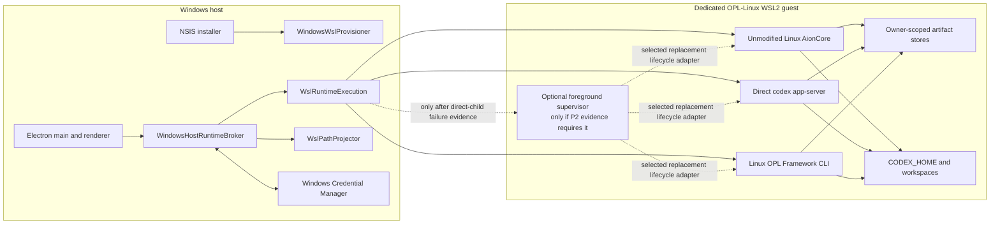
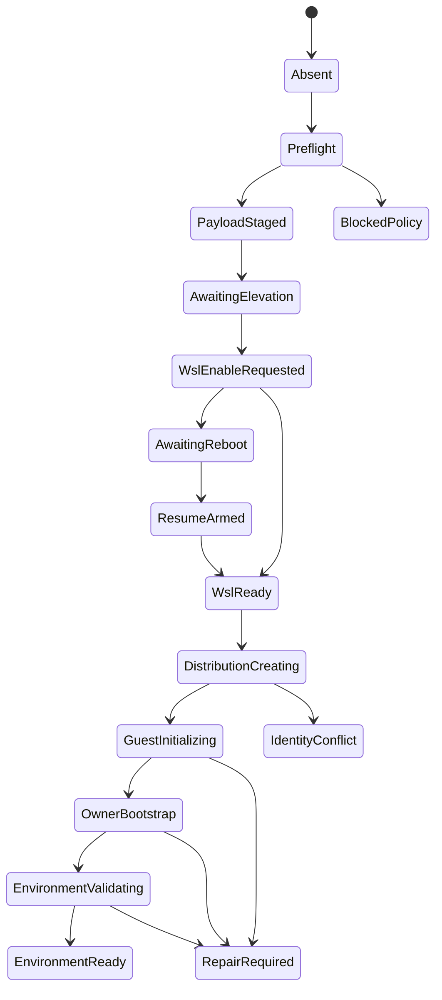

# Windows WSL2-Only Execution Implementation Blueprint

Owner: `one-person-lab-app`
Purpose: `windows_wsl2_execution_reference_blueprint`
State: `reference_blueprint_non_binding`
Last reviewed: `2026-07-24`
Parent decision boundary:
[`windows-wsl2-execution-exploration.md`](windows-wsl2-execution-exploration.md)

Machine boundary: This document is a detailed, implementable reference for a
possible future Windows desktop product. It is not an active implementation
plan, backlog, supported-platform declaration, readiness claim, release gap, or
authorization to change App, Shell, Framework, AionCore, installer, workflow, or
release bytes. Current machine truth remains in `contracts/`, source, tests,
produced artifacts, and fresh runtime readback. Only an explicit E0 product
promotion may copy the selected slices into a dated `docs/active/` plan.

An explicitly authorized validation-only lane may exercise the reference
design, including a disposable Windows VM and WSL2 fixtures, under
[`windows-wsl2-execution-validation-plan.md`](windows-wsl2-execution-validation-plan.md).
Validation evidence may update this reference document, but it does not create
an App gap, change contracts, or authorize implementation or release work.

## 1. Conclusion

The Windows desktop path is technically feasible without modifying or forking
AionCore. A complete implementation should use:

```text
native Windows Electron and installer
+ OPL-owned WSL provisioner
+ dedicated OPL-Linux WSL2 distribution
+ direct `wsl.exe --exec` runtime launch path
+ unmodified upstream Linux AionCore
+ one owner-bound Linux Codex executor identity
+ Linux OPL Framework and authoritative workspace
+ authenticated Windows host broker
+ centralized host/guest path projection
+ transactional install, update, repair, rollback, and removal receipts
```

This is not a binary-path substitution. The current Windows process, PID,
filesystem, authentication, and lifecycle assumptions must be replaced at one
OPL-owned execution boundary. A patch only around `codex.exe` would leave
AionCore, direct Codex App Server, `oplRuntimeBridge`, paths, cancellation, and
updates split across Windows and Linux.

The recommended first public scope is deliberately narrow:

```text
host_os = Windows 11 22H2 or later
host_arch = x64
guest_os = OPL-managed Linux on WSL2
agent_executor = Linux Codex only
native_windows_executor_fallback = forbidden
default_workspace = /home/opl/code
default_codex_home = /home/opl/.codex
durable_work_supervision = evidence_selected
user_existing_distro_mutation = forbidden
```

Windows ARM64, Windows 10, enterprise offline distribution, and user-selected
execution distributions should be evaluated only after the x64 path reaches
production qualification. They must not complicate the first implementation.

### 1.1 Decision classification

The blueprint deliberately separates durable conditional requirements from
implementation choices that still need evidence:

| Class | Contents | How it changes |
| --- | --- | --- |
| Conditional product invariant | WSL2 Linux is the only Agent and Framework execution plane; no native Windows fallback; Windows remains GUI, installer, launcher, and explicit host integration; AionCore stays upstream byte-for-byte | Changes only through a new product decision |
| Preferred reference design | Dedicated OPL distribution, one structured execution port, direct `wsl.exe --exec` children first, Host Broker, Linux-native workspace, owner-scoped immutable artifacts, and transactional receipts | Selected slices may move into an active plan after E0 |
| Blocking spike decision | AionCore authenticated mode versus isolated guest proxy, first-credential bootstrap, Electron HTTP/WS mediation, WSL networking behavior, direct-child process-tree convergence versus an optional foreground supervisor, and exact Codex identity across ACP/App Server/Framework | Must be decided by P2 evidence; no default may be inferred from this document |
| Deferred product scope | Windows ARM64, Windows 10, enterprise offline policy, `.wsl` as the minimum carrier, arbitrary user distributions, and stronger same-user adversary isolation | Remains outside the first x64 implementation unless separately promoted |

When a spike selects a concrete mechanism, the active plan and future machine
contract own that selection. This blueprint should retain the alternatives and
evidence boundary instead of being rewritten as if the selection had always
been known.

## 2. Target Architecture



The Windows side owns presentation, installation, WSL management, process
transport, and explicit host integrations. The Linux side owns every Codex- or
Framework-backed execution path. `WslRuntimeExecution` begins with direct
`wsl.exe --exec` children. The optional supervisor is not part of the baseline;
P2 may select it only after direct-child lifecycle tests reproduce an orphan or
stale-owner failure that a smaller explicit guest stop/readback cannot close.
The renderer never selects a native executable and never receives a Linux PID,
AionCore internal credential, or unrestricted guest command channel.

### 2.1 Logical and physical distribution identity

`OPL-Linux` is the logical product identity. A custom-import experiment may use
`OPL-Linux-g0001` as its first physical distribution. If E5 later selects a
generation-based custom carrier, a rootfs replacement may import
`OPL-Linux-g0002`, validate it, and atomically switch the host's
`active-runtime.json` projection. A Microsoft-distributed base plus an
idempotent OPL bootstrap remains a valid candidate until that selection.

The logical/physical split avoids depending on a WSL distribution rename
operation and permits safe replacement if the custom carrier wins. User-facing
copy should continue to say `OPL Linux environment`, not expose experimental
generation names.

### 2.2 Runtime layout

Recommended host layout:

```text
%ProgramData%\OnePersonLab\
  wsl-capability\
    current.json

%LOCALAPPDATA%\OnePersonLab\
  installer\
    journal\
    receipts\
    payload-cas\
    active-runtime.json
  diagnostics\
```

Recommended guest layout:

```text
/opt/opl/carrier/store/sha256/<substrate-digest>/...
/opt/opl/carrier/activations/<generation>/manifest.json
/opt/opl/carrier/current -> /opt/opl/carrier/activations/<generation>
/opt/opl/bootstrap/opl-runtime-exec
/opt/opl/bootstrap/opl-runtime-inspect
/opt/opl/bootstrap/opl-runtime-control
/opt/opl/bootstrap/opl-guest-supervisor  # only if P2 selects it
/var/lib/opl/transactions/
/var/lib/opl/receipts/
/var/lib/opl/runtime-state/
/home/opl/.codex/
/home/opl/code/
```

These paths are an illustrative layout for OPL-owned carrier substrate only,
not a shared Base or Package activation root. Owner-managed AionCore, Codex,
Framework, Base, and Package artifacts retain their canonical lifecycle,
locations, and receipts even when the Windows carrier stages exact seed bytes.
User data, authentication, configuration, workspaces, and mutable databases
remain outside carrier activation slots.

## 3. Ownership Boundaries

| Surface | Canonical owner | Implementation responsibility | Explicit non-ownership |
| --- | --- | --- | --- |
| Windows product invariant, states, acceptance, release eligibility | `one-person-lab-app` | Machine contract, GUI state contract, test matrix, release gates after promotion | Does not implement WSL process transport or Framework lifecycle |
| Electron integration, WSL provisioner, runtime execution adapter, broker, path projection | `opl-aion-shell` | Direct-child transport first; an optional supervisor client only if selected by P2; packaging hooks and focused tests | Does not define Base, Package, Codex-version, or domain truth |
| Framework install, initialize, state/action, Base lifecycle, Package orchestration, owner receipts | `one-person-lab` | Produce, activate, and operate the Linux Framework artifact through existing authority | Does not manage WSL or Electron; the App carrier does not replace this lifecycle |
| AionCore process and protocol | Upstream AionCore | Supply exact released Linux bytes and existing authenticated behavior | No OPL source patch for WSL routing |
| Codex executable identity and lifecycle | Owner selected by the future executor/carrier contract | Produce one exact Linux executor identity and owner receipt consumed by ACP, direct App Server, and Framework routing | App/Shell does not select Codex versions or become its updater merely by carrying seed bytes |
| Microsoft WSL engine | Microsoft/Windows | WSL install, kernel, VM, import and registration primitives | OPL does not claim to own or transactionally update Microsoft WSL |
| Agent Packages and domain artifacts | Framework, native carrier, and Package/domain owners | Existing lifecycle, projections, and delivery authority | Installer and Shell do not select versions or duplicate owner state machines |

The App release may carry Framework-, Codex-, AionCore-, or Package-owner
produced offline seeds, but carrying bytes does not transfer lifecycle
authority. The guest bootstrap stages exact inputs, then invokes the canonical
owner's activation route and consumes its receipt. It must not manufacture a
second Framework, Base, Codex, or Package installation authority.

## 4. One Execution Port

Shell should first isolate all host process assumptions behind a small internal
port while preserving current macOS and Linux behavior:

```ts
interface RuntimeExecutionPort {
  ensureReady(): Promise<GuestIdentity>;
  projectPath(path: TypedPath, purpose: PathPurpose): Promise<PathProjection>;
  spawn(request: RuntimeSpawnRequest): RuntimeProcessHandle;
  execJson(request: RuntimeExecRequest): Promise<JsonResult>;
  execJsonLines(
    request: RuntimeExecRequest,
    onEvent: (event: JsonEvent) => void,
  ): Promise<JsonResult>;
  inspect(): Promise<RuntimeInspection>;
  stopAll(reason: ShutdownReason): Promise<ShutdownReadback>;
}
```

`NativeRuntimeExecution` preserves the existing macOS/Linux path.
`WslRuntimeExecution` is the only Windows implementation. Product code must not
branch directly on `process.platform` to find or spawn Agent executables after
this boundary lands.

`RuntimeProcessHandle` exposes streams, completion, cancellation, and tree
termination but keeps Linux process identity opaque:

```ts
interface RuntimeProcessHandle {
  readonly token: string;
  readonly stdin: Writable;
  readonly stdout: Readable;
  readonly stderr: Readable;
  wait(): Promise<RuntimeExit>;
  terminate(options: { graceMs: number }): Promise<TerminationReadback>;
  killTree(): Promise<TerminationReadback>;
}
```

The port owns App-session execution only. Durable scheduled work is selected
through its canonical Framework/Temporal owner and is not hidden behind a
generic `startService` method. The port is intentionally not a generic
remote-execution platform. Windows allows only logical programs declared by
exact owner receipts and the active carrier manifest:

```text
aioncore
codex
opl
runtime-inspect
runtime-control
```

In the baseline direct-child strategy, `WslRuntimeExecution` sends a bounded
structured request over stdin or an owned request file to a short-lived
`opl-runtime-exec` launcher. The launcher validates the logical program ID
against an exact owner-receipt-bound manifest, validates cwd and environment,
creates the process group and operation token, then uses `execve` so it does not
remain as a daemon or intermediate control plane. `runtime-control` performs a
targeted graceful/TERM/KILL sequence and `runtime-inspect` supplies terminal
guest readback. If P2 selects the optional supervisor, it performs the same
validation. Host input is structured `argv`, stdin bytes, cwd, environment
allowlist, timeout, and operation token. No request uses `bash -c`, PowerShell
interpolation, an unrestricted executable path, or a command string assembled
from user input.

The direct-child design must persist an atomic, guest-owned operation record
before `execve` containing the token, PID start time, process-group identity,
real executable identity, carrier identity, and session. `runtime-control` must
validate that record against fresh `/proc` readback before signalling anything;
PID equality alone is insufficient because of PID reuse. If a safe token-to-tree
mapping cannot be proven, P2 must select the smallest evidence-backed
supervisor or mark the route unsupported.

## 5. Lifecycle Strategy Selection

The baseline must first launch each route as a direct child of its own
`wsl.exe --exec` invocation:

```text
wsl.exe
  -d <active-physical-distro>
  --user opl
  --exec /opt/opl/bootstrap/opl-runtime-exec
  # bounded request arrives on stdin or by an owned request-file descriptor
```

`opl-runtime-exec` is a small launcher, not a supervisor: it validates and
establishes execution context, then replaces itself with the exact owner-bound
program. The direct strategy must preserve stdio, route-specific graceful
cancellation, guest-side process inspection, bounded termination, App-session
survivor readback, and idempotent restart. Killing the host `wsl.exe` PID is
never sufficient evidence that Linux descendants stopped.

P2 may introduce one foreground guest supervisor only when the direct strategy
reproducibly leaves an orphan, loses ownership after App/WSL restart, or cannot
produce a reliable terminal survivor readback. That selection requires a spike
receipt naming the failed direct case, the smaller alternatives tried, and the
acceptance gained. The supervisor remains a child of the App runtime session;
it is not a system daemon, Windows service, independently durable control plane,
or owner of installation transactions.

### 5.1 Runtime identity handshake

Before any route starts, the host obtains this identity through the direct
`runtime-inspect` command. If the optional supervisor is selected, its first
message must return the same shape:

```json
{
  "type": "hello",
  "protocol_version": 1,
  "session_id": "opaque-random-id",
  "guest_install_id": "uuid",
  "physical_distribution": "OPL-Linux-g0001",
  "distribution_generation": 1,
  "distribution_carrier_kind": "custom_rootfs_or_managed_base",
  "distribution_input_digest": "sha256:...",
  "carrier_activation_digest": "sha256:...",
  "architecture": "x86_64",
  "aioncore_digest": "sha256:...",
  "codex_digest": "sha256:...",
  "framework_digest": "sha256:...",
  "codex_home": "/home/opl/.codex",
  "workspace_root": "/home/opl/code"
}
```

The host compares this with exact owner receipts, the signed desired substrate
manifest, and the last committed host receipt. Missing fields, wrong
distribution identity, incompatible protocol, or same version with different
bytes produces `repair_required`; it never selects a Windows executable.

### 5.2 Optional supervisor protocol

This subsection is a contingency design, not a P1 requirement. If P2 selects
the supervisor, its minimum protocol surface is:

```text
inspect
spawn
exec_json
exec_json_lines
start_app_session_service
stdin
cancel
terminate
kill_tree
shutdown
```

Each request carries `request_id`, `session_id`, `program_id`, typed cwd,
structured argv, timeout, and expected carrier-environment identity. Each
response carries the same IDs, exit status, bounded stderr tail, and final
process-tree readback.
Streaming events are framed JSON Lines for control and text streams; binary
attachments use a separate bounded file handoff, not base64 mixed into control
messages. `start_app_session_service` rejects every route classified as durable;
durable start/stop remains an owner lifecycle action under Section 5.4.

### 5.3 Process ownership

Both strategies must meet the same terminal behavior. The direct strategy uses
the narrowest experimentally proven guest process-group and inspection
mechanism. If selected, the supervisor starts every long-lived child in its own
Linux process group, tracks descendants by opaque token, and applies:

```text
cancel request
-> route-specific graceful cancellation
-> SIGTERM to the process group
-> bounded grace period
-> SIGKILL to the process group
-> guest-side survivor inventory
-> terminal readback
```

`taskkill`, killing `wsl.exe`, `wsl --terminate`, or App exit alone is not
completion evidence. `wsl --terminate <owned-distro>` is a repair escalation,
not routine cancellation. `wsl --shutdown` is forbidden because it affects
unrelated distributions.

### 5.4 Durable work boundary

Interactive AionCore, App Server, and request-scoped Framework commands belong
to the App-session lifecycle above. A scheduled job, Temporal worker, or other
Framework-owned process that must survive App exit has a different owner and
must not be made durable accidentally by orphaning a foreground child.

P2 must classify every such route as one of:

```text
app_session_scoped
guest_service_owned_by_framework
windows_login_resident_broker
unsupported_until_a_durable_owner_is_selected
```

If durable work is required, the spike compares a guest-native service manager,
a Windows login-resident broker that launches exact guest owner commands, and
any existing Framework/Temporal lifecycle primitive. It records startup,
shutdown, upgrade, user-logoff, WSL-restart, and single-writer behavior before
selecting one. `systemd`, a Windows service, and the optional foreground
supervisor are not assumed defaults. Whatever mechanism is selected must
preserve Framework/Temporal task truth and receipts; App/Shell owns transport
only.

## 6. Route Migration

All routes must converge on the same `GuestIdentity`.

### 6.1 AionCore and ACP

The Windows launcher no longer resolves `aioncore.exe`, passes a Windows
`--parent-pid`, or uses `taskkill`. It asks `WslRuntimeExecution` to start the
manifest's exact Linux AionCore and managed resources.

Required readback:

```text
Linux executable format and digest
selected endpoint
/health result
authenticated API result
WebSocket connect and message
ACP initialize
one real conversation
cancel and no App-session-survivor result
```

AionCore remains byte-for-byte upstream. Its current stdout port discovery and
HTTP/WebSocket protocol may be retained where the authentication spike proves
them safe.

### 6.2 Direct Codex App Server

The existing JSONL adapter remains, but process creation, cwd, cancellation, and
binary resolution move behind `RuntimeExecutionPort`.

The direct route must use the same Linux Codex executable referenced by
AionCore's managed-resource manifest and the same `/home/opl/.codex`. It must
pass initialize, model list, thread list/read/start, review, cwd update,
streaming, cancellation, restart, and canonical thread readback.

### 6.3 OPL Runtime Bridge

Every `oplRuntimeBridge` operation runs Linux `opl` through the same guest:

```text
bootstrap and initialize
Codex configuration
fast and full App state
App action execution
scheduled work
update status and owner-routed update request
repair and recovery reference
```

Windows must bypass host Full-runtime discovery, host `fs/path` carrier probes,
and native `opl` resolution. The Framework remains responsible for command
semantics and receipts; the Shell transports structured requests and renders
their results.

Login credentials are the explicit exception to the generic action surface:
they use the dedicated typed IPC/stdin route and must never enter a generic App
action payload, log, state, error, or receipt. Rollback remains a
`rollback_ref`/recovery reference rather than an App or Framework Package
lifecycle verb. Update and repair remain owner-routed Settings operations.

The WebUI runtime proxy used by the Windows desktop package must not create an
independent native host route.

This list inventories invocation routes, not lifecycle ownership. Scheduled
work uses the durable owner selected in Section 5.4; an App-session supervisor
must not become a second scheduler or task-state authority.

### 6.4 Single Codex binding

Passing only `OPL_CODEX_BIN` is insufficient because a path does not bind
ownership, bytes, carrier identity, or update policy. The future Codex lifecycle
owner should produce an OPL-neutral binding file. The carrier passes that file
unchanged, together with `OPL_CODEX_BIN`, to Framework processes:

```json
{
  "surface_kind": "opl_codex_runtime_binding.v1",
  "executor_id": "codex",
  "lifecycle_owner": "<owner-selected-at-E5>",
  "owner_receipt_ref": "<immutable-owner-receipt>",
  "artifact_root": "<owner-declared-digest-root>",
  "binary_path": "<owner-declared-digest-root>/bin/codex",
  "binary_sha256": "<sha256>",
  "version": "<version>",
  "artifact_ref": "<immutable-artifact-ref>",
  "carrier_environment_id": "opl-linux-environment-0007",
  "codex_home": "/home/opl/.codex",
  "lifecycle_mode": "owner_managed"
}
```

Framework consumes this neutral contract and does not read an AionCore-private
managed-resource manifest. It must verify:

```text
absolute path and realpath containment in the owner-declared artifact root
exact membership in the owner manifest and owner receipt
regular executable Linux file
binary SHA256 and version
carrier environment identity equals runtime-inspect readback
OPL_CODEX_BIN equals the bound realpath
CODEX_HOME equals the bound Linux path
```

The binding identifies the selected executor; it does not itself transfer or
disable lifecycle authority. If the E5 owner contract explicitly selects an
external owner, Framework routes Codex install, update, reinstall, remove,
activation, and rollback requests to that owner and returns its explicit
receipt. Only in that selected mode may Framework suppress its own competing
Codex maintenance. If Framework remains the Codex lifecycle owner, its existing
owner path stays active. App/Shell cannot set either disposition unilaterally.
Framework environment, initialize, worker, and Base readback preserve and
expose the owner receipt, carrier environment, realpath, digest, and
`CODEX_HOME`.

The hard acceptance is:

```text
AionCore ACP Codex realpath and SHA
== direct App Server Codex realpath and SHA
== Framework selected Codex realpath and SHA
```

An unbound global PATH candidate, an owner-inconsistent pending Codex, Windows
`codex.exe`, or a second guest binary fails readiness.

### 6.5 Host integrations

AionCore `/api/shell/*` behavior cannot be forwarded blindly because guest
`xdg-open`, `code`, and terminal commands do not represent Windows product
intent. `WindowsHostRuntimeBroker` owns these operations:

| Intent | Windows implementation |
| --- | --- |
| Open or reveal a Linux file | Validate and project to `\\wsl.localhost\<active-distro>\...`, then use Electron shell APIs |
| Open VS Code | Use the supported VS Code Remote WSL entry for the exact distribution and Linux path |
| Open terminal | Start the selected host terminal attached to the exact distribution and guest cwd |
| Open external URL | Electron `shell.openExternal` after URL policy validation |
| Check host tool | Inspect the Windows host, not the guest |
| Run Git or GitHub operation for a project | Execute inside the guest against the Linux-authoritative workspace |

## 7. Host-to-Guest Security

Localhost is transport, not caller authentication. Current AionCore `--local`
mode skips authentication and therefore cannot be exposed unchanged through WSL
localhost forwarding.

### 7.1 Required threat boundary

The implementation must reject:

```text
an ordinary browser page
an unrelated local Windows process scanning localhost
a stale App instance or stale runtime token
an untrusted preview or webview
a request with the wrong Origin, session, or activation
```

It does not claim to resist a compromised Windows user, Windows administrator,
Electron main-process injection, `wsl.exe -u root`, or a compromised Windows/WSL
kernel. A dedicated distribution is a deterministic dependency and servicing
boundary, not a tamper-proof security boundary.

### 7.2 Preferred authenticated path

The preferred path is:

1. Provision an internal random AionCore credential during guest initialization
   while the local-mode endpoint is isolated from Windows.
2. Stop the bootstrap instance.
3. Run normal AionCore without `--local`, using upstream JWT, cookie, CSRF, and
   WebSocket authentication.
4. Store the reusable internal secret in Windows Credential Manager and its
   verifier in the guest.
5. Let `WindowsHostRuntimeBroker` authenticate and keep JWT, cookie, CSRF, and
   refresh material in Electron main-process memory.
6. Give the renderer only a session-scoped IPC or broker capability, never the
   internal password.
7. Rotate the runtime lease on App restart, WSL restart, carrier switch, sleep
   recovery, and repair.

The one-time local-mode bootstrap must run in a private guest network namespace
or another experimentally proven scope that Windows cannot reach. The
implementation must prove the negative access result, not infer it from a bind
address.

### 7.3 Fallback without changing AionCore

If upstream non-local authentication cannot support the current Desktop API:

1. Keep AionCore local mode inside a private guest network namespace.
2. Put an OPL-owned authenticated guest proxy in front of it.
3. Expose only the proxy to `WindowsHostRuntimeBroker`.
4. Keep the raw AionCore port unreachable from Windows.
5. Repeat the same unauthorized-client, stale-token, WebSocket, and secret-leak
   tests.

This fallback adds a proxy but still consumes unmodified AionCore. If neither
path passes, Windows development stops at the security gate. Native fallback or
an exposed unauthenticated endpoint is not an accepted bridge.

### 7.4 Renderer and log boundary

The E1 spike must prove whether Electron can inject HTTP and WebSocket
authentication without exposing secrets to renderer JavaScript, DevTools,
crash reports, Sentry, command lines, environment dumps, or feedback bundles.
If WebSocket header injection is not safe, the main process terminates the
WebSocket and relays typed events through IPC.

All AionCore, Codex, Framework, provisioner, and supervisor stderr is
structurally redacted before user display or diagnostic packaging. Production
logs must not sample prompt or WebSocket payload bodies.

## 8. Filesystem and Path Policy

The path model has three explicit types:

```ts
type RuntimePath =
  | { kind: "linux_authoritative"; path: string }
  | { kind: "windows_presentation"; path: string }
  | { kind: "windows_import"; path: string; mode: "copy" | "mounted" };
```

`WslPathProjector` is the only conversion owner. It validates:

```text
active distribution identity
allowed Linux roots
canonical path
symlink resolution
path traversal
Windows reserved names
file versus directory intent
UNC result
```

Rules:

- Projects, Git repositories, worktrees, `CODEX_HOME`, runtime databases, and
  Package state are Linux-authoritative.
- `/mnt/c` is not the default workspace or runtime-data root.
- A Windows-selected file is copied into a digest-bound guest ingress directory
  unless the user explicitly selects mounted operation.
- A Windows-selected directory may be mounted only through an explicit path
  type with documented performance, permission, case-sensitivity, and sandbox
  behavior.
- Attachments and drag/drop record both source identity and resulting guest
  path; downstream Agent requests receive only the guest path.
- Explorer and host editors receive a validated UNC or Remote WSL projection.
- Canonical thread cwd and thread readback store the Linux path. A presentation
  path never becomes conversation identity.

Recommended WSL configuration begins with
`interop.appendWindowsPath=false` so guest resolution cannot accidentally find
`codex.exe` or `opl.exe`. Disabling Windows executable interop entirely remains
an E3 experiment because explicit host integration must still work through the
broker.

## 9. Artifact and Build Design

### 9.1 Release inputs

The Windows installer consumes a signed, carrier-neutral manifest binding:

```text
selected distribution carrier kind and exact input identity
guest bootstrap and runtime-inspect digest
optional supervisor digest only when P2 selected it
unmodified Linux AionCore digest and upstream provenance
Codex/ACP owner manifest, payload digest, and receipt contract
Framework/Base owner artifact manifest, bootstrap entry, and receipt contract
host provisioner and broker digest
minimum Windows and WSL versions
lifecycle-strategy compatibility range
```

The production carrier is deliberately not frozen before E5. Validation and
development may select a disposable carrier fixture after the bounded P3
comparison, but that selection is not a release or support decision:

| Candidate | Required evidence before selection |
| --- | --- |
| Signed OPL custom rootfs imported with `--version 2` | Exact base digest, reproducible Linux build, CVE owner, online/offline size, rootfs update and rollback |
| Microsoft-distributed base plus idempotent OPL bootstrap | Exact base identity, unattended acquisition policy, non-interference with user distributions, bootstrap replay, base update and rollback |

For the custom-rootfs experiment, `rootfs.tar` is the compatibility-first
carrier; `.wsl` may be evaluated when requiring WSL `2.4.4+` is acceptable.
VHDX remains a recovery/export artifact, not a routine component update unit.
The experimental rootfs is built on Linux CI from a pinned base-image digest
and contains only the minimal substrate, non-root user bootstrap, directory
skeleton, and direct runtime-inspect helper. The optional supervisor is included
only if P2 selects it.

The V1 lane imported a Canonical-distributed Ubuntu 24.04 `.wsl` package only
as the disposable `OPL-Validation-g0001` fixture. That choice is validation
input, not the `OPL-Linux` product distribution identity, a production carrier
selection, or evidence that `.wsl` is the minimum carrier. The E5 carrier
decision remains open.

For the Microsoft-base experiment, the provisioner creates an OPL-owned
distribution identity and applies the same signed, idempotent substrate
bootstrap. It never mutates an existing user/default distribution. P3 may
select one carrier for the development-validation path from measured install,
policy, and bootstrap evidence; E5 still selects the production carrier from
servicing, security, signing, and recovery evidence.

AionCore, Codex, Framework/Base, and Packages remain separate owner artifacts.
The carrier manifest references exact carrier, AionCore, Codex, and
Framework/Base inputs plus their owner receipt contracts. It may also record
the immutable Package seed bytes actually included in a selected Full/offline
build, solely as build provenance. Package seed or installed identities never
define Package currentness, ordinary readiness, a family cohort, or carrier
activation eligibility.

### 9.2 Build separation

Linux jobs prepare and execute-validate Linux AionCore and managed resources.
The Windows packaging job only verifies and embeds or references their immutable
artifacts. It must not download a Linux target binary on a Windows runner and
then attempt target `--version` or managed-resource preparation.

The same owner-bound Linux Codex executable is used for:

```text
AionCore ACP
direct codex app-server
Framework OPL_CODEX_BIN
```

If the ACP adapter itself is a separate wrapper, the wrapper may remain a
separate managed resource, but it still resolves the same underlying Codex
payload. No second Codex install or mutable PATH discovery is allowed. Which
owner selects and updates that payload is an explicit E5 contract decision, not
an App/Shell packaging default.

### 9.3 Product variants

A future Windows Standard installer may download the signed guest payload after
App installation. A future Windows Full installer may carry the exact same
payload as an offline seed. Both consume one App Official Profile and one
runtime identity; Full does not own a second package list or execution model.

## 10. Provisioning State Machine

The user-facing environment projection stays small:

```text
absent
provisioning
awaiting_reboot
ready
degraded
repair_required
detached
removed
```

User model access is a separate projection:

```text
unknown
needs_user_auth
ready
invalid
```

An intact execution environment may therefore be `ready + needs_user_auth`.
Authentication absence never rewrites installation identity or triggers
destructive repair.

Each install, update, rollback, repair, or uninstall operation has an independent
transaction:

```text
planned -> staged -> mutating -> reconciling -> validating -> committed
```

Allowed non-success terminal or wait states are:

```text
awaiting_elevation
awaiting_reboot
awaiting_user_action
failed_no_change
failed_rolled_back
failed_degraded
external_result_unknown
```

`external_result_unknown` always enters bounded read-only reconciliation before
any repeated mutation.



### 10.1 I0: Admission

Read only:

```text
Windows version and architecture
initiating Windows user SID
virtualization and policy state
WSL presence, version, status, and pending reboot
registered distributions and exact name collisions
available disk space
payload/channel reachability
```

The coordinator writes the exact install intent before external mutation. It
does not mutate a user's Ubuntu, `docker-desktop`, default distribution, global
`.wslconfig`, or system WSL defaults.

### 10.2 I1: Payload staging

Download or read all required payloads, verify signature, digest, size,
architecture, and compatibility, then place them in the host content-addressed
store. Failure ends as `failed_no_change`.

### 10.3 I2: WSL enablement

The non-elevated, per-user signed coordinator owns the transaction. A minimal
elevated helper may only enable or update required Windows WSL capabilities; it
does not accept arbitrary commands and does not register the user-scoped
distribution.

Before UAC, persist:

```text
transaction ID
initiating SID
manifest digest
current stage
expected next stage
```

If Windows requires a restart, record `awaiting_reboot` and arm an exact
per-user resume entry. After login, re-read WSL capability under the same SID.
The helper's exit code is not readiness evidence.

### 10.4 I3: Owned distribution creation

The original user coordinator creates a unique physical name through the
candidate's exact primitive. For the custom-rootfs experiment:

```text
wsl.exe --import OPL-Linux-g0001 <owned-location> <exact-rootfs.tar> --version 2
```

For the Microsoft-base experiment, use only the selected documented acquisition
and registration primitive, then apply the signed OPL substrate bootstrap. Both
branches must yield the same product identity/readback contract and must not
adopt or modify an existing user distribution.

Unknown results reconcile as follows:

| Observation | Disposition |
| --- | --- |
| Name absent and owned target empty | Same transaction may retry |
| Name present and baked install identity matches | Continue idempotent initialization |
| Name present and identity differs | `blocked_identity_conflict`; never adopt or unregister |
| Name absent but target contains unknown VHDX/data | Preserve and enter repair |

The readback must prove exact name, WSL version 2, architecture, selected
carrier input identity, and host/guest install ID binding.

### 10.5 I4: Guest initialization

Only bootstrap runs as root. It:

```text
creates and selects non-root user opl
writes the scoped /etc/wsl.conf
creates carrier-substrate and mutable roots
stages exact owner-produced seeds without claiming their lifecycle
invokes Framework/Base and other selected owner activation entries
consumes their owner receipts
creates and switches only the OPL carrier-substrate activation
initializes internal transport/auth state
writes an in-progress guest journal
```

It then restarts the distribution if required for the default-user
configuration and continues as `opl`.

### 10.6 I5a: Environment integrity and route bootstrap

Before committing the environment, run only authentication-independent
acceptance:

```text
guest identity and digest readback
carrier-substrate identity and exact owner receipt references
Linux executable-format checks
bwrap and seccomp capability probe
AionCore health plus internal broker-authenticated HTTP/WebSocket
unauthorized localhost/browser/process negative probes
ACP process and protocol bootstrap to success or typed needs_user_auth
direct App Server process and initialize to success or typed needs_user_auth
opl system initialize --events --json
opl app state --profile fast --json
one read-only or dry-run App action
CODEX_HOME and workspace identity comparison
cancel, App exit, restart, and survivor readback
native-executable fallback scan
```

This gate must not make a model call or require an existing user credential.
Missing user Codex authentication produces `needs_user_auth`, not
`repair_required`. A typed auth-required response proves route reachability but
does not prove user execution. The survivor check covers only processes
classified as `app_session_scoped`; selected durable services require healthy
owner readback and must remain outside the App-session process group.

### 10.7 I5b: Authenticated user execution acceptance

After the user completes the canonical Codex login route, run:

```text
authenticated model and account readback
AionCore ACP initialize, real conversation, streaming, and cancel
direct App Server model/list/read/start and canonical thread readback
Framework login/status and one Codex-backed owner route
same Codex owner receipt, realpath, SHA, CODEX_HOME, and workspace comparison
restart and post-auth route readback
```

Success writes an immutable user-execution acceptance linked to the committed
environment receipt. Logout or credential expiry changes `user_access`; it does
not rewrite distribution, carrier, or Base installation identity.

### 10.8 I6: Environment commit

Only after I0-I5a pass does the guest write an immutable committed environment
receipt and the host atomically project `environment=ready`. The host receipt
references that guest receipt digest and exact environment acceptance results.
If user authentication is absent, the valid product state is
`environment=ready, user_access=needs_user_auth`; I5b later advances only
`user_access` and its acceptance ref. A registered distribution, acquired base,
`/health`, or successful bootstrap alone is not environment ready.

## 11. Transactions and Receipts

WSL capability is machine-scoped while distribution registration is
user-scoped, so two host projections are required:

1. `%ProgramData%\OnePersonLab\wsl-capability\current.json` records Windows,
   WSL, reboot generation, and signed helper identity.
2. `%LOCALAPPDATA%\OnePersonLab\installer\receipts\current.json` records the
   initiating SID, owned distribution, desired manifest, committed guest
   environment receipt digest, carrier activation, user-access projection, and
   linked acceptance refs.

The guest receipt records:

```text
transaction ID
guest install ID
selected carrier kind and exact distribution input identity
carrier-substrate manifest and previous carrier activation digest
component owner, version, artifact digest, tree digest, and owner receipt ref
kernel and architecture
AionCore, ACP, Codex, and Framework executable identity
CODEX_HOME and workspace root
lifecycle-strategy version
environment-integrity acceptance
mutable-state epoch and whether user mutation has begun
```

I4 writes only an append-only in-progress journal. I6 creates the immutable
guest environment receipt after I5a. I5b creates a separate user-execution
acceptance because user credentials can change independently of the installed
environment.

Minimum host product receipt shape:

```json
{
  "schema": "opl_windows_wsl2_product_receipt.v1",
  "install_id": "uuid",
  "windows_user_sid": "<sid>",
  "generation": 7,
  "operation": {
    "id": "uuid",
    "type": "install",
    "stage": "committed",
    "status": "committed"
  },
  "desired": {
    "release_manifest_sha256": "<sha256>",
    "logical_distribution": "OPL-Linux",
    "physical_distribution": "OPL-Linux-g0001",
    "distribution_carrier_kind": "<custom_rootfs-or-managed_base>",
    "architecture": "x64"
  },
  "observed": {
    "wsl_version": "<version>",
    "distribution_version": 2,
    "guest_install_id": "uuid",
    "distribution_input_sha256": "<sha256>",
    "carrier_activation_sha256": "<sha256>",
    "aioncore_sha256": "<sha256>",
    "codex_sha256": "<sha256>",
    "framework_sha256": "<sha256>",
    "owner_receipt_refs": ["<immutable-ref>"],
    "guest_environment_receipt_sha256": "<sha256>",
    "user_access": "needs_user_auth",
    "user_execution_acceptance_ref": null
  },
  "previous": {
    "receipt_sha256": "<sha256-or-null>",
    "carrier_activation_sha256": "<sha256-or-null>"
  },
  "environment_acceptance": [],
  "failure": null
}
```

The concrete schema belongs in the post-E5 machine contract. This example fixes
the identity and reconciliation requirements without authorizing a current
contract file.

Host and guest use the same `transaction_id`. The host uses a named mutex plus
generation compare-and-swap; the guest uses `flock` plus carrier-activation
generation compare-and-swap. Journals are append-only, while `current.json` and
`/opt/opl/carrier/current` are atomic projections. Owner-managed lifecycle
objects use their own locks, CAS rules, and receipts.

Same name and same digest is idempotent. Same name or version with different
digest fails closed. Timeout or crash triggers inspection of journal, WSL
registration, active symlink, processes, and receipts before any retry.

Receipts prove observed consistency, not tamper resistance against the same
Windows user or guest root. Artifact signatures and digests establish byte
identity.

## 12. Update, Rollback, and Distribution Servicing

Servicing planes remain distinct:

| Plane | Owner | Mechanism |
| --- | --- | --- |
| Windows App, provisioner, broker | App/Shell | Signed App updater and restart activation |
| Microsoft WSL engine | Microsoft/Windows | Minimum-version gate and explicit WSL maintenance |
| OPL distribution carrier substrate | Owner selected at E5; Shell executes the selected adapter | Carrier-only staging, validation, switch, and receipt; no Base or Package mutation |
| AionCore artifact | Upstream artifact plus the future App/Shell carrier contract | Exact released bytes and App-route compatibility receipt; no source patch |
| Codex executor | Owner selected by the future executor/carrier contract | Owner plan, activation, rollback, and binding receipt |
| OPL Base / Framework | `one-person-lab` | Existing Framework lifecycle, migrations, reconciliation, and receipts |
| OPL Packages | Native carriers, Framework orchestration, and Package/domain owners | Existing per-Package lifecycle and receipts |

An App update may contain or download owner-produced seed bytes, but it cannot
select a Base, Codex, or Package version or mark that object updated.
Carrier-substrate compatibility preflight is limited to the carrier itself and
the execution ABI required to keep the App routes working, such as the
host/carrier bridge, AionCore, and owner-bound Codex/Base routes. It is not
authority for a shared App-owned updater. Package checks remain fresh
presence/callability observations on the configured carrier; Package-specific
incompatibility degrades only the affected Package route and invokes that
Package's owner action.

### 12.1 Carrier-substrate update

```text
preflight and acquire the carrier single-writer lock
-> read the exact carrier, AionCore, and owner-bound Codex/Base route identities
-> reject an incompatible required execution ABI without mutating owner objects
-> observe configured-carrier Package presence/callability for post-switch projection only
-> stage exact carrier substrate in /opt/opl/carrier/store
-> construct and self-check an inactive carrier activation
-> quiesce App-session execution and coordinate durable owner work
-> compare-and-swap /opt/opl/carrier/current
-> run I5a environment acceptance
-> commit guest environment then host carrier receipt
-> retain the prior carrier activation
```

Before pointer switch, failure leaves the current carrier activation untouched.
After switch, a failed I5a may restore the prior carrier activation and verify
it because this operation does not migrate or roll back Base, Package,
workspace, `CODEX_HOME`, or other owner state. If the new carrier already caused
an owner mutation, automatic carrier rollback is forbidden until that owner's
receipt and reconciliation declare the combination safe; use forward repair
otherwise.

Host and guest lifecycle strategies declare compatible version ranges. An
update stages a host/carrier pair and validates the candidate before switching,
so a half-updated App cannot silently talk to an incompatible guest.

### 12.2 Owner-routed component updates

Base, Codex, and Package changes follow:

```text
App requests or user selects an owner action
-> owner plans exact current and target identities
-> owner acquires its single-writer lock
-> owner stages, migrates, activates, validates, and commits its receipt
-> Shell projects progress and terminal readback
-> I5a revalidates the environment
-> if user_access=ready, repeat I5b when the changed object can affect execution
-> otherwise invalidate the prior user-execution acceptance and preserve needs_user_auth
```

The Shell does not reproduce owner migrations, locks, rollback rules, LKG,
Package locks, or receipts. Packages are never members of a carrier generation.
A carrier or distribution rollback must preserve their current bytes and state,
or stop for owner-guided reconciliation when preservation cannot be proven.

### 12.3 Distribution carrier replacement

If E5 selects a custom rootfs, rootfs replacement is a separate, infrequent
operation:

1. Quiesce all OPL writes.
2. Export or copy every owner-declared mutable root and verify its
   digest/inventory.
3. Import a new physical distribution generation from exact signed rootfs
   bytes.
4. Restore owner roots without changing their logical identities or versions.
5. Invoke each owner-provided recovery/readback entry; do not synthesize
   activation.
6. Run I5a and, when user access is ready, I5b.
7. Atomically switch `active-runtime.json`.
8. Keep the prior generation until the retention gate expires.

After the user resumes writing on the new generation, automatic switchback
would lose newer data and is forbidden. Repair must move forward or explicitly
protect and reconcile the current data first.

If E5 selects a Microsoft-distributed base, use its separately selected
base-servicing and recovery route instead of pretending it is a custom-rootfs
generation. WSL engine and distribution-base updates are never hidden inside an
ordinary App, Base, Codex, or Package update.

## 13. Repair

Repair begins with read-only classification and chooses the narrowest owner
mutation:

| Failure class | Repair route |
| --- | --- |
| WSL missing, outdated, or broken | Host WSL repair with explicit UAC/restart; do not touch guest data first |
| Owned distribution healthy, carrier-substrate digest drift | Rebuild an inactive carrier activation from signed bytes |
| Framework/Base drift or failed migration | Request the Framework owner repair route and consume its receipt |
| Codex binding or byte drift | Request the selected Codex lifecycle owner repair route; do not install a Shell-selected version |
| Package drift or carrier mismatch | Request the Framework/native-carrier Package repair route; do not rebuild it in the carrier activation |
| AionCore artifact drift | Restore the exact upstream artifact selected by the App/Shell carrier contract |
| Owned distribution present, bootstrap incomplete | Idempotently resume only after install identity matches |
| Distribution name collision with different identity | Fail closed; do not adopt, rename, or unregister |
| Distribution missing, verified backup available | Recreate the selected carrier and restore declared owner roots |
| Distribution severely damaged | Export/salvage before replacement; no automatic unregister without verified retention |
| Endpoint or auth mismatch | Rotate broker lease/credential and revalidate; do not expose local mode |
| NAT, VPN, firewall, or localhost failure | Diagnose transport and select the proven broker path; do not change executor |
| External command result unknown | Reconcile processes and receipts before retry |

Repair completion repeats I5a. When `user_access=ready`, it also repeats the
affected I5b routes. A healthy carrier never overrides a failed owner repair
receipt.

## 14. Uninstall and Data Retention

The default uninstall removes the App but preserves the Linux environment and
user data:

| Mode | Behavior |
| --- | --- |
| `app_only_keep_environment` | Stop App-session processes; for selected durable work, present the owner-defined keep/stop action and record the user's choice; a Windows login-resident broker may be kept only if it has an independently installed and maintainable owner surface; remove host App; retain distribution, workspace, `CODEX_HOME`, and recovery receipt; project `detached` |
| `remove_runtime_export_user_data` | Inventory every durable route; invoke each owner-defined drain/stop action and require terminal owner receipts; export selected user data; verify archive digest and readability; then remove the owned distribution |
| `remove_everything` | Inventory every durable route; invoke each owner-defined drain/stop action and require terminal owner receipts; show explicit permanent-deletion warning and require second confirmation before exact owned-distribution unregister |

`wsl --unregister` is destructive. It is allowed only when host receipt,
registered physical name, and guest install ID all match and the selected
retention/export action has succeeded. Uninstall never removes Microsoft WSL,
another distribution, a user's default distribution, or global WSL settings.

Data classification:

```text
retain by default: workspaces, projects, domain artifacts
user choice: CODEX_HOME, credentials, configuration
rebuildable: carrier activations, owner-declared caches, download staging
retain tombstone: removed identities, digests, time, and retention choice
```

## 15. Machine Contract Promotion Boundary

### 15.1 Development-only contract after E0

E0 may create a schema proposal in the dated `docs/active/` plan. After E0,
implementation may add one development-only machine SSOT with
`support_state=development_validation`; it must not add release support or
production release inputs. The production servicing/release decision still
has to select the carrier, lifecycle strategies, owner contracts, and
development acceptance before production projections are added:

```text
contracts/app-windows-wsl2-execution.json
```

Existing contracts reference and project it; they must not each invent a WSL
state machine. During development validation, only the minimum fields required
to describe the tested execution route may be populated, and the contract must
remain explicitly non-release. The contract should contain:

```text
support_state
product_invariant
host_and_execution_platform_mapping
managed_distribution
execution_routes
runtime_identity
lifecycle_strategy
optional_supervisor_protocol
durable_work_strategy
transport_security
process_lifecycle
filesystem_authority
provisioning_projection_and_operations
repair_and_uninstall
acceptance
ownership
```

### 15.2 Production projections after E5

After E5 and during development validation,
`contracts/app-product-profile.json#supported_release_platforms` remains
macOS-only. Windows becomes a supported platform only after the later
production-release gate.

Required App contract projections after E5:

| Contract | Change |
| --- | --- |
| `app-product-profile.json` | Reference the Windows execution contract; do not prematurely add release support |
| `app-shell-adapter.json` | Separate host `win32-x64` from execution `linux-x64`; declare direct-child execution, the evidence-selected optional supervisor/durable-work strategy, broker, direct App Server, Framework executor, and no-fallback capability |
| `app-runtime-bridge.json` | Require common runtime identity, path type, cancellation, and route coverage; do not duplicate provisioning |
| `app-first-run-test-matrix.json` | Add no-WSL, reboot resume, partial import, repair, auth, no-fallback, and retention scenarios |
| `app-install-exposure-policy.json` | Add Windows Desktop substrate provisioning before Framework first run |
| `app-gui-product-contract.json` | Define environment install, restart, auth, repair, and blocked-policy states |
| `app-page-state-matrix.json` | Route platform maintenance to Settings, not Runtime |
| `app-settings-control-plane.json` | Add exact inspect, repair, export, and uninstall actions |
| `app-release-channel.json` | Add Windows assets and clean-VM receipts only during production-release work |

## 16. Repository Implementation Map

### 16.1 App repository

Expected implementation write set across post-E0 development and post-E5
production projection:

```text
contracts/app-windows-wsl2-execution.json
contracts/app-product-profile.json
contracts/app-shell-adapter.json
contracts/app-runtime-bridge.json
contracts/app-first-run-test-matrix.json
contracts/app-first-run-compiled-expectations.json
contracts/app-install-exposure-policy.json
contracts/app-gui-product-contract.json
contracts/app-page-state-matrix.json
contracts/app-settings-control-plane.json
contracts/app-release-channel.json
scripts/compile-first-run-expectations.ts
scripts/validate-active-shell/**
tests/release/app-release-boundary-cases/**
docs/active/<dated-windows-plan>.md
```

The compiled expectation file remains generated. A focused validator should
ensure every declared Codex-backed route maps to `linux-x64`, shares one runtime
identity, and forbids native fallback.

### 16.2 Shell repository

Recommended new surfaces:

```text
packages/desktop/src/process/services/runtime-execution/types.ts
packages/desktop/src/process/services/runtime-execution/nativeRuntimeExecution.ts
packages/desktop/src/process/services/runtime-execution/wslRuntimeExecution.ts
packages/desktop/src/process/services/runtime-execution/pathProjection.ts
packages/desktop/src/process/services/runtime-execution/index.ts
packages/desktop/src/process/services/windows-wsl/provisioner/**
packages/desktop/src/process/services/windows-wsl/runtimeBroker/**
resources/opl-linux/bootstrap/**
resources/opl-linux/manifests/**
```

Expected integration surfaces:

```text
packages/desktop/src/index.ts
packages/web-host/src/backend-launcher.ts
packages/desktop/src/process/backend/binaryResolver.ts
packages/desktop/src/process/backend/fullRuntime.ts
packages/desktop/src/process/services/codexAppServer/adapter.ts
packages/desktop/src/process/services/codexAppServer/codexCliResolver.ts
packages/desktop/src/process/bridge/oplRuntimeBridge.ts
packages/desktop/src/process/bridge/codexAppServerBridge.ts
packages/desktop/src/common/adapter/httpBridge.ts
packages/desktop/src/common/adapter/ipcBridge.ts
packages/desktop/electron-builder.yml
scripts/build-with-builder.js
scripts/prepareAioncore.js
packages/shared-scripts/src/prepare-aioncore.js
packages/shared-scripts/src/verify-bundled-aioncore-resources.js
Windows build and qualification workflows
focused unit, integration, and VM tests
```

The exact file set must be refreshed from the then-current Shell before
implementation. This list records today's call-chain inventory, not perpetual
ownership.

### 16.3 Framework repository

Framework remains unaware of Windows and WSL, but the current implementation
will need a small owner-neutral Codex binding if fresh verification confirms the
current path-only behavior. Expected work is limited to demonstrated gaps in:

```text
owner-produced Linux install artifact, activation entry, and receipt
OPL_CODEX_BINDING_FILE schema, parser, containment, digest, and version checks
owner-bound OPL_CODEX_BIN selection and readback
owner-routing for Codex install/update/remove/activation/rollback only when the selected owner contract requires it
Linux CODEX_HOME and workspace readback
initialize/event and App state/action compatibility
update/repair receipts callable through the guest
runtime identity fields required by the App contract
worker/service environment propagation for binding, Codex, state, and runtime roots
```

Framework must not learn Windows paths, WSL distribution names, Electron
sessions, or host broker details. The Framework owner still controls Framework
semantics, Base activation, mutable state, Package orchestration, migrations,
and owner receipts. The App carrier may stage an exact Framework-owner seed,
invoke the owner activation entry, and consume its receipt; it must not invent a
second Framework update authority.

### 16.4 AionCore

Expected write set:

```text
none
```

The implementation consumes exact upstream Linux bytes. Any later source change
requires a reproducible blocker that survives both authenticated upstream mode
and the OPL proxy fallback, an upstream-first proposal, and a separate
maintenance decision.

## 17. Delivery Phases and Gates

The validation-only lane is current and non-blocking. The P0-P7 stages below
remain conditional implementation stages and are not current product tasks.
The phase mapping is explicit: exploration E0 maps to P0, E1-E4-equivalent
evidence is produced across P2-P5, and the production servicing decision E5
maps to P6. P1 is a no-behavior-change implementation seam after E0; P7 is the
separate production qualification gate.

### Validation-only lane

Run V0-V5 from
[`windows-wsl2-execution-validation-plan.md`](windows-wsl2-execution-validation-plan.md).
Its evidence may refine this blueprint and the parent exploration, but it may
not create an App gap, active implementation plan, machine contract, release
blocker, or supported-platform claim.

### P0: Product promotion and frozen decisions

Select:

```text
Windows 11 x64 baseline
WSL2-only invariant
carrier experiment set and E5 selection criteria
dedicated logical and physical distribution identity
Linux-native workspace and CODEX_HOME
host/guest security threat boundary
repository owners and exact initial write sets
development-validation terminal outcome
```

Exit: a dated active plan with a machine-contract schema proposal exists, while
Windows remains unsupported. Subsequent development stages may add a
development-only execution contract; release workflows, generated release
expectations, and supported-platform truth remain unchanged before E5.

### P1: Native seam with no behavior change

Introduce `RuntimeExecutionPort` and `NativeRuntimeExecution`, route current
macOS behavior through it, and pass existing validation.

Exit: no product behavior change; structural tests prove no new Windows
fallback; blast radius is known.

### P2: Six blocking Windows spikes

Using a disposable WSL2 development distribution:

1. Launch unmodified Linux AionCore, complete authenticated HTTP/WebSocket and a
   real ACP conversation.
2. Prove renderer/broker credential handling or select main-process WebSocket
   relay.
3. Start with direct `wsl.exe --exec`; prove guest process-group cancel,
   App-exit cleanup, WSL restart recovery, no App-session survivors, and an
   atomic operation-token to PID/starttime/process-group/executable-identity
   mapping. Select the optional supervisor only with reproducible direct-child
   failure evidence.
4. Prove localhost behavior under NAT, mirrored networking, VPN, firewall,
   sleep, resume, IPv4/IPv6, and port collision.
5. Prove AionCore ACP, direct App Server, and Framework select the exact same
   Linux Codex owner receipt, realpath, SHA, carrier environment, and
   `CODEX_HOME`, with all other candidate executors rejected.
6. Inventory scheduled and durable Framework/Temporal work, then select an
   explicit durable owner or mark that route unsupported; do not orphan it from
   the App-session lifecycle. Verify Windows login/logoff, App exit, WSL
   restart, update coordination, single-writer behavior, and owner receipt
   readback.

Exit: each spike has exact artifacts and negative tests. Authentication or
lifecycle failure without a safe proxy or evidence-selected lifecycle route
stops implementation; it does not activate a Windows executor.

### P3: Dedicated distribution and provisioner

Implement both bounded carrier experiments far enough to compare them, select
one disposable development carrier fixture, then build the host transaction
state machine, UAC/reboot resume, per-user owned distribution creation, guest
initialization, identity receipts, and idempotent repair. Production carrier
selection remains an E5 decision.

Exit: a clean Windows 11 x64 VM with no WSL reaches
`environment=provisioned`, and injected provisioning interruptions reconcile
without native fallback or data deletion. `environment=ready` remains a P4
exit after route-complete I5a acceptance.

### P4: Route-complete execution

Migrate AionCore/ACP, direct App Server, `oplRuntimeBridge`, WebUI proxy, and
scheduled paths to the shared guest. Enforce one Codex and one `CODEX_HOME`.

Exit: static route inventory and runtime process inventory show no native
`aioncore.exe`, `codex.exe`, `opl.exe`, PowerShell Agent, or unclassified
Codex-backed path, and I5a promotes the provisioned environment to
`environment=ready` or the typed `environment=ready, user_access=needs_user_auth`
projection.

### P5: Files and host integration

Land typed paths, centralized projection, attachment ingress, Explorer, VS Code
Remote WSL, terminal, URL, Git, GitHub, worktree, citations, and drag/drop.

Exit: Linux canonical paths survive thread create/read/update and every
round-trip; traversal and wrong-distribution negatives pass.

### P6: E5 decision, servicing, and removal

Entry: E1-E4-equivalent P2-P5 evidence is complete after E0 promotion. Make
the explicit E5 decision for production distribution carrier,
Base/Codex/Package owner interaction, lifecycle strategy, servicing/rollback
policy, signing, diagnostics, and development acceptance. Only this gate
authorizes production release projections and servicing claims.

Land carrier-substrate staging/switch, owner-routed component update and
migration, rollback, forward repair, selected distribution-base servicing,
export, three uninstall modes, and data-retention readback.

Exit: fault injection before and after each mutation produces a reconciled
terminal state; same-name different-digest and identity collision fail closed.

### P7: Production qualification

Switch explicitly to `production_release`. Add Windows assets to the release
bundle, signed updater inputs, clean-VM fleet, support diagnostics, security
review, and public documentation.

Exit: only the owner-authoritative release and installed-machine readbacks may
add Windows to `supported_release_platforms`.

## 18. Qualification Matrix

### 18.1 Clean-machine and compatibility cases

```text
no WSL installed
WSL installed with no distribution
WSL1-only legacy distribution
outdated WSL requiring update
existing healthy Ubuntu
existing docker-desktop
same OPL distribution name with foreign identity
virtualization disabled
enterprise policy blocks WSL
UAC denied
restart required and resume succeeds
network unavailable after payload staging
insufficient disk
x64 Windows on supported build
unsupported ARM64 or Windows build
```

### 18.2 Execution cases

```text
AionCore health, authenticated read/mutation, and WebSocket
ACP initialize, conversation, streaming, and cancel
direct App Server initialize, model/thread/review/cwd lifecycle
Framework initialize events, fast state, action, login, and update status
same Codex owner receipt, digest, CODEX_HOME, workspace, and carrier environment on all routes
App quit, crash, cancel, sleep/resume, WSL restart, and runtime crash
no App-session descendants or stale endpoint after App-session shutdown
selected durable services retain owner-defined state and healthy owner readback
```

### 18.3 Security negatives

```text
missing, stale, wrong-session, and wrong-carrier-environment credentials
ordinary browser and unrelated localhost process
wrong Origin and cross-window/cross-process request
path traversal, symlink escape, and wrong distribution
secret scan of argv, env, logs, crash dump, Sentry, and feedback bundle
renderer storage and DevTools contain no reusable internal secret
```

### 18.4 Servicing faults

Inject interruption:

```text
before and after WSL enablement
before and after reboot
during selected distribution creation or custom-rootfs import
during guest bootstrap
during component extraction
before and after activation compare-and-swap
during schema migration
during live acceptance
during receipt commit
during export and unregister
```

Every case must end in a known state with preserved evidence. An unknown result
must reconcile before retry.

Hosted Windows CI that cannot provide nested virtualization is insufficient for
the final gate. Use a maintained Windows 11 x64 VM fleet or self-hosted runners
with real WSL2, disposable snapshots, and fresh installed-package readback.

## 19. Definition of Done

Development validation is complete only when:

- The App launches exact unmodified Linux AionCore and one owner-bound Linux
  Codex.
- AionCore ACP, direct App Server, and Framework share the same guest identity,
  Codex owner receipt, carrier environment, `CODEX_HOME`, and Linux workspace.
- Authentication, negative localhost access, cancellation, no App-session
  survivor, durable-owner readback, and path acceptance pass on a real
  Windows/WSL machine.
- A clean no-WSL machine completes UAC, reboot resume, owned-distribution
  creation, initialization, user auth handoff, and App startup.
- Update, rollback, repair, and uninstall fault cases reach reconciled terminal
  states without deleting unknown data.
- No code path resolves or launches native Windows Agent, AionCore, Codex, or
  Framework executables.

Production release is complete only when all development evidence is repeated
against the immutable release bundle and:

- Windows installer, selected distribution input, carrier substrate, App, Shell,
  AionCore, Codex, and Framework identities are signed and receipt-bound.
- The clean-VM matrix passes from public installation bytes.
- App/carrier updater, selected distribution servicing, owner-routed component
  servicing, repair, export, and removal pass against installed bytes.
- Security and privacy review accepts the broker, credentials, logs, and threat
  boundary.
- Public download, updater metadata, support documentation, and installed App
  readback agree.
- `supported_release_platforms` is changed by an explicit production decision.

Passing a prototype, unit test, `/health`, imported distribution, candidate
package, or development VM does not satisfy the production definition.

## 20. Effort and Primary Risks

Indicative effort after E0, not a commitment:

| Outcome | Engineering effort |
| --- | --- |
| Security/lifecycle technical prototype | 1-2 engineer-weeks |
| Windows x64 internal route-complete build | 6-10 engineer-weeks |
| Public release quality including servicing and qualification | Re-estimate after P2; `10-16` engineer-weeks is a best-case scenario, not a planning baseline |

Parallel work is useful only across non-overlapping owners: App contracts,
Shell execution transport, provisioning/servicing, and VM qualification.
Canonical integration and release remain single-writer.

The largest risks are:

1. AionCore authenticated non-local Desktop compatibility and first-credential
   bootstrap.
2. Electron HTTP/WebSocket secret isolation.
3. Guest process-tree ownership across cancellation, crash, sleep, and WSL
   restart.
4. WSL localhost behavior under VPN, firewall, and networking modes.
5. One owner-bound Codex payload remaining authoritative across ACP, App Server,
   and Framework without transferring lifecycle authority to the carrier.
6. Durable Framework/Temporal work retaining one explicit owner across App exit,
   Windows login/logoff, WSL restart, update, and uninstall.
7. Host/guest path correctness for attachments, Git, and canonical threads.
8. Reboot-resumable, user-SID-correct WSL installation.
9. Selected distribution and owner-managed mutable-data servicing without
   unsafe automatic rollback.

The first six are P2 stop gates. The rest are engineering and qualification
work once the boundary is proven.

## 21. Maintenance Rules

- Keep this blueprint subordinate to the parent exploration SSOT.
- Keep current technical experiments under the separate validation-only plan;
  validation evidence must not become an App gap or release claim.
- Do not add progress checkboxes, owners, due dates, or completion percentages
  while it remains `reference_blueprint_non_binding`.
- On E0 promotion, copy only selected phase details into a dated active plan.
- Put executable acceptance in one App machine contract and focused validators;
  do not copy the WSL state machine across existing contracts.
- Re-read current AionCore, Codex, WSL, Shell, and Framework behavior before
  implementation because today's paths and official requirements may drift.
- Build Linux target resources on Linux and preserve upstream AionCore byte
  identity in every release receipt.
- Treat an AionCore source change as a separately authorized upstream-first
  exception, never as an incidental Windows patch.
- Keep development evidence distinct from supported-platform and production
  release evidence.
