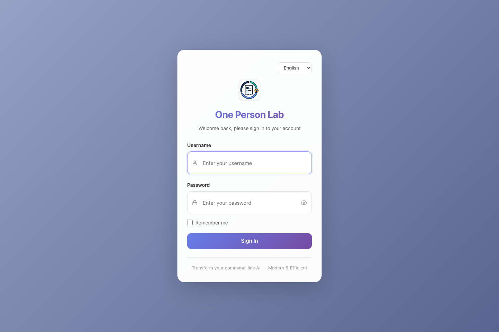
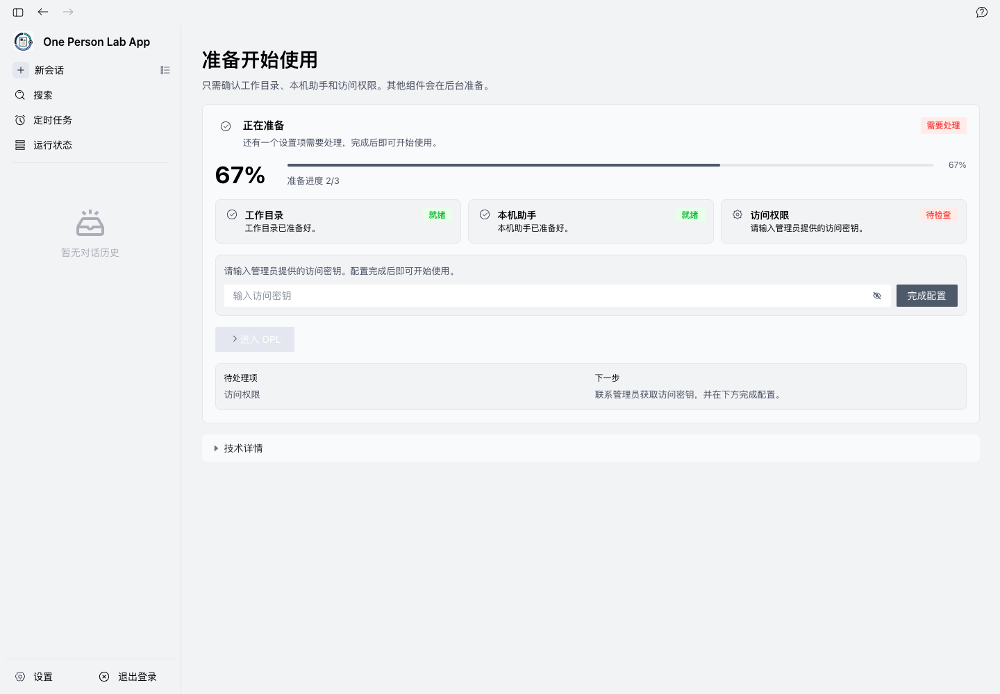
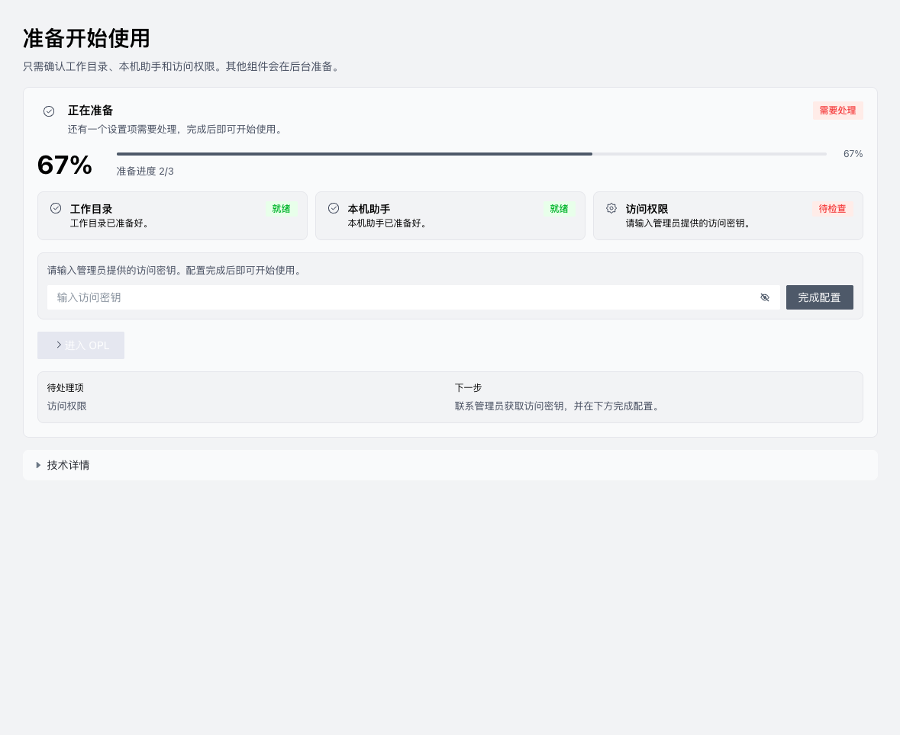
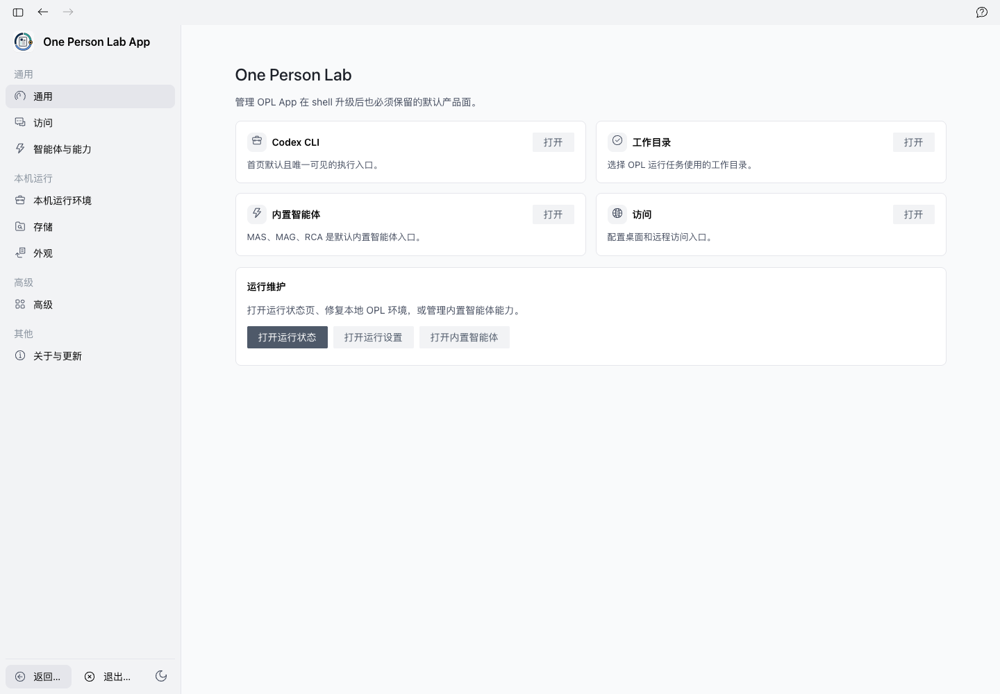

# One Person Lab Docker/WebUI 一键安装教程

Owner: `one-person-lab-app`
Purpose: `docker_webui_install_user_guide_source`
State: `active`
Machine boundary: Human-readable Docker/WebUI user guide source. App install contracts, release artifacts, GHCR publish receipts, shell Dockerfile, WebUI backend behavior, and live container smoke remain the machine truth.

适用对象：Linux、Windows 或服务器用户；默认没有 Docker 经验。

新手主路径是运行 One Person Lab 提供的一键安装器，然后在浏览器里完成首次配置。手动 Docker 命令只作为排障或高级部署路径保留。

镜像：`ghcr.io/gaofeng21cn/one-person-lab-webui:latest`

参考：https://github.com/gaofeng21cn/one-person-lab/blob/main/docs/references/current-support/opl-docker-webui-deployment.md

> 不要把访问密钥写进终端命令、环境变量、截图或公开文档。一键安装器只准备 Docker/WebUI、compose.yaml、数据目录和项目目录；模型/API 访问密钥在浏览器 WebUI 的首启访问页或 Settings -> Access 里填写。

## 准备清单

- 一台 Windows 10/11、Ubuntu Linux、Linux 服务器或可运行 Docker 的 macOS 机器。
- Windows 用户先安装并启动 Docker Desktop；Linux 服务器由管理员确认 Docker Engine 可用。
- 稳定网络，用于下载 Docker/WebUI 镜像和运行时组件。
- 准备固定保存目录：Windows 默认 `%USERPROFILE%\OnePersonLab`，Linux/macOS 默认 `$HOME/OnePersonLab`。
- 准备管理员提供的模型/API 访问密钥；密钥稍后只在浏览器 WebUI 里填写，不放进命令行。

## 1. 选择你的系统

先确认你要在哪台机器上运行 WebUI。本机 Windows 用户打开 PowerShell；Linux、macOS 或服务器用户打开 Terminal/终端。Windows 需要 Docker Desktop 已经启动，Linux 服务器需要 Docker Engine 已经可用。macOS 桌面新手仍优先使用 DMG、Homebrew 或 macOS App 一键安装；Docker/WebUI 更适合服务器、跨平台 WebUI 或需要容器部署的用户。

**系统入口**

```text
Windows -> PowerShell -> 一键 PowerShell 安装器
Linux / macOS / Server -> Terminal -> 一键 shell 安装器
macOS 桌面新手 -> DMG / Homebrew / macOS App 一键安装
所有 Docker/WebUI 路径最后都打开 http://localhost:3000/
```

重点：

- 不要先复制手动 docker run；新手主路径是一键安装器。
- Windows 如果看不到 Docker running，先打开 Docker Desktop。
- 服务器对外访问需要管理员配置域名、TLS、反向代理和访问控制。

说明：

- 本教程描述 repo 合同和安装 artifact 形态，不声明公开 GHCR latest 或一键脚本已经线上发布。
- Docker/WebUI 是浏览器入口，不替代 macOS 桌面 App 的普通安装路径。

## 2. 运行一键安装器

一键安装器负责创建 `OnePersonLab/data`、`OnePersonLab/projects` 和 `compose.yaml`，再用 Docker Compose 启动 WebUI。它不会询问或接收模型/API 访问密钥。新手可以直接复制在线命令；已经 clone 源码仓库的用户也可以运行本地脚本。

**一键命令**

```text
Linux / macOS 在线一键:
{{download.linux_macos_online_command}}

Windows PowerShell 在线一键:
{{download.windows_online_command}}

Windows 管理员一键安装 Docker/WSL2 依赖:
{{download.windows_admin_prerequisites_command}}

源码仓库内:
sh ./scripts/install-docker-webui.sh
powershell -ExecutionPolicy Bypass -File .\scripts\install-docker-webui.ps1 -Yes

安装器输出:
OnePersonLab/data -> 容器 /data
OnePersonLab/projects -> 容器 /projects
compose.yaml -> Docker Compose 启动定义
浏览器地址 -> http://localhost:3000/
```

重点：

- 访问密钥不出现在命令行，也不写进 compose.yaml。
- Windows 依赖安装只在显式使用 `-InstallPrerequisites` 时执行，并且需要管理员 PowerShell。
- 如果一键安装器提示 Docker 不可用，先修复 Docker Desktop 或 Docker Engine。
- 终端窗口或 compose 服务保持运行时，浏览器才能访问 WebUI。

说明：

- 合同要求 Linux/macOS shell 脚本、Windows PowerShell 脚本和 `compose.yaml` 共同构成 one-click installer model。
- 本指南只声明 repo artifact/contract；真实公开可用性以 release artifact、GHCR publish receipt 和 live smoke 为准。

## 3. 打开浏览器

安装器启动成功后，打开 Chrome、Edge、Safari 或 Firefox，在地址栏输入 `http://localhost:3000/`。如果部署在服务器上，使用管理员提供的 https 地址。Docker/WebUI 会自动配置本机浏览器会话；新手不需要输入 WebUI 用户名或密码。

**浏览器地址**

```text
本机电脑：http://localhost:3000/
服务器：使用管理员提供的 https 地址
正常情况：直接进入 One Person Lab WebUI
```



重点：

- 地址输入到浏览器地址栏，不是在搜索框里搜索。
- 如果页面打不开，先看安装器/compose/Docker 窗口是否仍在运行。
- 如果看到登录页，不要猜用户名密码；先刷新，再重启 WebUI。

说明：

- 截图来自本机 Docker 容器运行的 WebUI，浏览器已自动进入界面。
- 不同版本的首屏可能略有变化，但浏览器入口保持一致。

## 4. 在 WebUI 里填写访问密钥

首次进入后，如果页面提示访问配置未完成，联系管理员获取模型/API 访问密钥。拿到密钥后，在首启访问页的输入框里粘贴并保存；之后也可以从 Settings -> Access 进入同一个配置面。这个密钥不是 WebUI 登录密码，也不应该出现在终端命令里。

**访问密钥配置**

```text
1. 打开首启检查或 Settings -> Access
2. 在访问密钥输入框粘贴管理员提供的密钥
3. 点击保存或完成配置
4. 配置通过后进入 One Person Lab
```



重点：

- 不要把真实密钥写进聊天、截图、脚本、compose.yaml 或 shell 历史。
- 密钥保存到本机 `OnePersonLab/data` 对应的 WebUI 数据目录。
- 以后要更换密钥，从 Settings -> Access 处理。

说明：

- WebUI-first key entry 是 Docker/WebUI 新手路径的安全边界。
- 如果管理员要求使用组织代理、域名或 TLS，按组织部署说明处理。

## 5. 理解数据目录和项目目录

一键安装器会把主机上的 `OnePersonLab/data` 挂载到容器 `/data`，把 `OnePersonLab/projects` 挂载到容器 `/projects`。`data` 保存 WebUI 配置、登录会话、访问配置、运行维护记录、日志和缓存；`projects` 保存你的项目文件。升级、重建或替换容器时，不要删除这两个主机目录。

**持久化目录**

```text
Windows: %USERPROFILE%\OnePersonLab\data -> /data
Windows: %USERPROFILE%\OnePersonLab\projects -> /projects
Linux/macOS: $HOME/OnePersonLab/data -> /data
Linux/macOS: $HOME/OnePersonLab/projects -> /projects
```



重点：

- `OnePersonLab/data` 是 WebUI 内部状态，不要随手删除。
- `OnePersonLab/projects` 是项目文件位置，长期项目建议放这里。
- 容器可以替换；数据目录和项目目录才是用户状态。

说明：

- 合同固定容器内 `/data` 和 `/projects` 两个挂载点。
- WebUI 里的目录选择应从 `/projects` 开始找项目文件。

## 6. 下次打开、关闭和更新

日常使用时，先启动 Docker Desktop 或确认 Docker Engine 正常，再用安装器生成的 compose 入口启动 WebUI，浏览器访问 `http://localhost:3000/`。不用时停止 compose 服务。收到更新通知时，更新入口镜像或重新运行一键安装器生成的 compose 流程；只要保留 `OnePersonLab/data` 和 `OnePersonLab/projects`，配置和项目会继续保留。

**日常维护**

```text
打开：启动 Docker Desktop / Docker Engine
启动：使用安装器生成的 compose.yaml
访问：http://localhost:3000/
关闭：停止 compose 服务
更新：拉取新 WebUI 镜像或重新运行一键安装器
保留：OnePersonLab/data 和 OnePersonLab/projects
```



重点：

- 镜像更新主要更新 WebUI 外壳、启动器、bootstrap、基础系统层和预热内容。
- OPL Framework、Codex CLI、模块和维护状态以 WebUI 进入后的 OPL 维护结果为准。
- 不要把测试通过或文档生成当成线上 latest 已发布的证明。

说明：

- 真实 release/currentness 需要 release workflow、GHCR publish receipt 和 live smoke 证明。
- 本教程只给普通用户解释该怎么安全进入和维护 WebUI。

## 7. 高级路径：手动 Docker 排障

手动 `docker run` 和 `docker compose` 不是新手主路径。它们保留给技术支持确认镜像、端口、挂载和环境变量。手动命令也不能携带模型/API 访问密钥；密钥仍然只在 WebUI 里填写。

**手动 Docker 参考**

```text
docker run --rm -p 3000:3000 \
  -v "$HOME/OnePersonLab/data:/data" \
  -v "$HOME/OnePersonLab/projects:/projects" \
  -e AIONUI_ALLOW_REMOTE=true \
  -e AIONUI_DATA_DIR=/data \
  -e OPL_PROJECTS_DIR=/projects \
  ghcr.io/gaofeng21cn/one-person-lab-webui:latest

compose.yaml 也必须保留 /data、/projects 和浏览器 WebUI-first key entry 边界。
```

重点：

- 手动命令只用于排障、服务器高级部署或技术支持接管。
- 不要在 `docker run`、compose environment 或 shell history 中写访问密钥。
- 如果端口 3000 被占用，由技术支持调整端口映射和访问地址。

说明：

- Docker 官方安装细节仍以 Docker 文档为准；本教程不复刻 Docker 官方文档。
- 手动 fallback 不改变合同：新手主路径仍是一键安装器，密钥仍然 WebUI-first。

## 常见问题

- 一键安装器做什么：创建 `OnePersonLab/data`、`OnePersonLab/projects` 和 `compose.yaml`，然后启动 Docker/WebUI。
- 为什么不在命令里传访问密钥：命令行、环境变量和 shell 历史容易泄露；密钥必须在浏览器 WebUI 的访问配置里填写。
- Windows 找不到 Docker：先启动 Docker Desktop，等它显示 running，再重新运行 PowerShell 安装器。
- Linux 上 Docker 权限不够：让管理员确认 Docker Engine 和当前用户权限；临时排障可由管理员使用 `sudo`。
- 浏览器打不开 `localhost:3000`：确认 compose 服务仍在运行，3000 端口没有被占用，Docker 容器没有退出。
- 服务器给别人访问：不要直接裸露端口，请配置 TLS、域名、反向代理和访问控制。
- 数据在哪里：配置、访问状态、日志和缓存在 `OnePersonLab/data`；项目文件在 `OnePersonLab/projects`。
- 能不能只用手动 docker run：可以作为高级排障路径，但新手文档和合同默认一键安装器是主路径。
- 这个文档是否证明 latest 已发布：不能。本教程只证明 repo guide artifact 和合同已声明目标安装模型；公开发布仍看 release/GHCR/live smoke 证据。

## 验证方式

- 合同验证检查 Docker/WebUI installer model：一键 shell、PowerShell、compose.yaml、`/data`、`/projects`、无 CLI key、WebUI-first key entry、manual Docker fallback。
- 生成器会扫描 source、Markdown 和 HTML，禁止真实 secret marker 出现在教程 artifact 中。
- WebUI 自动登录行为由 Web CLI / web-host runtime 验证；本教程不把截图或文档当作 runtime-ready 证明。
- Docker 持久化边界按 App install exposure contract、active shell Dockerfile 和 web-cli 实现核对：`AIONUI_DATA_DIR=/data`，`OPL_PROJECTS_DIR=/projects`。
- 手动 Docker fallback 保留 `AIONUI_ALLOW_REMOTE`、`AIONUI_DATA_DIR` 和 `OPL_PROJECTS_DIR` 作为排障参考，不是新手主入口。
- 验证方式包括 `npm run docs:docker-webui-guide`、install exposure validator/release-boundary focused checks 和 JSON parse。

## 来源与边界

- 本教程是新手 onboarding artifact，不是 Docker 官方文档复刻，也不是 release-ready、runtime-ready 或 public latest 证明。
- Docker/WebUI 镜像坐标、构建发布和 release gate 归 `one-person-lab-app`；plain WebUI runtime 变量以 active shell Dockerfile / web-cli / web-host 为实现真相。
- Docker/WebUI one-click installer 合同要求 Linux/macOS shell、Windows PowerShell、compose.yaml、持久化 data/projects 目录、无 CLI key、WebUI-first key entry 和 manual Docker fallback。
- 截图资产保存在 `docs/delivery/user-guides/docker-webui-install/assets/`，生成器会校验文件存在、尺寸和 SHA256。
