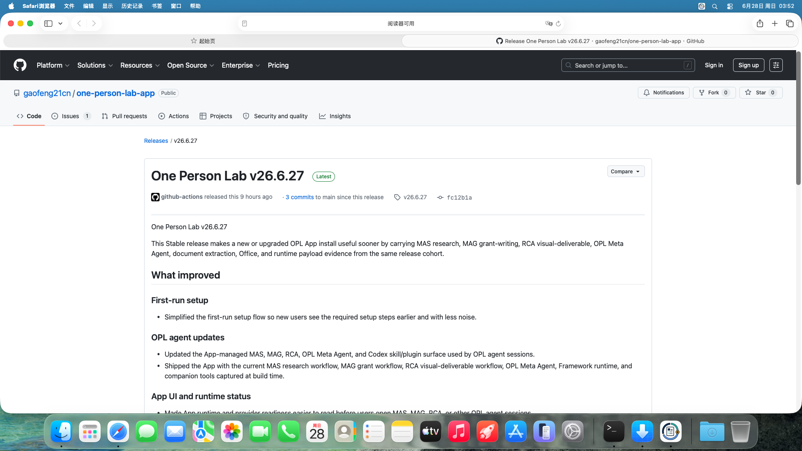
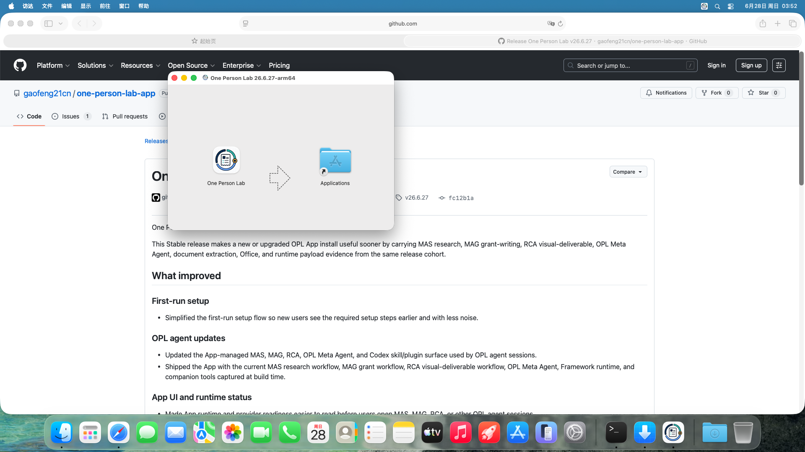
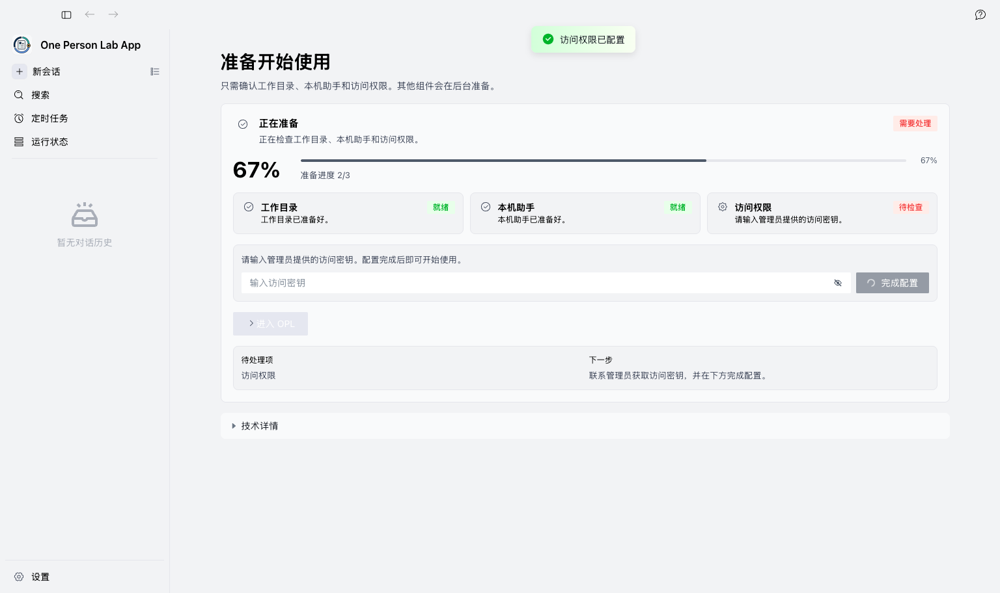
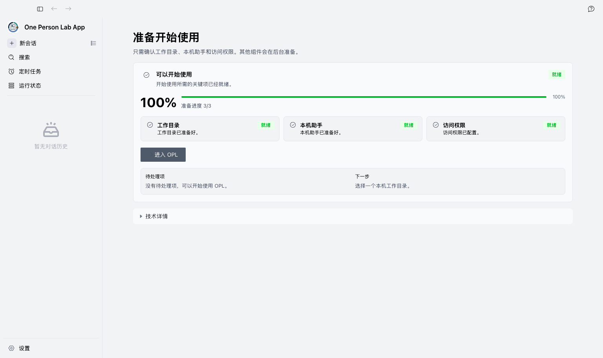
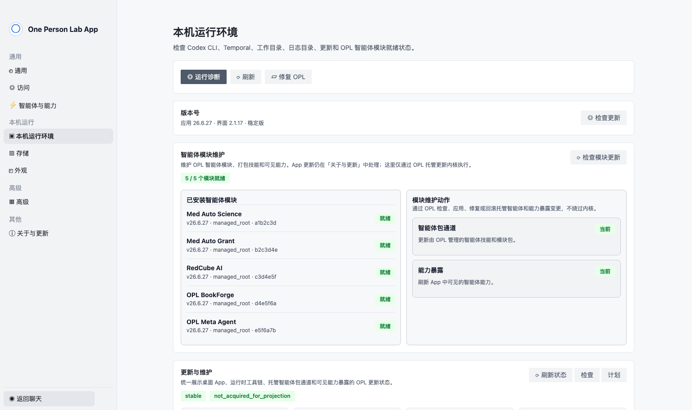
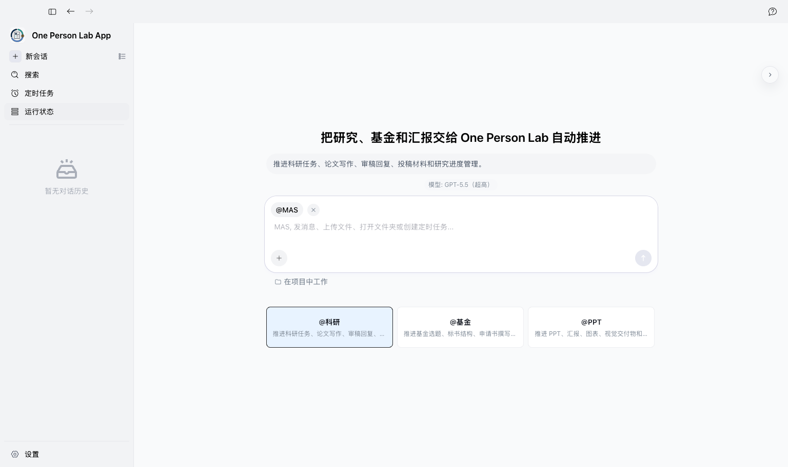
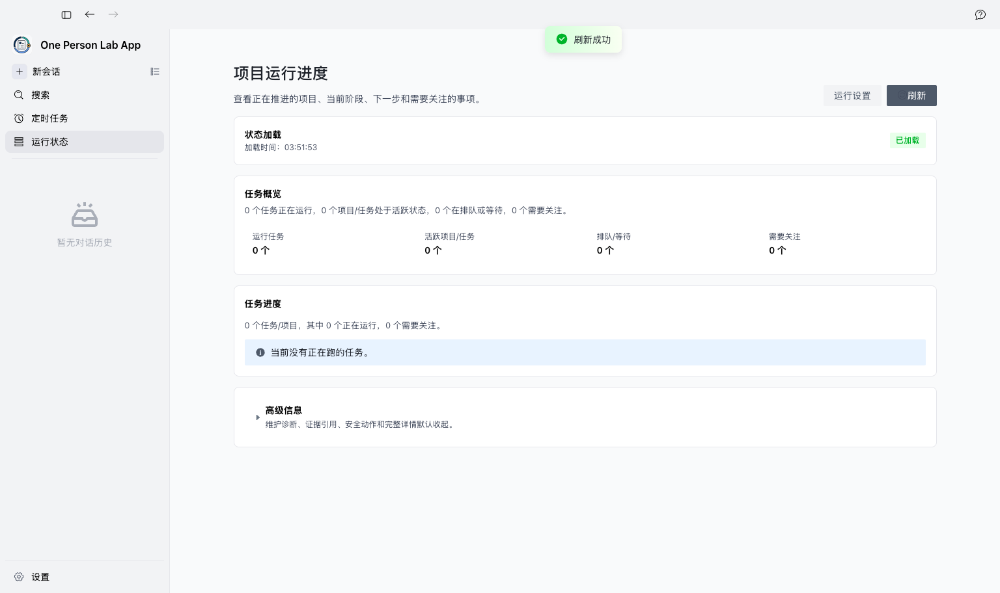

<!-- _class: cover -->

<strong>One Person Lab App</strong>macOS 首次安装与首启

  <h1>One Person Lab App 首次安装图文教程</h1>
  
按下载安装、首次配置、环境检查、科研入口和进度查看的顺序演示。

  
curl -fsSL <a href="https://raw.githubusercontent.com/gaofeng21cn/one-person-lab-app/main/install.sh">https://raw.githubusercontent.com/gaofeng21cn/one-person-lab-app/main/install.sh</a> | bash -s -- --stable-macos-install --yes

  
<ul><li>一台 Apple Silicon Mac 或可运行 macOS App 的 Mac。</li>
<li>稳定网络，用于下载 One Person Lab 和完成首次环境检查。</li>
<li>gflabtoken 开通状态；涉及访问权限时请联系 gflabtoken 管理员获取访问密钥。</li>
<li>本地研究数据文件夹，数据需完成脱敏并符合本机构数据管理要求。</li></ul>

<figure class="cover-shot">
  
</figure>

中文截图 · local-vm-guide-refresh-2026-06-28T03-49-46-243Z1 / 10

<!--
本教程用于 macOS App 首次安装和首启说明。截图来自 local-vm-guide-refresh-2026-06-28T03-49-46-243Z 的中文截图资产。
-->

---

<!-- _class: step -->

<strong>One Person Lab App</strong>macOS 首次安装与首启

<header class="step-title">
  <h1>1. 下载 One Person Lab</h1>
  
访问 One Person Lab App 最新 Release 页面，下载 macOS Apple Silicon DMG。首次安装或干净机器建议选择 Full ...

</header>

<main class="step-layout">
  <figure class="shot-frame">
    
  </figure>
  <aside class="focus">
    <h2>本页重点</h2>
    <ul><li>最新版本页面：<a href="https://github.com/gaofeng21cn/one-person-lab-app/releases/latest">https://github.com/gaofeng21cn/one-person-lab-app/releases/latest</a></li>
<li>最简单命令：install.sh --stable-macos-install --yes。</li>
<li>首次安装建议使用 Full 版 DMG。</li>
<li>需要轻量 App 包时可显式选择标准 DMG。</li></ul>
  </aside>
</main>

访问 One Person Lab App 最新 Release 页面，下载 macOS Apple Silicon DMG。首次安装或干净机器建议选择 Full 版 DMG。

截图来自 local-vm-guide-refresh-2026-06-28T03-49-46-243Z；PNG 保留原始尺寸。2 / 10

<!--
访问 One Person Lab App 最新 Release 页面，下载 macOS Apple Silicon DMG。首次安装或干净机器建议选择 Full 版 DMG。 最新版本页面：https://github.com/gaofeng21cn/one-person-lab-app/releases/latest 最简单命令：install.sh --stable-macos-install --yes。 首次安装建议使用 Full 版 DMG。 需要轻量 App 包时可显式选择标准 DMG。
-->

---

<!-- _class: step -->

<strong>One Person Lab App</strong>macOS 首次安装与首启

<header class="step-title">
  <h1>2. 安装 App</h1>
  
打开 DMG，将 One Person Lab 拖入 Applications。首次打开如出现 macOS 安全提示，按系统提示确认。

</header>

<main class="step-layout">
  <figure class="shot-frame">
    
  </figure>
  <aside class="focus">
    <h2>本页重点</h2>
    <ul><li>安装完成后从 Applications 启动 App。</li>
<li>不要长期在 DMG 挂载窗口内运行 App。</li></ul>
  </aside>
</main>

打开 DMG，将 One Person Lab 拖入 Applications。首次打开如出现 macOS 安全提示，按系统提示确认。

截图来自 local-vm-guide-refresh-2026-06-28T03-49-46-243Z；PNG 保留原始尺寸。3 / 10

<!--
打开 DMG，将 One Person Lab 拖入 Applications。首次打开如出现 macOS 安全提示，按系统提示确认。 安装完成后从 Applications 启动 App。 不要长期在 DMG 挂载窗口内运行 App。
-->

---

<!-- _class: step -->

<strong>One Person Lab App</strong>macOS 首次安装与首启

<header class="step-title">
  <h1>3. 配置访问权限</h1>
  
首次启动如果提示访问权限未配置，请联系 gflabtoken 管理员获取访问密钥，并在首启页面完成配置。

</header>

<main class="step-layout">
  <figure class="shot-frame">
    
  </figure>
  <aside class="focus">
    <h2>本页重点</h2>
    <ul><li>管理员开通后，在页面输入访问密钥。</li>
<li>点击完成配置后继续首启检查。</li>
<li>不要截图、转发或保存密钥到研究目录。</li></ul>
  </aside>
</main>

首次启动如果提示访问权限未配置，请联系 gflabtoken 管理员获取访问密钥，并在首启页面完成配置。

截图来自 local-vm-guide-refresh-2026-06-28T03-49-46-243Z；PNG 保留原始尺寸。4 / 10

<!--
首次启动如果提示访问权限未配置，请联系 gflabtoken 管理员获取访问密钥，并在首启页面完成配置。 管理员开通后，在页面输入访问密钥。 点击完成配置后继续首启检查。 不要截图、转发或保存密钥到研究目录。
-->

---

<!-- _class: step -->

<strong>One Person Lab App</strong>macOS 首次安装与首启

<header class="step-title">
  <h1>4. 等待首次环境检查</h1>
  
OPL 会先检查开始使用所需的关键项：工作目录、本机助手和访问权限。

</header>

<main class="step-layout">
  <figure class="shot-frame">
    
  </figure>
  <aside class="focus">
    <h2>本页重点</h2>
    <ul><li>首屏只显示“正在准备 / 可以开始 / 需要处理”的简短状态。</li>
<li>技术 phase、刷新和原始错误默认收在技术细节里。</li>
<li>遇到阻塞时先阅读界面提示。</li></ul>
  </aside>
</main>

OPL 会先检查开始使用所需的关键项：工作目录、本机助手和访问权限。

截图来自 local-vm-guide-refresh-2026-06-28T03-49-46-243Z；PNG 保留原始尺寸。5 / 10

<!--
OPL 会先检查开始使用所需的关键项：工作目录、本机助手和访问权限。 首屏只显示“正在准备 / 可以开始 / 需要处理”的简短状态。 技术 phase、刷新和原始错误默认收在技术细节里。 遇到阻塞时先阅读界面提示。
-->

---

<!-- _class: step -->

<strong>One Person Lab App</strong>macOS 首次安装与首启

<header class="step-title">
  <h1>5. 进入科研入口</h1>
  
准备完成后，根据目标选择科研、基金、演示或写书入口。本教程以科研入口为例。

</header>

<main class="step-layout">
  <figure class="shot-frame">
    
  </figure>
  <aside class="focus">
    <h2>本页重点</h2>
    <ul><li>通过 Research Foundry / Med Auto Science 进入 MAS。</li>
<li>基金、演示和写书入口分别对应 MAG、RCA 和 BookForge。</li>
<li>用户不需要另行获取这些专业 Agent 的分发资产。</li></ul>
  </aside>
</main>

准备完成后，根据目标选择科研、基金、演示或写书入口。本教程以科研入口为例。

截图来自 local-vm-guide-refresh-2026-06-28T03-49-46-243Z；PNG 保留原始尺寸。6 / 10

<!--
准备完成后，根据目标选择科研、基金、演示或写书入口。本教程以科研入口为例。 通过 Research Foundry / Med Auto Science 进入 MAS。 基金、演示和写书入口分别对应 MAG、RCA 和 BookForge。 用户不需要另行获取这些专业 Agent 的分发资产。
-->

---

<!-- _class: step -->

<strong>One Person Lab App</strong>macOS 首次安装与首启

<header class="step-title">
  <h1>6. 确认工作目录和运行设置</h1>
  
在本机运行环境中确认工作目录、Codex CLI、Temporal 和本机基础状态。

</header>

<main class="step-layout">
  <figure class="shot-frame">
    
  </figure>
  <aside class="focus">
    <h2>本页重点</h2>
    <ul><li>数据目录和运行入口从 Settings 的本机运行环境进入。</li>
<li>专业 Agent 能力在智能体与能力中查看。</li>
<li>App 与 OPL Packages 维护状态在关于与更新中查看。</li>
<li>患者数据需先脱敏，并遵守机构要求。</li></ul>
  </aside>
</main>

在本机运行环境中确认工作目录、Codex CLI、Temporal 和本机基础状态。

截图来自 local-vm-guide-refresh-2026-06-28T03-49-46-243Z；PNG 保留原始尺寸。7 / 10

<!--
在本机运行环境中确认工作目录、Codex CLI、Temporal 和本机基础状态。 数据目录和运行入口从 Settings 的本机运行环境进入。 专业 Agent 能力在智能体与能力中查看。 App 与 OPL Packages 维护状态在关于与更新中查看。 患者数据需先脱敏，并遵守机构要求。
-->

---

<!-- _class: step -->

<strong>One Person Lab App</strong>macOS 首次安装与首启

<header class="step-title">
  <h1>7. 发起首次科研任务</h1>
  
第一条任务可直接用自然语言描述，让 MAS 先判断研究方向、证据缺口和下一步。

</header>

<main class="step-layout">
  <figure class="shot-frame">
    
  </figure>
  <aside class="focus">
    <h2>本页重点</h2>
    <ul><li>示例提示词写清数据类型、workspace、原始材料位置和目标产物。</li></ul>
  </aside>
</main>

第一条任务可直接用自然语言描述，让 MAS 先判断研究方向、证据缺口和下一步。

截图来自 local-vm-guide-refresh-2026-06-28T03-49-46-243Z；PNG 保留原始尺寸。8 / 10

<!--
第一条任务可直接用自然语言描述，让 MAS 先判断研究方向、证据缺口和下一步。 示例提示词写清数据类型、workspace、原始材料位置和目标产物。 我有一批肺结节随访数据，专病 workspace 在“肺结节真实世界研究”，原始材料在 raw_data/，请先判断最值得推进的研究问题，并说明还缺哪些证据，目标是形成一篇可投稿论文。
-->

---

<!-- _class: step -->

<strong>One Person Lab App</strong>macOS 首次安装与首启

<header class="step-title">
  <h1>8. 查看进度与结果</h1>
  
任务启动后，重点查看当前阶段、阻塞项、下一步和产物位置。

</header>

<main class="step-layout">
  <figure class="shot-frame">
    
  </figure>
  <aside class="focus">
    <h2>本页重点</h2>
    <ul><li>看到人工确认项时，由研究者或 PI 判断。</li>
<li>投稿前科学判断、伦理合规和署名仍由团队负责。</li></ul>
  </aside>
</main>

任务启动后，重点查看当前阶段、阻塞项、下一步和产物位置。

截图来自 local-vm-guide-refresh-2026-06-28T03-49-46-243Z；PNG 保留原始尺寸。9 / 10

<!--
任务启动后，重点查看当前阶段、阻塞项、下一步和产物位置。 看到人工确认项时，由研究者或 PI 判断。 投稿前科学判断、伦理合规和署名仍由团队负责。
-->

---

<!-- _class: final -->

<strong>One Person Lab App</strong>macOS 首次安装与首启

<header class="final-title">
  <h1>常见问题与验证来源</h1>
  
遇到下载、权限、模块、数据路径问题时，先按界面提示和本页检查。

</header>

<main class="final-grid">
  

    <h2>常见问题</h2>
    <ul><li>GitHub Release 下载入口：<a href="https://github.com/gaofeng21cn/one-person-lab-app/releases/latest">https://github.com/gaofeng21cn/one-person-lab-app/releases/latest</a></li>
<li>下载失败：换网络后重试，或请技术支持人员确认 GitHub Release 是否可访问。</li>
<li>访问权限未配置：联系 gflabtoken 管理员获取访问密钥，并在首启页面完成配置。</li>
<li>模块未就绪：在本机运行环境或关于与更新中重新检查维护状态。</li>
<li>Release、DMG、首启日志和模块状态以 App repo contracts / workflow / VM smoke artifacts 为机器真相。</li></ul>
  

  

    <h2>验证来源</h2>
    <ul><li>Release、DMG、首启日志和模块状态以 App repo contracts / workflow / VM smoke artifacts 为机器真相。</li>
<li>截图 manifest 记录来源、语言、尺寸、SHA 和预期中文界面文案。</li>
<li>PPTX/PDF 幻灯片由静态 Marp 编译链路生成，并逐页渲染检查。</li></ul>
  

</main>

涉及访问权限配置时，请联系 gflabtoken 管理员获取访问密钥。不要截图、转发或保存密钥到研究目录。

GitHub Release: <a href="https://github.com/gaofeng21cn/one-person-lab-app/releases/latest">https://github.com/gaofeng21cn/one-person-lab-app/releases/latest</a>10 / 10

<!--
GitHub Release 下载入口：https://github.com/gaofeng21cn/one-person-lab-app/releases/latest 下载失败：换网络后重试，或请技术支持人员确认 GitHub Release 是否可访问。 访问权限未配置：联系 gflabtoken 管理员获取访问密钥，并在首启页面完成配置。 模块未就绪：在本机运行环境或关于与更新中重新检查维护状态。 Release、DMG、首启日志和模块状态以 App repo contracts / workflow / VM smoke artifacts 为机器真相。 Release、DMG、首启日志和模块状态以 App repo contracts / workflow / VM smoke artifacts 为机器真相。 截图 manifest 记录来源、语言、尺寸、SHA 和预期中文界面文案。 PPTX/PDF 幻灯片由静态 Marp 编译链路生成，并逐页渲染检查。
-->
