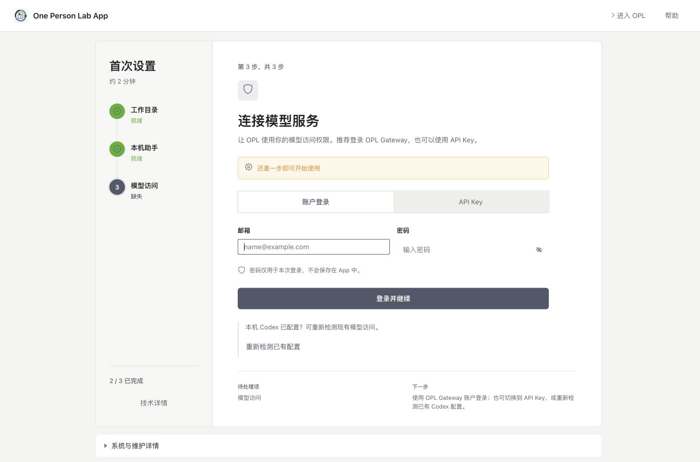

适用对象：希望在 Windows 或 Linux 电脑上通过浏览器使用 One Person Lab 的用户；默认不要求 Docker 经验。

本文以 **Windows x64 + Docker Desktop + WSL 2** 为主要路径。安装完成后，浏览器会直接打开 One Person Lab 工作台；如果模型访问等首次设置尚未完成，再从工作台进入“完成首次设置”。

::: {.callout-note title="先了解两个边界"}

- 本机安装只允许当前电脑访问 `http://localhost:3000/`，不需要注册 WebUI 账号或输入 WebUI 登录密码。
- OPL Gateway 账户邮箱/密码和 API Key 都只在浏览器 WebUI 中填写。不要把凭据放进 PowerShell、环境变量、`compose.yaml`、聊天或截图。

:::

## 安装路径总览

1. 安装并启动 Docker Desktop，确认使用 WSL 2 和 Linux containers。
2. 在 PowerShell 运行 One Person Lab 一键安装器。
3. 浏览器打开 `http://localhost:3000/`，直接进入工作台。
4. 如果侧栏出现“完成首次设置”，按提示完成模型访问配置。

## 准备清单

### Windows

- 64 位 x64 电脑。当前 WebUI 镜像与 Windows 验证路径以 `linux/amd64`、Windows X64 为准；Windows ARM 暂不作为本教程的验证路径。
- Docker Desktop 当前支持的 Windows 版本。请以 [Docker Desktop Windows 安装页]({{download.docker_desktop_windows_url}}) 的最新系统要求为准。
- WSL 2、硬件虚拟化和 Linux containers 模式。
- 能够安装 Docker Desktop；单位管理的电脑可能需要管理员协助。
- 稳定网络和足够的 Docker 磁盘空间。

### Linux

- 能够运行 Docker Engine 的 x64 Linux 电脑或服务器。
- 当前用户可以运行 `docker` 和 `docker compose`。
- 公网服务器不要使用本机免密码路径，参见本文末尾的“服务器部署”。

### 模型访问

默认使用 OPL Gateway 账户登录，准备好 Gateway 账户邮箱和密码即可。API Key 只作为兼容或备用方式；暂时没有可用凭据也可以先打开工作台，但完成模型访问配置前不能正常发送模型请求。

## 1. 准备 Docker

### Windows：安装 Docker Desktop

1. 打开 [Docker Desktop Windows 安装页]({{download.docker_desktop_windows_url}})。
2. 下载并安装 Docker Desktop，保持 WSL 2 相关推荐设置。
3. 按提示重启电脑或重新登录。
4. 确认 Docker Desktop 使用 **Linux containers**。如果菜单显示“Switch to Linux containers”，请先执行切换。

普通一键安装器会自动启动已经安装的 Docker Desktop 并等待 Engine 就绪，不需要每次先手工打开。如果 Docker Desktop 首次启动显示许可、WSL 2 或登录提示，请按提示完成一次，再重新运行一键安装命令。

需要排查依赖时，在普通 PowerShell 中确认：

```powershell
wsl --status
docker version
docker compose version
```

::: {.callout-warning title="Docker 或 WSL 2 尚未安装"}

如果后续一键安装命令提示缺少 Docker Desktop 或 WSL 2，并且你有管理员权限，可以在“以管理员身份运行”的 PowerShell 中执行：

```powershell
{{download.windows_admin_prerequisites_command}}
```

Windows 要求重启时，先重启，再用普通 PowerShell 重新运行一键安装命令。只有安装 Docker Desktop 或启用 WSL 2 依赖时才使用管理员 PowerShell。

:::

### Linux：准备 Docker Engine

Ubuntu 用户可参考 [Docker Engine Ubuntu 安装页]({{download.docker_engine_ubuntu_url}})。安装完成后确认：

```bash
docker version
docker compose version
```

如果提示权限不足，请先由管理员完成 Docker Engine 和当前用户权限配置，不要使用删除数据目录的方式排障。

## 2. 运行一键安装器

### Windows PowerShell

打开普通 PowerShell 窗口，复制并运行：

```powershell
{{download.windows_online_command}}
```

### Linux 终端

```bash
repo='gaofeng21cn/one-person-lab-app'
root="https://raw.githubusercontent.com/$repo/main"
curl -fsSL "$root/scripts/install-docker-webui.sh" |
  bash -s -- --yes
```

安装器会拉取 One Person Lab WebUI 镜像、创建 `compose.yaml` 和两个持久目录，然后启动 WebUI。默认映射如下：

| 宿主机目录 | 容器内路径 | 保存内容 |
|---|---|---|
| `OnePersonLab/data` | `/data` | WebUI 配置、状态和日志 |
| `OnePersonLab/projects` | `/projects` | 项目材料与生成结果 |

安装成功后会自动打开浏览器，并在终端显示：

```text
http://localhost:3000/
```

## 3. 打开 WebUI

使用 Edge、Chrome 或 Firefox 打开 <http://localhost:3000/>。

本机 Docker 安装会自动建立本机 WebUI 会话。当前产品入口直接进入工作台，不再把设备检查页作为普通启动门槛。

{width=96% fig-align="center"}

如果页面打不开：

- 确认 Docker Desktop 或 Docker Engine 仍在运行。
- 查看安装器最后一屏是否报告镜像、端口或健康检查错误。
- 确认 Docker Desktop 没有切换到 Windows containers。
- 重新运行安装命令不会删除已有的 `data` 和 `projects` 目录。

## 4. 完成首次设置

工作台会在后台读取当前状态。只有工作目录、本机助手或模型访问尚未完成时，侧栏才会显示“完成首次设置”；点击后进入独立的首次设置页面。

{width=96% fig-align="center"}

首次设置包含三个项目：

1. **工作目录**：Docker WebUI 固定使用容器内 `/projects`，对应宿主机 `OnePersonLab/projects`。
2. **本机助手**：确认容器中的 Codex CLI 可以运行。
3. **模型访问**：WebUI 默认使用 Gateway 账户登录，也可以切换到 API Key，或重新检测已有配置。

### 配置模型访问

保持默认的“账户登录”，输入 OPL Gateway 账户邮箱和密码，然后点击“登录并继续”。密码仅用于本次登录，不会保存在 App 中。

{width=96% fig-align="center"}

登录成功后，如果页面出现“设为模型访问方式”，再点击一次确认。账户连接和切换模型访问方式是两个明确步骤，只有需要确认时页面才会显示第二个按钮。

“重新检测已有配置”只检查同一 `OnePersonLab/data` 持久目录中已有的 WebUI/Codex 配置。Windows 宿主机原有的 `%USERPROFILE%\.codex` 登录或配置不会自动挂载进容器。

暂时没有 Gateway 账户或 API Key 时可以先进入工作台。准备好后，打开：

```text
设置 -> 账户与模型 -> 账户与访问
```

{width=96% fig-align="center"}

默认模型和推理强度位于“设置 -> 账户与模型 -> 模型”，与凭据管理是两个独立页面。

::: {.callout-important title="不要混淆三种凭据"}

- **OPL Gateway 账户邮箱和密码**：默认的模型服务登录方式，在首次设置或“账户与访问”中填写。
- **OPL Gateway API Key**：兼容或备用的模型访问方式，可在同一页面切换后填写。
- **WebUI 登录密码**：只用于服务器或公网部署的浏览器登录；普通本机安装不会要求。

:::

## 5. 日常使用与更新

Windows 日常使用时可以直接重新运行安装器，它会在需要时启动 Docker Desktop；Linux 先确认 Docker Engine 正常。浏览器继续访问 <http://localhost:3000/>。

Windows 更新 WebUI 时，在普通 PowerShell 中运行下面这一行；显式 `-Update` 会拉取 stable、按不可变 digest 重建容器：

```powershell
{{download.windows_update_command}}
```

Linux 重新运行同一条一键安装命令即可。两条路径都会保留：

```text
Windows: %USERPROFILE%\OnePersonLab\data
Windows: %USERPROFILE%\OnePersonLab\projects
Linux:   $HOME/OnePersonLab/data
Linux:   $HOME/OnePersonLab/projects
```

建议定期备份 `projects`。不要把 `data` 当作 Docker 缓存删除，否则会丢失 WebUI 配置和本机状态。

## 常见问题

### Windows 提示找不到 Docker 或 WSL

重新运行普通一键安装命令；安装器会自动尝试启动已安装的 Docker Desktop。如果 Docker Desktop 首次启动仍有许可、WSL 2 或登录提示，请手工打开并完成提示。在 PowerShell 中重新执行 `wsl --status`、`docker version` 和 `docker compose version`；如果依赖确实缺失，再使用前文的管理员依赖安装命令。

### 提示端口 3000 已被占用

下载脚本后改用其它本机端口，例如：

```powershell
$repo = 'gaofeng21cn/one-person-lab-app'
$root = "https://raw.githubusercontent.com/$repo/main"
$p = Join-Path $env:TEMP 'install-docker-webui.ps1'
iwr -UseBasicParsing "$root/scripts/install-docker-webui.ps1" -OutFile $p
powershell -ExecutionPolicy Bypass -File $p -Port 3001 -Yes
```

随后访问 `http://localhost:3001/`。

### 页面启动失败，怎样收集诊断信息

健康检查超时时，安装器会输出自动生成的诊断目录。也可以主动指定诊断目录：

```powershell
$repo = 'gaofeng21cn/one-person-lab-app'
$root = "https://raw.githubusercontent.com/$repo/main"
$p = Join-Path $env:TEMP 'install-docker-webui.ps1'
iwr -UseBasicParsing "$root/scripts/install-docker-webui.ps1" -OutFile $p
powershell -ExecutionPolicy Bypass -File $p `
  -Yes -NoOpen `
  -DiagnosticsDir "$env:USERPROFILE\OnePersonLab\diagnostics"
```

发送诊断材料前仍应检查并遮挡个人路径或凭据。不要发送 Gateway 密码或完整 API Key。

### 本机安装为什么短暂出现登录页

本机 WebUI 首次启动时需要几秒钟初始化自动会话。如果浏览器过早打开并短暂显示登录页，请等待几秒后刷新页面；正常本机安装会自动进入工作台，不需要猜测或重置 WebUI 密码。若刷新后仍显示登录页，请确认使用的是本机安装路径，而不是配置了登录密码的服务器部署。

### 已经在 Windows 上使用 Codex，容器能自动复用吗

不能自动复用宿主机 `.codex`。Docker WebUI 只保留挂载到 `/data` 的配置，但可以在浏览器内登录 OPL Gateway 账户，或切换到 API Key。重装或更新时保留 `OnePersonLab/data` 即可复用原 WebUI 配置。

### 暂时没有 Gateway 账户或 API Key

可以先进入工作台，之后从“设置 -> 账户与模型 -> 账户与访问”补充；完成前模型请求不可用。

## 服务器部署

::: {.callout-warning title="不要把本机 3000 端口直接暴露到公网"}

云服务器、办公室服务器或任何可能被其他电脑访问的环境，必须配置 WebUI 登录密码、HTTPS 和访问控制。本机自动登录路径不适用于公网。

:::

服务器路径由技术人员参照 [Docker/WebUI 高级部署说明]({{download.support_reference_url}}) 处理。
