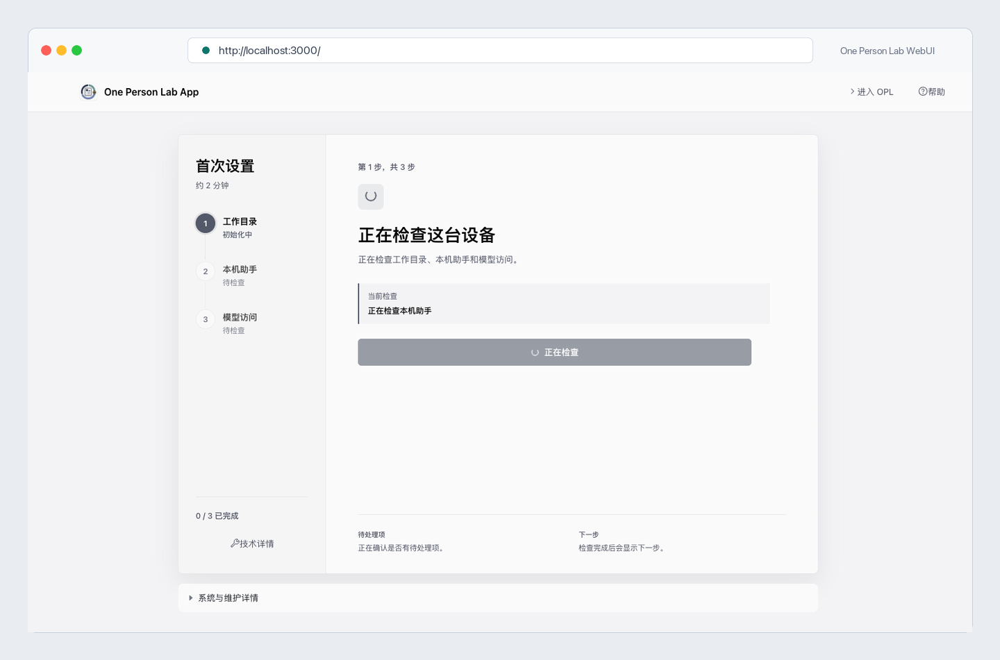
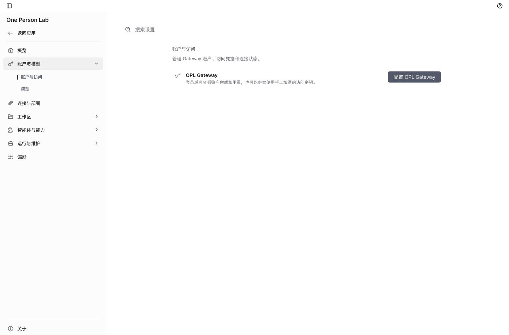

适用对象：Linux、Windows 或服务器用户；默认没有 Docker 经验。

新手主路径是先让 Docker 正常运行，再运行 One Person Lab 提供的一键安装器，最后在浏览器里完成首次配置。手动 Docker 命令只作为排障或高级部署路径保留。

镜像：`{{download.image}}`

参考：<{{download.support_reference_url}}>

> 不要把访问密钥写进终端命令、环境变量、截图或公开文档。一键安装器只准备 Docker/WebUI、`compose.yaml`、数据目录和项目目录；模型/API 访问密钥在浏览器 WebUI 的首启访问页或“设置 -> 访问”里填写。

## 准备清单

- 一台 Windows 10/11、Ubuntu Linux、Linux 服务器或可运行 Docker 的 macOS 机器。
- Windows 用户先安装并启动 Docker Desktop，看到 Docker Desktop 处于 Running/运行中后再继续。
- Linux 用户打开终端；如果系统里还没有 Docker，请先让管理员安装 Docker Engine 并确认当前用户可以运行 Docker。
- 稳定网络，用于下载 Docker/WebUI 镜像和运行时组件。
- 准备固定保存目录：Windows 默认 `%USERPROFILE%\OnePersonLab`，Linux/macOS 默认 `$HOME/OnePersonLab`。
- 如果这台机器已有旧的 `OnePersonLab/data`，先保留并记录目录内容；不要为了重装而删除。
- 准备管理员提供的模型/API 访问密钥；密钥稍后只在浏览器 WebUI 里填写，不放进命令行。

## 1. 选择你的系统

Windows 用户用 Docker Desktop 提供 Docker 环境，再用 PowerShell 运行一键安装器。Linux 用户在终端运行一键安装器，前提是系统里的 Docker Engine 已经可用。

macOS 桌面新手仍优先使用 DMG、Homebrew 或 macOS App 一键安装；Docker/WebUI 更适合服务器、跨平台 WebUI 或需要容器部署的用户。

```text
Windows -> 安装并打开 Docker Desktop -> PowerShell -> 一键安装器
Linux / Server -> Terminal -> 一键安装器
macOS 桌面新手 -> DMG / Homebrew / macOS App 一键安装
所有 Docker/WebUI 路径最后都打开 http://localhost:3000/
```

重点：

- 不要先复制手动 `docker run`；新手主路径是一键安装器。
- Windows 如果看不到 Docker Desktop running/运行中，先打开 Docker Desktop，等它启动完成。
- Linux 如果命令提示没有 Docker 或权限不足，请先让管理员处理 Docker Engine 和用户权限。
- 服务器对外访问需要管理员配置域名、TLS、反向代理和访问控制。

普通用户默认镜像入口是安装器里的 WebUI full seed 镜像；`--tag` 和 `--image` 是技术支持或高级部署才使用的覆盖项。是否已经具备 release、真实安装或 clean VM 通过状态，必须看对应 release/GHCR/smoke artifact 或 typed blocker；本教程本身只说明用户路径。

## 2. Windows：安装并启动 Docker Desktop

Windows 上不要先运行 `docker run`。先打开 Docker 官方下载页安装 Docker Desktop。安装过程中如果提示使用 WSL 2，请保持默认选择；安装结束后重启电脑或重新登录。

重新进入桌面后，打开 Docker Desktop，等待状态显示 Docker 正在运行，然后再打开 PowerShell 执行 One Person Lab 一键安装命令。

```text
1. 打开 Docker Desktop 官方 Windows 安装页:
{{download.docker_desktop_windows_url}}
2. 下载并安装 Docker Desktop
3. 安装向导里保持 WSL 2 / recommended settings 默认选择
4. 按提示重启电脑或重新登录
5. 打开 Docker Desktop，等到 Running/运行中
6. 打开 PowerShell，进入下一步运行 OPL 安装器
```

重点：

- 这一步只做一次；以后日常使用只需要先打开 Docker Desktop。
- 如果公司电脑限制安装软件，需要管理员先允许 Docker Desktop 和 WSL 2。
- Docker Desktop 没有运行时，浏览器里的 WebUI 也打不开。

## 3. 运行一键安装器

一键安装器负责在 Home 目录下创建 `OnePersonLab/data`、`OnePersonLab/projects` 和 `compose.yaml`，再启动 WebUI。即使 Home 目录下还没有 `OnePersonLab`，安装器也会自动创建目录和子目录。

它不会询问或接收模型/API 访问密钥。新手可以直接复制在线命令；已经 clone 源码仓库的用户也可以运行本地脚本。

Linux / macOS 终端在线一键：

```bash
git clone {{download.source_repo}}
cd one-person-lab-app
sh ./scripts/install-docker-webui.sh --yes
```

Windows PowerShell 在线一键：

```powershell
git clone {{download.source_repo}}
cd one-person-lab-app
powershell -ExecutionPolicy Bypass `
  -File .\scripts\install-docker-webui.ps1 -Yes
```

Windows 管理员依赖安装入口（只有 Docker Desktop/WSL2 缺失时使用）：

```powershell
powershell -ExecutionPolicy Bypass `
  -File .\scripts\install-docker-webui.ps1 `
  -InstallPrerequisites -Yes
```

源码仓库内：

```text
sh ./scripts/install-docker-webui.sh
powershell -ExecutionPolicy Bypass -File .\scripts\install-docker-webui.ps1 -Yes

安装器输出：
OnePersonLab/data -> 容器 /data
OnePersonLab/projects -> 容器 /projects
compose.yaml -> Docker Compose 启动定义
浏览器地址 -> http://localhost:3000/
```

重点：

- 访问密钥不出现在命令行，也不写进 `compose.yaml`。
- Windows 依赖安装只在显式使用 `-InstallPrerequisites` 时执行，并且需要管理员 PowerShell。
- 如果一键安装器提示 Docker 不可用，Windows 先启动 Docker Desktop；Linux 先让管理员修复 Docker Engine。
- 如果 `OnePersonLab/data` 已存在，一键安装器会按保留/迁移边界处理，不能把旧数据目录当作可删除缓存。
- 终端窗口或 compose 服务保持运行时，浏览器才能访问 WebUI。

安装器输出会先报告普通用户路径状态：一键安装、浏览器地址、访问密钥入口、runtime proxy、startup doctor 和 data preservation。operator 或技术支持应优先读这些状态，再进入 release evidence、preflight 或 smoke artifact 细节。

## 4. 打开浏览器

安装器启动成功后，打开 Chrome、Edge、Safari 或 Firefox，在地址栏输入 `http://localhost:3000/`。如果部署在服务器上，使用管理员提供的 https 地址。

Docker/WebUI 会自动配置本机浏览器会话；新手不需要输入 WebUI 用户名或密码。



重点：

- 地址输入到浏览器地址栏，不是在搜索框里搜索。
- 如果页面打不开，先看安装器、compose 或 Docker 窗口是否仍在运行。
- 如果看到登录页，不要猜用户名密码；先刷新，再重启 WebUI。
- 截图里的会话状态来自自动会话，不需要你注册或输入账号密码。

## 5. 确认页面已经可用

正常情况下，浏览器会直接进入 One Person Lab WebUI，不需要输入 WebUI 用户名或密码。页面打开后，看到首屏、访问配置入口或设置入口，就可以继续下一步填写访问密钥。

```text
新手看到这些即可继续:
1. 浏览器能打开 http://localhost:3000/
2. 没有要求输入 WebUI 用户名或密码
3. 页面出现 One Person Lab 或访问配置入口
4. 可以进入设置或访问密钥配置

技术支持排障时再检查:
compose.yaml
docker ps
docker logs
HTTP health readback
auth user readback
install manifest readback
projects mount readback
```

普通用户不需要理解 Docker 日志；页面打不开时把安装器输出交给技术支持。日志和 readback 里如果出现访问密钥，先脱敏再发送。

如果启动失败，优先运行安装器自带 startup doctor 或让技术支持收集诊断包。诊断包应包含 `compose.yaml`、Docker 版本、compose 状态、容器日志、HTTP probe、目录 readback 和 data-preservation verdict；诊断包不能包含真实访问密钥。

## 6. 在 WebUI 里填写访问密钥

首次进入后，如果页面提示访问配置未完成，联系管理员获取模型/API 访问密钥。拿到密钥后，在首启访问页的输入框里粘贴并保存；之后也可以从“设置 -> 访问”进入同一个配置面。

这个密钥不是 WebUI 登录密码，也不应该出现在终端命令里。


```text
1. 打开首启检查或 设置 -> 访问
2. 在访问密钥输入框粘贴管理员提供的密钥
3. 点击保存或完成配置
4. WebUI 通过 runtime proxy smoke 调用 `opl system configure-codex --api-key-stdin --json`
5. 配置通过后进入 One Person Lab
```

重点：

- 不要把真实密钥写进聊天、截图、脚本、`compose.yaml` 或 shell 历史。
- 密钥保存到本机 `OnePersonLab/data` 对应的 WebUI 数据目录。
- runtime proxy smoke 只验证浏览器访问配置能走 stdin 传输，不把密钥写进安装命令或诊断包。
- 以后要更换密钥，从“设置 -> 访问”处理。



## 7. 理解数据目录和项目目录

一键安装器会把主机上的 `OnePersonLab/data` 挂载到容器 `/data`，把 `OnePersonLab/projects` 挂载到容器 `/projects`。

`data` 保存 WebUI 配置、访问配置、会话历史、运行维护记录、日志、缓存和更新 receipt；`projects` 保存你的项目文件。升级、重建或替换容器时，不要删除这两个主机目录。

如果机器上已有旧的 `OnePersonLab/data`，正确结果是保留或迁移，并能在诊断包里看到迁移/保留记录和安装清单 readback。


```text
Windows: %USERPROFILE%\OnePersonLab\data -> /data
Windows: %USERPROFILE%\OnePersonLab\projects -> /projects
Linux/macOS: $HOME/OnePersonLab/data -> /data
Linux/macOS: $HOME/OnePersonLab/projects -> /projects
```

重点：

- `OnePersonLab/data` 是 WebUI 内部状态，不要随手删除。
- `OnePersonLab/projects` 是项目文件位置，长期项目建议放这里。
- 项目文件放 `/projects`，不要把 `/data` 当工作目录。
- 容器可以替换；数据目录和项目目录才是用户状态。

## 8. 下次打开、关闭和更新

日常使用时，Windows 先启动 Docker Desktop；Linux 先确认 Docker Engine 正常。然后用安装器生成的 compose 入口启动 WebUI，浏览器访问 `http://localhost:3000/`。不用时停止 compose 服务。

OPL Framework、Codex CLI 和模块主要由进入 WebUI 后的 OPL 维护机制检查和更新。WebUI 入口镜像、基础系统层、启动器或预热内容更新时，在主机上重新运行一键安装器，或使用显式更新模式。更新路径会拉取新的 WebUI 镜像并用同一个 `compose.yaml` 重建服务。

只要保留 `OnePersonLab/data` 和 `OnePersonLab/projects`，配置、会话历史和项目文件会继续保留。

```text
打开：启动 Docker Desktop / Docker Engine
启动：使用安装器生成的 compose.yaml
访问：http://localhost:3000/
关闭：停止 compose 服务
日常模块更新：进入 WebUI 后按 OPL 维护提示处理
入口镜像更新：重跑一键安装器，或运行 install-docker-webui.sh --update / install-docker-webui.ps1 -Update
保留：OnePersonLab/data 和 OnePersonLab/projects
operator progress：进入 WebUI 后看首启检查、设置里的访问状态和维护提示
ordinary_docker_webui_user_path：一键安装 -> 浏览器 WebUI -> Settings -> Access -> runtime proxy -> startup doctor -> data preservation
```

重点：

- 镜像更新主要更新 WebUI 外壳、启动器、bootstrap、基础系统层和预热内容。
- OPL Framework、Codex CLI、模块和维护状态以 WebUI 进入后的 OPL 维护结果为准。
- Docker/WebUI 不通过浏览器 WebUI 挂载 Docker socket 自我更新容器，也不需要 Watchtower。
- 定期或收到通知时在主机上拉取新镜像；替换容器前确认 `data/projects` 仍映射到同一个主机目录。

## 9. 高级路径：手动 Docker 排障

手动 `docker run` 和 `docker compose` 不是新手主路径。它们保留给技术支持确认镜像、端口、挂载和环境变量。手动命令也不能携带模型/API 访问密钥；密钥仍然只在 WebUI 里填写。

```bash
docker run --rm -p 3000:3000 \
  -v "$HOME/OnePersonLab/data:/data" \
  -v "$HOME/OnePersonLab/projects:/projects" \
  -e AIONUI_ALLOW_REMOTE=true \
  -e AIONUI_DATA_DIR=/data \
  -e OPL_PROJECTS_DIR=/projects \
  {{download.image}}
```

`compose.yaml` 也必须保留 `/data`、`/projects` 和浏览器 WebUI-first key entry 边界。

## 10. 发布验证边界

Docker/WebUI 发布验收不是只看文档、合同或本地容器启动。release/GHCR/smoke 结论只来自对应 workflow artifact、publish receipt、VM smoke result 或 typed blocker。clean Linux VM、clean Windows VM、已有 Docker 的机器、以及已有旧 `OnePersonLab/data` 的机器都要按各自 gate 读取，不能从教程、合同或本地单次容器启动直接推出通过状态。

当前教程说明验收预期；如果可选诊断 gate 没跑，应该记录为 skipped 或 typed blocker，不能把未跑的 gate 包装成已通过。

```text
clean_linux_vm -> install-docker-webui.sh --yes -> 新 OnePersonLab/data
clean_windows_vm -> install-docker-webui.ps1 -Yes -> 新 OnePersonLab/data
existing_docker -> 复用已有 Docker，不重新安装 Docker
existing_old_onepersonlab_data_dir -> 保留或迁移旧 data，不删除
```

镜像当前性、release 状态和 VM gate 是否通过，必须看对应 workflow/readback artifact 或 typed blocker。普通用户安装排障时，先读安装器和 smoke result 里的用户路径状态，再决定是否需要进入 evidence bundle。

## 常见问题

- 一键安装器做什么：创建 `OnePersonLab/data`、`OnePersonLab/projects` 和 `compose.yaml`，然后启动 Docker/WebUI。
- 为什么不在命令里传访问密钥：命令行、环境变量和 shell 历史容易泄露；密钥必须在浏览器 WebUI 的访问配置里填写。
- Windows 找不到 Docker：先安装并启动 Docker Desktop，等它显示 Running/运行中，再重新运行 PowerShell 安装器。
- Linux 上 Docker 权限不够：让管理员确认 Docker Engine 和当前用户权限；临时排障可由管理员使用 `sudo`。
- 浏览器打不开 `localhost:3000`：确认 compose 服务仍在运行，3000 端口没有被占用，Docker 容器没有退出。
- 页面可用怎么看：浏览器能打开 `localhost:3000`，自动进入 WebUI，不要求输入 WebUI 用户名或密码。
- 服务器给别人访问：不要直接裸露端口，请配置 TLS、域名、反向代理和访问控制。
- 数据在哪里：配置、访问状态、会话历史、维护记录、日志和缓存在 `OnePersonLab/data`；项目文件在 `OnePersonLab/projects`。
- 已有旧数据目录怎么办：先保留或备份目录，重跑安装器时应保留或迁移旧 `OnePersonLab/data`，不要删除后当作成功。
- 能不能只用手动 `docker run`：可以作为高级排障路径，但新手文档和合同默认一键安装器是主路径。
- 这个文档是否证明 latest 当前可用：不能；镜像当前性必须由 release workflow、GHCR publish receipt、smoke result 或 typed blocker 证明。

## 验证方式

- 这份长文 HTML/PDF 使用 Quarto 渲染；Quarto 负责目录、主题、HTML/PDF 输出和 LaTeX PDF 排版路径。
- 生成脚本检查 QMD、HTML 和 PDF 文本中不存在未展开的双花括号模板占位符。
- 生成脚本扫描 source、HTML 和 PDF 文本，禁止真实 secret marker 出现在教程 artifact 中。
- 截图资产保存在 `docs/guides/docker-webui-install/screenshots/`，生成器会校验文件存在、尺寸和 SHA256，并发布到 `docs/public/docker-webui-install/screenshots/`。
- Docker/WebUI gate 结论必须来自对应 smoke artifact 或 typed blocker；未跑的 clean VM、existing Docker 或 old-data gate 不能包装成已通过。
