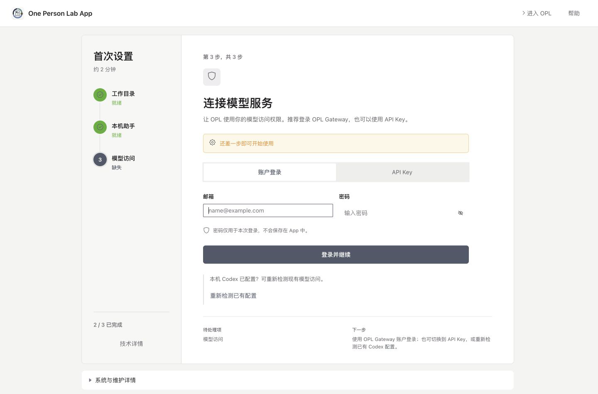

适用对象：希望在 Windows、macOS 或 Linux 电脑上通过浏览器使用 One Person Lab 的用户；默认不要求 Docker 经验。

本文以 **Windows x64 + Docker Desktop + WSL 2** 为主要安装示例。公开 Docker 镜像同时提供 `linux/amd64` 和 `linux/arm64`，Docker 会按宿主架构自动选择对应镜像；这条 Container WebUI 发行线独立于 macOS arm64 Desktop 主发行物。安装完成后，浏览器会建立本机 WebUI 会话。页面会在后台检查本机助手和模型访问；确认尚未配置时会尝试自动打开首次设置。如果没有自动跳转，不代表安装失败，直接点击工作台左下角的“完成首次设置”即可继续。普通启动不会被这项检查长时间阻塞。

```{=html}
<p><a class="btn btn-primary" href="{{download.pdf_href}}" download>下载 PDF 版（适合打印和离线阅读）</a></p>
```

::: {.callout-note title="先了解两个边界"}

- 本机安装只允许当前电脑访问 `http://localhost:3000/`，不需要注册 WebUI 账号或输入 WebUI 登录密码。
- OPL Gateway 账户邮箱/密码和 API Key 都只在浏览器 WebUI 中填写。不要把凭据放进 PowerShell、环境变量、`compose.yaml`、聊天或截图。
- **Windows Desktop App 不要求 Docker Desktop。**
- Docker Desktop 只对本教程的 **Container WebUI 路径** 必需；只安装桌面版的用户不需要执行本文的 Docker 安装或恢复步骤。

:::

## 安装路径总览

1. 安装并启动 Docker Desktop，确认使用 WSL 2 和 Linux containers。
2. 在 PowerShell 运行 One Person Lab 一键安装器。
3. 浏览器打开 `http://localhost:3000/`，建立本机 WebUI 会话。
4. 未配置时页面会尝试自动进入首次设置；没有跳转时从工作台左下角的“完成首次设置”继续。

## 准备清单

### Windows

- 64 位 x64 电脑。本教程的 Windows 安装步骤按 Windows X64 验证；Windows ARM 暂不作为本教程的验证路径。
- Docker Desktop 当前支持的 Windows 版本。请以 [Docker Desktop Windows 安装页]({{download.docker_desktop_windows_url}}) 的最新系统要求为准。
- WSL 2、硬件虚拟化和 Linux containers 模式。
- 能够安装 Docker Desktop；单位管理的电脑可能需要管理员协助。
- 稳定网络和足够的 Docker 磁盘空间。

### Linux

- 能够运行 Docker Engine 的 x64 或 arm64 Linux 电脑或服务器。
- 当前用户可以运行 `docker` 和 `docker compose`。
- 公网服务器不要使用本机免密码路径，参见本文末尾的“服务器部署”。

### macOS

- 已安装并启动 Docker Desktop、OrbStack 或 Colima。
- 当前用户可以运行 `docker` 和 `docker compose`。
- Intel 与 Apple Silicon 会分别选择 `linux/amd64` 与 `linux/arm64` 镜像。
- Docker WebUI 与 macOS Desktop App 是两种独立使用形态；这里安装的是浏览器 WebUI。

### 模型访问

默认使用 OPL Gateway 账户登录，准备好 Gateway 账户邮箱和密码即可。API Key 只作为兼容或备用方式；暂时没有可用凭据也可以先打开工作台，但完成模型访问配置前不能正常发送模型请求。

## 1. 准备 Docker

### Windows：安装 Docker Desktop

1. 打开 [Docker Desktop Windows 安装页]({{download.docker_desktop_windows_url}})。
2. 下载并安装 Docker Desktop，保持 WSL 2 相关推荐设置。
3. 按提示重启电脑或重新登录。
4. 确认 Docker Desktop 使用 **Linux containers**。如果菜单显示“Switch to Linux containers”，请先执行切换。

普通一键安装器会自动启动已经安装的 Docker Desktop 并等待 Engine 就绪，不需要每次先手工打开。如果 Docker Desktop 首次启动显示许可、WSL 2 或登录提示，请按提示完成一次，再重新运行一键安装命令。

使用 `-InstallPrerequisites` 安装 Docker Desktop 后，安装器会刷新当前 PowerShell 进程的 Machine/User PATH，并解析受支持安装位置中的绝对 `docker.exe`；后续启动、拉取、Compose 和诊断都使用同一个绝对路径。这样即使命令来自 WSL interop、当前 `PATHEXT` 不含 `.EXE`，也不会把已成功安装的 Docker Desktop 误报为缺失或重复调用 `winget`。

公开 One Person Lab 镜像不要求登录 GHCR。Windows 安装器从第一次拉取开始，就只针对公开的 One Person Lab GHCR 镜像使用一次性匿名 Docker 配置，避免管理员 PowerShell 会话被 Docker 凭据助手卡住；不会改写 Docker Desktop 登录状态，也不会把任何凭据写入安装目录。自定义或私有镜像仍使用当前 Docker 登录配置。

需要排查依赖时，在普通 PowerShell 中确认：

```powershell
wsl --status
docker version
docker compose version
```

::: {.callout-warning title="Windows 上 Docker Desktop 启动很久后报 dockerInference 错误"}

只有 Docker Desktop 明确显示 Unexpected error，且错误包含 `dockerInference`、`AF_UNIX` 或 “The file cannot be accessed by the system” 时，才使用本段。普通启动正常时不要运行恢复命令。

1. 在 Docker Desktop 错误窗口选择 **Quit**，并从系统托盘退出 Docker Desktop。
2. 打开任务管理器，确认 `Docker Desktop`、`com.docker.backend`、`com.docker.build` 和 `com.docker.proxy` 均已退出；脚本发现任何一个仍在运行时会拒绝操作。
3. 在普通 PowerShell 中运行：

```powershell
{{download.windows_docker_start_repair_command}}
```

该模式只迁移 `%LOCALAPPDATA%\docker-secrets-engine` 和 `%LOCALAPPDATA%\Docker\run` 中的 AF_UNIX ReparsePoint 运行端点，并保留带时间戳的 `.stale-*` 备份。目录中只要出现普通文件就会 fail closed；它不会停止进程，不会执行 Docker **Factory Reset**，也不会删除 image、container、volume、`docker_data.vhdx`、`OnePersonLab/data` 或 `OnePersonLab/projects`。

脚本报告 Docker Desktop ready 后，重新运行一键安装命令。若仍失败，保留错误和 `.stale-*` 备份用于诊断，不要反复运行恢复命令。

:::

```{=latex}
\newpage
```

::: {.callout-warning title="Docker 或 WSL 2 尚未安装"}

如果后续一键安装命令提示缺少 Docker Desktop 或 WSL 2，并且你有管理员权限，可以在“以管理员身份运行”的 PowerShell 中执行：

```powershell
{{download.windows_admin_prerequisites_command}}
```

Windows 要求重启时，先重启，再用普通 PowerShell 重新运行一键安装命令。只有安装 Docker Desktop 或启用 WSL 2 依赖时才使用管理员 PowerShell。

:::

### Linux：准备 Docker Engine

Ubuntu 用户可参考 [Docker Engine Ubuntu 安装页]({{download.docker_engine_ubuntu_url}})。安装完成后确认：

```bash
docker version
docker compose version
```

如果提示权限不足，请先由管理员完成 Docker Engine 和当前用户权限配置，不要使用删除数据目录的方式排障。

## 2. 运行一键安装器

普通用户的公开入口是 GitHub Release 中的 `opl-install.sh`，不是仓库分支中的
`install.sh`。后者只用于已经审阅的 source checkout 中做开发或恢复。公开入口先把
Latest 解析成一个精确 Release，再校验 installer 的名称、URL、大小和 SHA-256；不会
回退到 `main`，也不会直接执行未经校验的 `releases/latest/download` 字节。

### Windows PowerShell

打开普通 PowerShell 窗口，复制并运行：

```powershell
$repo = 'gaofeng21cn/one-person-lab-app'
$name = 'install-docker-webui.ps1'
$cache = Join-Path $env:LOCALAPPDATA 'OnePersonLab\installer-cache'
$p = Join-Path $cache $name
$id = Join-Path $cache 'install-docker-webui.identity.json'
try {
  $release = Invoke-RestMethod "https://api.github.com/repos/$repo/releases/latest"
  $asset = @($release.assets | Where-Object name -eq $name)
  if ($release.draft -or $release.prerelease -or $release.tag_name -notmatch '^v[0-9A-Za-z._-]+$' -or
      $asset.Count -ne 1 -or $asset[0].digest -notmatch '^sha256:[0-9a-f]{64}$' -or
      [int64]$asset[0].size -le 0) { throw 'Latest did not resolve to one eligible exact installer asset.' }
  $expectedUrl = "https://github.com/$repo/releases/download/$($release.tag_name)/$name"
  if ($asset[0].browser_download_url -ne $expectedUrl) { throw 'Release asset URL mismatch.' }
  New-Item -ItemType Directory -Force $cache | Out-Null
  $candidate = "$p.new"
  Invoke-WebRequest -UseBasicParsing $expectedUrl -OutFile $candidate
  $sha = (Get-FileHash $candidate -Algorithm SHA256).Hash.ToLowerInvariant()
  if ((Get-Item $candidate).Length -ne [int64]$asset[0].size -or
      $sha -ne $asset[0].digest.Substring(7)) {
    Remove-Item $candidate -Force
    throw 'Downloaded installer size or SHA-256 mismatch.'
  }
  Move-Item $candidate $p -Force
  $identity = [ordered]@{
    schema = 'opl_verified_installer_cache.v1'
    repository = $repo
    release_tag = $release.tag_name
    asset = [ordered]@{name=$name; url=$expectedUrl; sha256=$sha; size_bytes=[int64]$asset[0].size}
  }
  $identity | ConvertTo-Json -Depth 4 | Set-Content $id -Encoding UTF8
} catch {
  if (-not (Test-Path $p) -or -not (Test-Path $id)) { throw }
  $saved = Get-Content $id -Raw | ConvertFrom-Json
  $sha = (Get-FileHash $p -Algorithm SHA256).Hash.ToLowerInvariant()
  $savedUrl = "https://github.com/$repo/releases/download/$($saved.release_tag)/$name"
  if ($saved.schema -ne 'opl_verified_installer_cache.v1' -or $saved.repository -ne $repo -or
      $saved.release_tag -notmatch '^v[0-9A-Za-z._-]+$' -or $saved.asset.name -ne $name -or
      $saved.asset.url -ne $savedUrl -or $saved.asset.sha256 -ne $sha -or
      [int64]$saved.asset.size_bytes -ne (Get-Item $p).Length) {
    throw 'No valid verified installer cache is available.'
  }
  Write-Warning "Using verified installer cache from $($saved.release_tag): $($_.Exception.Message)"
}
powershell -ExecutionPolicy Bypass -File $p -EnableAutoUpdate -Yes
```

### Linux 个人电脑或 macOS 终端

```bash
repo='gaofeng21cn/one-person-lab-app'
work_dir="$(mktemp -d)"
release_json="$work_dir/release.json"
installer="$work_dir/opl-install.sh"

curl -fsSL "https://api.github.com/repos/$repo/releases/latest" -o "$release_json"
read -r tag url expected_sha expected_size <<EOF
$(python3 - "$release_json" "$repo" <<'PY'
import json, sys
r = json.load(open(sys.argv[1], encoding='utf-8'))
assets = [a for a in r.get('assets', []) if a.get('name') == 'opl-install.sh']
if r.get('draft') or len(assets) != 1:
    raise SystemExit('Latest did not resolve to one published installer asset')
a = assets[0]
tag = r.get('tag_name', '')
url = f"https://github.com/{sys.argv[2]}/releases/download/{tag}/opl-install.sh"
digest = a.get('digest', '')
if a.get('browser_download_url') != url or not digest.startswith('sha256:'):
    raise SystemExit('Release installer identity is invalid')
print(tag, url, digest[7:], a.get('size', 0))
PY
)
EOF
curl -fsSL "$url" -o "$installer"
test "$(wc -c < "$installer" | tr -d ' ')" = "$expected_size"
if command -v shasum >/dev/null 2>&1; then
  actual_sha="$(shasum -a 256 "$installer" | awk '{print $1}')"
else
  actual_sha="$(sha256sum "$installer" | awk '{print $1}')"
fi
test "$actual_sha" = "$expected_sha"
chmod 0755 "$installer"
"$installer" --container-webui --yes --enable-auto-update
```

这条个人电脑命令会在当前用户范围启用每天 03:00 的宿主自动更新。macOS 使用 LaunchAgent；Linux 使用 `systemd --user` timer。Linux 服务器默认不启用自动更新，请使用不带 `--enable-auto-update` 的安装命令，再由管理员根据维护窗口显式配置系统级调度。

安装器会把通过 exact Release 名称、URL、大小和 SHA-256 校验的 Docker/WebUI 子安装器
保存为本机已验证缓存。GitHub API、元数据或网络暂时不可用时，仍可重新计算缓存大小和摘要后
继续使用；如果新下载明确不匹配，则只拒绝这次新字节并保留原缓存和已安装 WebUI。
可选 attestation 暂时不可用不会阻断已经通过上述必需校验的字节。

安装器默认拉取 `ghcr.io/gaofeng21cn/one-person-lab-webui:stable`，创建 `compose.yaml` 和两个持久目录，然后启动 WebUI。`:latest` 仅供用户显式选择 Preview，不会被普通安装或自动更新静默选中。首次镜像下载约为 1 GB，安装器会持续显示 Docker layer 下载输出；不需要重新复制命令或重开 PowerShell。每次拉取开始时会显示 `attempt 1/3` 之类的当前尝试和总次数；20 秒没有新 layer 输出时会报告等待时间、3 分钟无进展边界和 Docker Desktop 代理入口。达到无进展边界后自动短退避重试，最多共 3 次；Docker 会复用已经完成的 layer，但不承诺当前未完成 layer 的字节级断点续传。首次启动还需要初始化数据库、内置能力和工作台资源；在较慢的 WSL 2 或虚拟机中可能接近 10 分钟，请保持 PowerShell 和 Docker Desktop 运行，等待安装器报告健康检查通过。后续启动和更新通常更快。安装成功后，Windows 桌面会出现 **One Person Lab** 快捷方式；以后不需要再次复制安装命令。Windows 推荐命令还会为当前用户注册 **One Person Lab WebUI Stable Update** 计划任务：用户已登录时每天 03:00 检查 `stable`，并在该用户每次登录时补一次检查。任务不保存 Windows 密码；电脑关机或用户未登录时不会后台强行运行。默认映射如下：

| 宿主机目录 | 容器内路径 | 保存内容 |
|---|---|---|
| `OnePersonLab/data` | `/data` | WebUI 配置、状态和日志 |
| `OnePersonLab/projects` | `/projects` | 项目材料与生成结果 |

安装成功后会自动打开浏览器，并在终端显示：

```text
http://localhost:3000/
```

## 3. 打开 WebUI

使用 Edge、Chrome 或 Firefox 打开 <http://localhost:3000/>。

### Windows 日常一键启动

首次安装成功后，直接双击桌面的 **One Person Lab**：

1. 如果 Docker Desktop 尚未运行，启动器会自动打开并等待 Docker Engine 就绪。
2. 启动或复用现有 WebUI 容器，不执行 `docker compose down`，也不会删除 `data` 或 `projects`。
3. 持续检查真实 WebUI HTTP 状态；服务就绪后自动打开浏览器，不依赖固定等待 20 秒。

`compose.yaml` 使用 `restart: unless-stopped`。Docker Desktop 随 Windows 启动后，WebUI 容器通常会自动恢复；桌面入口仍会确认容器和页面均已就绪再打开浏览器。启动失败时窗口会保留错误信息，按提示重新运行一次安装器即可刷新启动文件和快捷方式。

本机 Docker 安装会自动建立本机 WebUI 会话。打开后先读取当前设置，模型访问尚未完成时按“完成本机准备”提示处理；也可先进入工作台，再从“设置 → 账户与模型”完成配置。状态读取失败时保留工作台和错误提示，先排查服务及网络。

{width=96% fig-align="center"}

本教程的工作台与设置截图展示桌面版和 WebUI 共用的界面；浏览器边框、工作目录选择等入口可能随运行方式不同。

如果页面打不开：

- 确认 Docker Desktop 或 Docker Engine 仍在运行。
- 查看安装器最后一屏是否报告镜像、端口或健康检查错误。
- 确认 Docker Desktop 没有切换到 Windows containers。
- 重新运行安装命令不会删除已有的 `data` 和 `projects` 目录。

## 4. 完成首次设置

首次准备面板集中显示工作目录、本机助手和模型访问检查。点击“重新检查”刷新状态，点击“打开设置”处理未完成项；“稍后处理”允许先进入工作台，需要模型的任务仍须完成访问配置。无需为进入设置而重装或重置密码。

{width=96% fig-align="center"}

首次设置包含三个项目：

1. **工作目录**：Docker WebUI 固定使用容器内 `/projects`，对应宿主机 `OnePersonLab/projects`。
2. **本机助手**：确认容器中的 Codex CLI 可以运行。
3. **模型访问**：WebUI 默认使用 Gateway 账户登录，也可以切换到 API Key，或重新检测已有配置。

### 配置模型访问

打开“设置 → 账户与模型 → 账户与访问”，选择“OPL Gateway 账户”，输入邮箱和密码并点击“登录”。也可选择“API Key”配置模型访问。密码只用于登录。

{width=96% fig-align="center"}

登录成功后，如果页面出现“设为模型访问方式”，再点击一次确认。账户连接和切换模型访问方式是两个明确步骤，只有需要确认时页面才会显示第二个按钮。

当前版本只把 `gateway.medopl.com` 作为 OPL Gateway 的可信服务主机：账户登录、账户信息和用量查看使用 `https://gateway.medopl.com/api/v1`，模型访问使用 `https://gateway.medopl.com/v1`。新配置会由 App 自动写入 provider ID `oplgateway` 和上述模型地址，无需手工填写 Base URL。

旧配置不会隐式迁移。`OnePersonLab/data` 中已有 OPL Gateway Codex 配置时，App 会按 Gateway 地址原位复用，不改写原 provider ID、名称或 Base URL，以保留既有会话和配置关联。

已有配置的检查与复用只针对同一 `OnePersonLab/data` 持久目录中的 WebUI/Codex 配置。Windows 宿主机原有的 `%USERPROFILE%\.codex` 登录或配置不会自动挂载进容器。

暂时没有 Gateway 账户或 API Key 时可以先进入工作台。准备好后，打开：

```text
设置 -> 账户与模型 -> 账户与访问
```

默认模型和推理强度位于“设置 → 账户与模型 → 模型与执行”，也可在任务输入框右下角选择。

如果发送任务时提示本机助手或模型访问尚未完成，先保留草稿，按提示进入设置，处理后继续发送。

::: {.callout-important title="不要混淆三种凭据"}

- **OPL Gateway 账户邮箱和密码**：默认的模型服务登录方式，在首次设置或“账户与访问”中填写。
- **OPL Gateway API Key**：兼容或备用的模型访问方式，可在同一页面切换后填写。
- **WebUI 登录密码**：只用于服务器或公网部署的浏览器登录；普通本机安装不会要求。

:::

## 5. 选择智能体，开始专项工作

点击“新建任务”，选择工作区，再点击输入框上方的“日常工作”。Docker 中的工作目录使用容器内路径，例如 `/projects/研究项目`，对应宿主机 `OnePersonLab/projects/研究项目`。

{width=96% fig-align="center"}

| 目标 | 选择 |
|---|---|
| 文献、研究设计、数据分析与论文 | 医学科研 · Med Auto Science（MAS） |
| 基金申请与标书修改 | 医学基金 · Med Auto Grant（MAG） |
| 汇报、幻灯片与视觉内容 | 汇报展示 · RedCube AI（RCA） |
| 长篇书稿 | 书籍写作 · OPL Book Forge（OBF） |
| 智能体设计与改进 | 智能演进 · OPL Meta Agent（OMA） |
| 医学科普动画 | 医学科普视频 · Med Auto Cast（按实际安装情况） |

入口随当前安装与可用情况变化。找不到所需项时，从“管理智能体…”或“设置 → 智能体与能力”查看状态。普通整理与问答直接使用“日常工作”。

选好智能体后，用“＋”添加材料，说明目标、材料位置和想得到的结果。例如选“医学基金”后输入：

> 请根据附件中的申请指南和现有标书，先评估科学问题与研究方案的对应关系，列出主要缺口，再给出修改建议。

模型通常保留“自动（推荐）”。在同一任务中回答问题、补充要求并查看生成文件；新的独立工作再新建任务。患者及敏感研究资料先脱敏，并遵守机构要求。

## 6. 日常使用与更新

Windows 日常使用时双击桌面的 **One Person Lab**；只有需要修复启动文件、改变端口或手动更新时才重新运行安装器。Linux 先确认 Docker Engine 正常。浏览器继续访问 <http://localhost:3000/>。

### 跨平台宿主自动更新

Windows 推荐命令和 Linux/macOS 个人电脑命令都会启用当前用户范围的宿主自动更新。三平台共享“启用、禁用、状态、更新时间、手动更新”语义，但使用各自原生调度器：

| 平台 | 当前用户调度器 | 默认触发 |
|---|---|---|
| Windows | Task Scheduler | 每天 03:00；当前用户登录时补跑 |
| macOS | LaunchAgent | 每天 03:00；当前用户登录时运行 |
| Linux 个人电脑 | `systemd --user` timer | 每天 03:00；用户管理器启动后补跑 |

自动任务只跟随 `ghcr.io/gaofeng21cn/one-person-lab-webui:stable`。启用时，安装器会在 `OnePersonLab/updater` 保存一份本地、经过本次安装器生成或复制的固定 runner；以后调度器只运行这个本地副本，不会每天下载并执行 GitHub `main` 上的可变安装器代码。更新会先保留旧 image digest，拉取并启动新 digest，健康检查通过才算成功；拉取、重建或健康检查失败时会恢复旧 digest。整个过程不需要把 Docker Socket 暴露给 WebUI，也不会把密码或 API Key 写入任务。以下目录始终保留：

```text
%USERPROFILE%\OnePersonLab\data
%USERPROFILE%\OnePersonLab\projects
```

Windows 查看调度器和最近一次结果：

```powershell
{{download.windows_auto_update_status_command}}
```

Linux/macOS 查看调度器和最近一次结果：

```bash
{{download.linux_macos_auto_update_status_command}}
```

对应的本地安装器入口是 `--auto-update-status`。

自动更新日志只保留当前和上一次，位于当前用户的 `OnePersonLab/updater/logs`。这项任务只更新 One Person Lab WebUI 镜像；Docker Desktop、Docker Engine、OrbStack 或 Colima 自身仍按各自更新设置处理。

查看当前日志末尾：

```powershell
Get-Content "$env:USERPROFILE\OnePersonLab\updater\logs\current.log" -Tail 80
```

当前用户调度器不会获得服务器级后台权限。Windows 用户长期未登录时任务不会保存密码强行运行；Linux 服务器也不会由一键安装器自动创建系统级 timer。需要无人值守服务器更新时，应由管理员先把已审阅的安装器保存到固定本地路径，再让系统级调度调用该本地文件的 `--update`；不要把下载 GitHub `main` 的在线 `curl` 命令直接放进定时任务。

关闭自动更新：

```powershell
{{download.windows_disable_auto_update_command}}
```

```bash
{{download.linux_macos_disable_auto_update_command}}
```

对应的本地安装器入口是 `--disable-auto-update`。

更改每天运行时间时，重新执行启用命令并传入本地时间，例如 Windows 的 `-AutoUpdateTime 04:15` 或 Linux/macOS 的 `--auto-update-time 04:15`。

自定义 `-Image` / `--image`、非 `stable` 的 tag 或固定 digest 不允许启用自动更新，避免调度器静默覆盖高级用户的版本选择；这些版本只能手动更新。`stable` 是普通安装与自动更新跟随的发布指针。`-Tag latest` / `--tag latest` 只是显式 Preview 选择，不会注册自动更新，也不等价于容器内自更新能力。

### 手动更新

Windows：

```powershell
{{download.windows_update_command}}
```

Linux/macOS：

```bash
{{download.linux_macos_update_command}}
```

```{=latex}
\newpage
```

### 手工拉取 stable 后快速应用

如果你已经先运行过：

```powershell
docker pull ghcr.io/gaofeng21cn/one-person-lab-webui:stable
```

不要手工编辑 `compose.yaml`，也不要删除原容器或 `OnePersonLab/data`。直接运行下面的应用命令：

```powershell
{{download.windows_update_command}}
```

安装器仍会校验 `stable` 当前对应的不可变 digest；因为镜像 layer 已在本机，通常会快速显示 `Image is up to date`，随后按新 digest 重建容器并等待 WebUI 健康。若 digest 没有变化，Docker Compose 不会替换正在运行的容器。此流程保留 `OnePersonLab/data` 与 `OnePersonLab/projects`。

如果没有启用计划任务，建议至少每月手动执行一次，并在得知新 `stable` 已发布后及时执行。Linux 重新运行同一条一键安装命令即可。所有更新路径都会保留：

```text
Windows: %USERPROFILE%\OnePersonLab\data
Windows: %USERPROFILE%\OnePersonLab\projects
Linux:   $HOME/OnePersonLab/data
Linux:   $HOME/OnePersonLab/projects
```

建议定期备份 `projects`。不要把 `data` 当作 Docker 缓存删除，否则会丢失 WebUI 配置和本机状态。

## 常见问题

### Windows 提示找不到 Docker 或 WSL

重新运行普通一键安装命令；安装器会自动尝试启动已安装的 Docker Desktop。如果 Docker Desktop 首次启动仍有许可、WSL 2 或登录提示，请手工打开并完成提示。在 PowerShell 中重新执行 `wsl --status`、`docker version` 和 `docker compose version`；如果依赖确实缺失，再使用前文的管理员依赖安装命令。

如果旧版日志停在 `Resolving WebUI image`，或出现 `error getting credentials`、`指定的登录会话不存在`，请重新运行最新安装命令。新版安装器会从第一次拉取开始隔离公开 One Person Lab 镜像的匿名配置，不再进入当前 Windows 会话的 Docker 凭据助手；若仍失败，再检查 GHCR 网络、代理/VPN 和 Docker Desktop 状态。无需为公开镜像执行 `docker login ghcr.io`。

如果停在 `Pulling the public OPL GHCR image`，新版安装器会立即显示 `docker pull` 的 layer 输出。首次镜像约为 1 GB；只要 layer 文本仍在变化，下载正在继续，不需要中断或重新运行。

如果连续 20 秒只看到安装器的等待提示，先看提示中的 `attempt x/3`，再重点检查 Docker Desktop 的网络，而不仅是浏览器是否能翻墙：打开 **Docker Desktop -> Settings -> Resources -> Proxies**，选择正确的系统或手动代理设置并应用；Docker Engine 不一定继承 Windows 浏览器、PowerShell 或 VPN 的代理。安装器会对明确识别出的连接重置、DNS、代理和 TLS 握手失败做最多两次短退避重试；连续 3 分钟没有任何 layer 输出时会停止本次拉取并进入重试，避免无反馈地等待半小时。重试会复用已经完成的 layer，但 Docker 不保证当前未完成 layer 一定从同一字节继续；如果仍无法完成，安装器会在 30 分钟总上限内保存诊断。然后重新打开 Docker Desktop，确认 `docker version` 能显示 Server 信息，再直接重跑同一条安装命令。公开 OPL 镜像不需要执行 `docker login ghcr.io`。

如果所在网络必须使用镜像加速，可以在 Docker Desktop 的 **Settings -> Docker Engine** 中由用户自己配置可信的 `registry-mirrors`，应用后再运行安装器。安装器不会静默修改 Docker Desktop 全局配置，也不会自动选择未经项目校验的第三方镜像；只有项目 owner 发布、绑定同一 OCI digest 且经过可用性验证的候选源，未来才允许进入自动回退。镜像源本身失效时，Docker 可能直接中断拉取，不要一次填入大量未经验证的地址。

如果镜像拉取超过 30 分钟，说明这次 GHCR 连接没有完成。安装器已经停止对应的卡住进程；请确认浏览器能够访问 `https://ghcr.io`，临时关闭或修正拦截 GHCR 的代理/VPN，然后重跑同一条安装命令。不要连续打开多个安装窗口，也不需要执行 Docker prune。

如果镜像已经显示 `Image is up to date`，随后持续显示 `WebUI is still completing first-time setup`，说明 WebUI 正在首次准备内置运行时和 Official Profile；这一步同样从 Docker Engine 访问 GitHub/GHCR，Windows 浏览器或系统 VPN 设置不一定会自动传入容器。请在 Docker Desktop 的 **Settings -> Resources -> Proxies** 中配置可用代理，或确认 Docker Engine 能直接访问 GitHub 和 GHCR。安装器会每 20 秒报告一次进度，并在默认 10 分钟窗口结束时保存诊断信息。

### 提示端口 3000 已被占用

使用前面主安装步骤保存的已验证脚本缓存，并改用其它本机端口，例如：

```powershell
$p = Join-Path $env:LOCALAPPDATA 'OnePersonLab\installer-cache\install-docker-webui.ps1'
powershell -ExecutionPolicy Bypass -File $p -Port 3001 -EnableAutoUpdate -Yes
```

随后访问 `http://localhost:3001/`。

### 页面启动失败，怎样收集诊断信息

健康检查超时时，安装器会输出自动生成的诊断目录。也可以主动指定诊断目录：

```powershell
$p = Join-Path $env:LOCALAPPDATA 'OnePersonLab\installer-cache\install-docker-webui.ps1'
powershell -ExecutionPolicy Bypass -File $p `
  -Yes -NoOpen `
  -DiagnosticsDir "$env:USERPROFILE\OnePersonLab\diagnostics"
```

发送诊断材料前仍应检查并遮挡个人路径或凭据。不要发送 Gateway 密码或完整 API Key。

### 本机安装为什么短暂出现登录页

本机 WebUI 首次启动时需要几秒钟初始化自动会话。如果浏览器过早打开并短暂显示登录页，请等待几秒后刷新页面；正常本机安装会自动进入工作台，不需要猜测或重置 WebUI 密码。若刷新后仍显示登录页，请确认使用的是本机安装路径，而不是配置了登录密码的服务器部署。

### 已经在 Windows 上使用 Codex，容器能自动复用吗

不能自动复用宿主机 `.codex`。Docker WebUI 只保留挂载到 `/data` 的配置，但可以在浏览器内登录 OPL Gateway 账户，或切换到 API Key。重装或更新时保留 `OnePersonLab/data` 即可复用原 WebUI 配置。

### 暂时没有 Gateway 账户或 API Key

可以先进入工作台，之后从“设置 -> 账户与模型 -> 账户与访问”补充；完成前模型请求不可用。

## 服务器部署

::: {.callout-warning title="不要把本机 3000 端口直接暴露到公网"}

云服务器、办公室服务器或任何可能被其他电脑访问的环境，必须配置 WebUI 登录密码、HTTPS 和访问控制。本机自动登录路径不适用于公网。

:::

服务器路径由技术人员参照 [Docker/WebUI 高级部署说明]({{download.support_reference_url}}) 处理。
