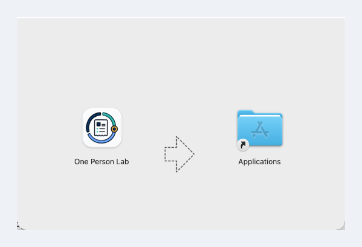
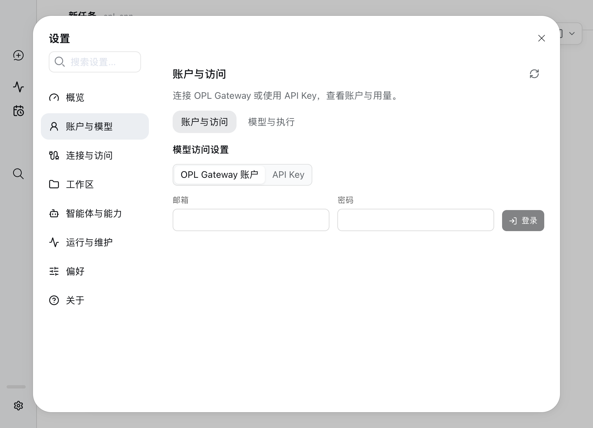
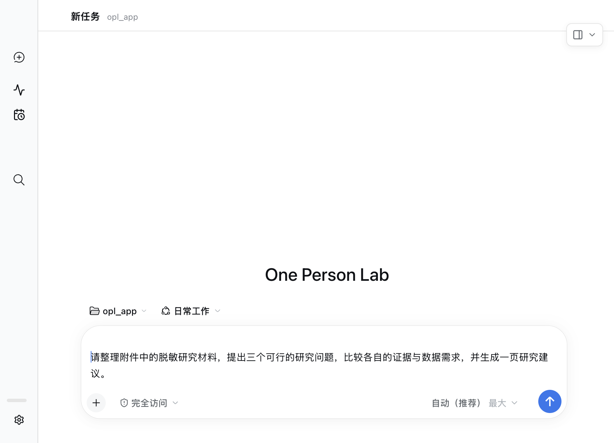
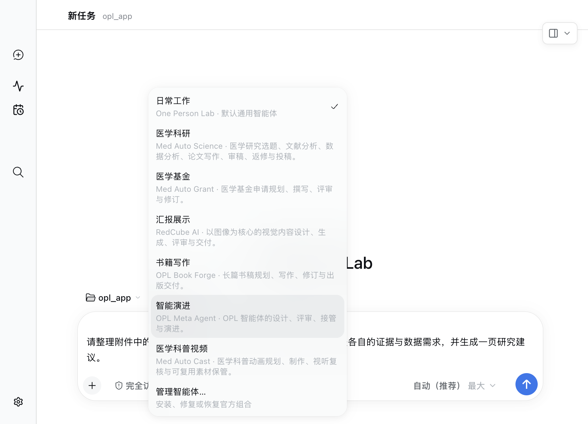
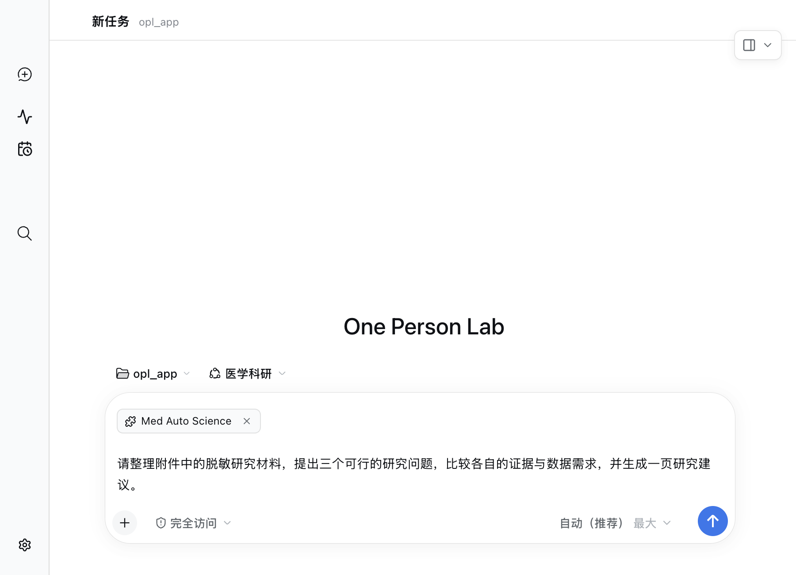
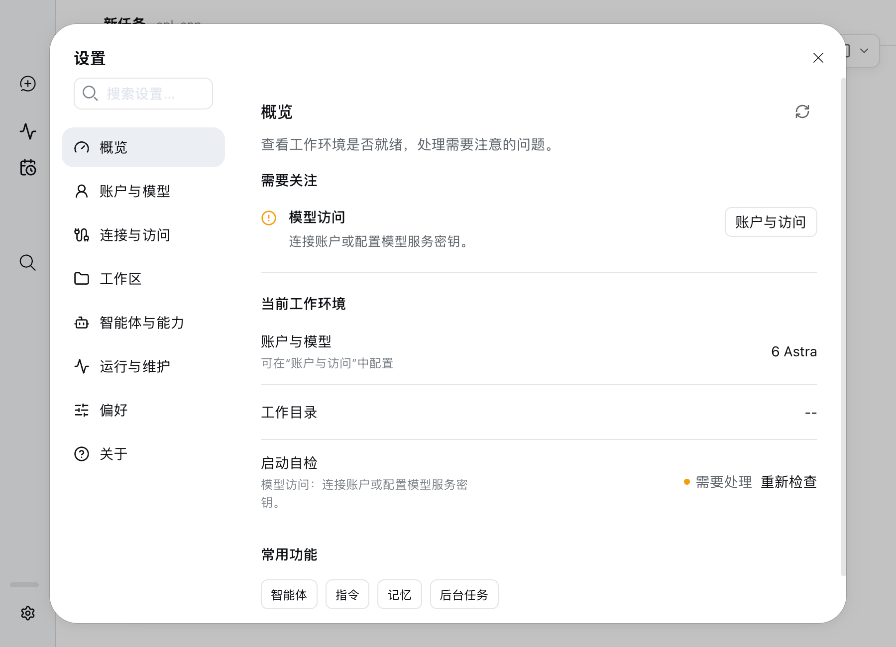

适用对象：医生、PI、课题负责人及合作团队成员；不要求计算机基础。

本文按“安装 App、完成首次检查、配置模型访问、选择智能体、开展第一项工作”的顺序说明首次使用。

下载最新版本：<{{download.latest_release_url}}>

> macOS 首次安装推荐下载 Full DMG，它预置 Base 和 Package seeds，可显著减少首启时的在线下载。
> Standard 适合稳定版升级，或网络环境非常好的首次安装。不要把可变分支中的安装脚本直接通过管道交给 shell 执行。

## 准备清单

- 一台 Apple Silicon（arm64）Mac；当前 macOS App 不支持 Intel Mac。
- 稳定网络，用于下载安装包、账户登录、更新和模型访问。Full 也需要联网完成登录和使用在线模型。
- 如果选择 Standard，需要很好的网络环境来下载 Base、Packages 和其他模块，并能访问所选模型服务；
  例如使用 OpenAI 时，需要能够直连 OpenAI。安装或首次检查异常时，先排查网络、代理、DNS 和目标服务连通性。
- 一个本机工作目录，用于保存项目材料和生成结果。
- 可选：可用的 OPL Gateway 账户，或兼容方式所需的 API Key。本机已有可用 Codex 配置时可以直接重新检测。

## 1. 安装 One Person Lab

**首次安装推荐 Full。** 打开上面的 Latest Release 页面，在 **Assets** 区域下载
`One-Person-Lab-Full-<版本>-mac-arm64.dmg`。不要下载 ZIP、Source code 或其他元数据文件。

已经完成首次安装、准备升级，或确认网络环境足以在线下载全部模块时，可以打开 macOS“终端”，
粘贴并运行下面的 Homebrew Standard 安装命令：

```bash
{{download.stable_install_command}}
```

这条命令适用于 Standard 联网安装和稳定版升级。Homebrew Cask 会把 App 安装到
“应用程序”，但不会自动打开 App，也不应被当作清理 quarantine 的入口。安装完成后运行：

```bash
open -a "One Person Lab"
```

App 启动后可直接跳到第 3 步。教程只保留 Latest 入口，不展示会随发版过期的版本截图或精确 tag URL。

- 当前只提供 Apple Silicon（arm64）安装包。
- 不要下载 ZIP、blockmap、YML、JSON 或 Source code。
- Release 页面版本号会持续变化，以标记为 Latest 的稳定版为准。
- 首次安装选择 `One-Person-Lab-Full-<版本>-mac-arm64.dmg`；它包含 Base 和 Package seeds。
- Standard 选择 `One-Person-Lab-<版本>-mac-arm64.dmg`，安装过程中需要联网下载模块，网络要求更高。
- Full 不是独立更新频道，安装后的 App 更新仍走 Standard 更新路径。

需要终端安装入口时，按照[安装指南的公开安装器步骤](https://github.com/gaofeng21cn/one-person-lab-app/blob/main/docs/delivery/install/README.zh-CN.md#latest-公共安装器)先下载并校验 `opl-install.sh`，再运行：

```bash
./opl-install.sh --stable-macos-install --full --yes
```

该安装器会在挂载 DMG 或替换 App 前校验所选 Release 与 DMG 的身份和摘要。

## 2. 手工安装 DMG（可选）

仅在第 1 步选择 Standard 或 Full DMG 时执行本步。打开 DMG，将
**One Person Lab** 拖到 **Applications**。复制完成后关闭 DMG 窗口，再从“应用程序”启动 App。

{width=82% fig-align="center"}

首次打开如出现 macOS 安全提示，按系统提示确认。不要长期在 DMG 挂载窗口中直接运行 App；如果系统持续阻止打开，可改用第 1 步的 Latest `opl-install.sh`，由它完成摘要校验、复制、quarantine 清理和启动。

## 3. 完成本机准备

首次启动会显示“完成本机准备”，检查工作目录、本机助手和模型访问。已有可用 Codex 配置时，App 会读取并复用。

{width=96% fig-align="center"}

点击“重新检查”可刷新结果；模型访问尚未配置时，点击“打开设置”。也可以选择“稍后处理”先查看工作台，需要模型的任务仍须完成模型访问设置。

## 4. 设置账户与模型

打开“设置 → 账户与模型 → 账户与访问”。

- **已有配置**：先查看连接状态。本机已有 Codex 或 OPL Gateway 配置时应直接复用；不要为了升级重新填写凭据。
- **新用户登录**：选择“OPL Gateway 账户”，填写邮箱和密码，点击“登录”。密码只用于登录。
- **手工密钥**：需要使用团队提供的密钥时，选择“API Key”，填写后点击“配置”。
- **确认模型来源**：登录后查看“本机默认模型来源”。如果显示的是其他服务，只有希望切换到 Gateway 时才使用页面提供的切换操作。
- **刷新结果**：完成配置后刷新账户状态；模型选择在同组的“模型与执行”页面，也可从任务输入框右下角选择。

{width=96% fig-align="center"}

OPL Gateway 的服务主机是 `gateway.medopl.com`。新配置由 App 按服务合同处理，无需手工猜填地址。本机已有配置会保留其关联；请勿把密码或完整 API Key 放进聊天、截图或代码仓库。

## 5. 选择智能体，开始专项工作

关闭设置，点击“新建任务”，从输入框上方选择工作区。工作区是本次材料和结果的保存位置，建议每个项目使用自己的文件夹。

{width=96% fig-align="center"}

### 根据工作目标选择智能体

点击输入框上方的“日常工作”，按当前目标选择智能体。选中后，入口会显示所选名称，例如“医学科研”；它会为新任务带入对应的专业工作方法。普通材料整理、问答或临时事务可直接用“日常工作”。

{width=96% fig-align="center"}

| 工作目标 | 可选择的智能体 | 可以这样开始 |
|---|---|---|
| 文献、研究设计、数据分析或论文 | 医学科研 · Med Auto Science（MAS） | “根据附件提出三个研究问题，比较证据和数据需求。” |
| 基金申请与标书修改 | 医学基金 · Med Auto Grant（MAG） | “按本次申请指南审阅标书，指出论证缺口并给出修改稿。” |
| 学术汇报、幻灯片或视觉内容 | 汇报展示 · RedCube AI（RCA） | “把论文和图表整理成一份 10 分钟汇报，先确定主线。” |
| 长篇书稿 | 书籍写作 · OPL Book Forge（OBF） | “根据这些材料设计一本面向临床医生的书，先给目录与样章方案。” |
| 设计或改进 OPL 智能体 | 智能演进 · OPL Meta Agent（OMA） | “评估这个智能体的工作流程，提出并实施可验证的改进。” |
| 医学科普动画 | 医学科普视频 · Med Auto Cast | “设计一段给患者看的两分钟术后康复科普，先给脚本和分镜。” |

菜单只展示当前已安装且可用的入口，并非每次安装都包含表中全部智能体。找不到所需项时，从菜单底部“管理智能体…”或“设置 → 智能体与能力”查看安装与可用状态；医学科普视频等能力按实际安装情况使用。

### 把目标、材料和交付结果说清楚

选好智能体后，点击输入框左下角的“＋”添加文件，或在任务中说明材料所在目录。第一次任务可以先要求整理、评估或提出方案，再根据回复补充信息。

例如选“医学科研”后输入：

> 请整理附件中的脱敏研究材料，提出三个可行的研究问题，比较各自的证据与数据需求，并生成一页研究建议。

{width=96% fig-align="center"}

点击发送后，在同一任务中补充要求、回答问题并查看生成文件。需要另一项独立工作时再新建任务；同一项目的修改和补充可继续原任务。模型通常保留“自动（推荐）”，选智能体主要决定工作方法，模型选择决定执行所用的模型。

涉及患者或敏感研究数据时，应先完成脱敏，并遵守所在机构的数据管理和伦理要求。

## 6. 查看状态与后续更新

“设置 → 概览”汇总当前工作环境、需要关注的问题和常用功能。排查问题时再进入“运行与维护”中的诊断页面。

{width=96% fig-align="center"}

- 账户与模型：打开“设置 → 账户与模型”。
- 智能体与能力：查看已安装智能体，按需安装或修复。
- 工作目录：打开“设置 → 工作区”。
- 本机能力与维护：打开“设置 → 运行与维护”。
- 更新和安装教程：打开“设置 → 关于”。

旧正式版和 Studio Preview 的升级沿各自更新入口进入同一个正式 App。Full 是预置运行资源的首次安装包，后续 App 更新走 Standard 路径。升级保留已有 OPL Gateway 登录状态和本机 Codex 数据。

OPL App 与本机 Codex App 使用同一 Codex 数据目录时，直接读取同一批原生会话。界面切换不需要复制对话，不应导入独立 AionUI/Gemini 的历史。旧 OPL 的置顶、排序等界面信息只关联已确认的原生线程。

```{=latex}
\clearpage
```

## 常见问题

- **Intel Mac 可以安装吗？** 当前不支持。请使用 Apple Silicon（arm64）Mac。
- **已经在用 Codex，还需要登录 OPL Gateway 吗？** 不需要。App 会复用已有配置；在“账户与模型”中查看状态，必要时点击“刷新状态”。
- **暂时没有 Gateway 账户或 API Key 怎么办？** 可以先选择“稍后处理”，后续从“设置 → 账户与模型”完成配置。
- **下载页面里文件很多，应该选哪个？** 首次安装选择 `One-Person-Lab-Full-<版本>-mac-arm64.dmg`。不要下载 ZIP、blockmap、YML、JSON 或 Source code。
- **Standard 安装或首次检查卡住怎么办？** Standard 需要在线下载 Base、Packages 和其他模块。先确认网络、代理和 DNS 正常，并检查所选模型服务是否可达；例如使用 OpenAI 时，需要能够直连 OpenAI。网络条件不稳定时改用 Full 首次安装。
- **打不开 App 怎么办？** 确认 App 已复制到 `/Applications` 并按 macOS 安全提示允许打开；仍无法启动时，使用同 tag `opl-install.sh` 安装。
- **账户登录失败怎么办？** 先确认邮箱和密码正确，并检查 `gateway.medopl.com` 的网络连通性；反馈问题时提供操作系统、发生步骤和不含密码或 API Key 的报错截图。
- **需要自己选择具体模型版本吗？** 通常不需要；需要调整时打开“设置 → 账户与模型 → 模型”。
