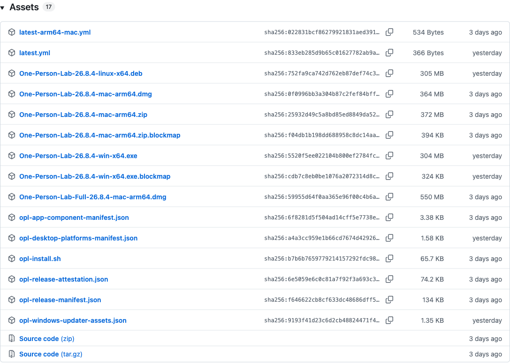
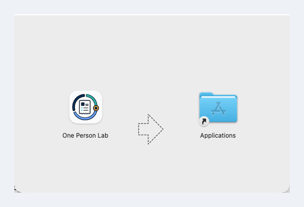
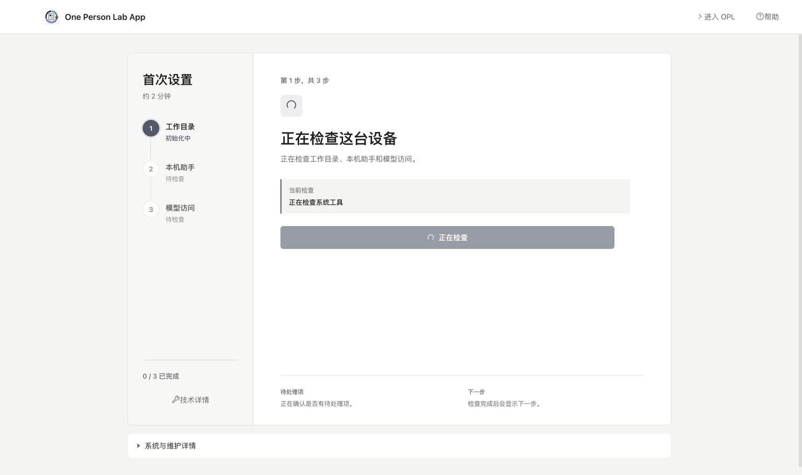
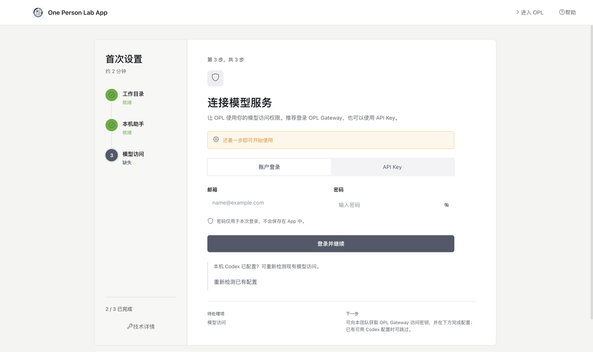

## 首次安装与首启

按安装、首次检查、登录或确认模型访问、进入工作台的顺序操作。

```bash
{{download.stable_install_command}}
```

{width=72%}

- 一台 Apple Silicon（arm64）Mac；当前 macOS App 不支持 Intel Mac。
- 稳定网络和一个本机工作目录。
- 默认使用 OPL Gateway 账户登录；已有可用 Codex 配置时可以直接重新检测。

## 1. 安装 One Person Lab

推荐在“终端”运行 Homebrew Standard 安装命令；不方便使用终端时，再从最新 Release 手工下载 arm64 DMG。

最新版本：<{{download.latest_release_url}}>

{width=78%}

- Homebrew Cask 会写入 `/Applications`，但不会自动打开 App；安装后运行 `open -a "One Person Lab"`。
- Homebrew 不是 quarantine 清理入口；系统持续阻止时改用同 tag `opl-install.sh`。
- 普通手工安装选择 Standard DMG；只有离线首装才选择同 tag Full DMG。
- 不要下载 ZIP、blockmap、YML、JSON 或 Source code。
- 页面版本号会持续变化，以最新稳定版为准。

## 2. 手工安装 DMG

仅在手工下载时执行：打开 DMG，将 One Person Lab 拖入 Applications，复制完成后从“应用程序”启动。

{width=70%}

- 首次打开如有安全提示，按系统提示确认。
- 不要长期在 DMG 挂载窗口内运行 App。
- 系统持续阻止打开时，改用同 tag `opl-install.sh` 完成摘要校验、quarantine 清理和启动。

## 3. 完成首次检查

首次启动后，OPL 会先检查工作目录、本机助手和模型访问，并显示当前进度。

{width=78%}

- 检查期间可以先“进入 OPL”，但不会自动完成缺失项目。
- 出现“需要处理”时，按页面给出的下一步操作。
- 普通用户不需要理解折叠在“技术细节”中的底层工具。

## 4. 登录或确认模型访问

默认填写 OPL Gateway 邮箱和密码并“登录并继续”；已有 Codex 配置时可独立重新检测，API Key 仅作为兼容方式。

{width=78%}

- 默认方式：账户登录。
- 已有配置：点击“重新检测已有配置”，它不是第三种登录方式。
- 兼容方式：切换到“API Key”。
- 暂不配置：先“进入 OPL”，之后从“设置 -> 账户与访问”继续。

## 5. 开始第一项工作

进入主界面后，直接描述目标，或选择科研、基金、演示、写书等专业入口。

{width=78%}

- 第一条任务同时说明目标和材料位置。
- 涉及患者或敏感数据时，先完成脱敏并遵守机构要求。
- 账户与访问在“设置 -> 账户与访问”，模型选择在“设置 -> 模型”。

## 常见问题

- Intel Mac：当前不支持，请使用 Apple Silicon（arm64）Mac。
- 已有 Codex 配置：点击“重新检测已有配置”，不需要先登录 Gateway。
- 暂时没有账户或 API Key：可以先进入 OPL，后续再配置。
- 下载文件很多：手工安装只选择 `mac-arm64.dmg`。
- 打不开 App：确认已复制到 Applications，或使用同 tag `opl-install.sh` 安装。

> 密码只用于本次登录；请勿公开转发或保存 API Key 到研究目录、论文附件或代码仓库。
