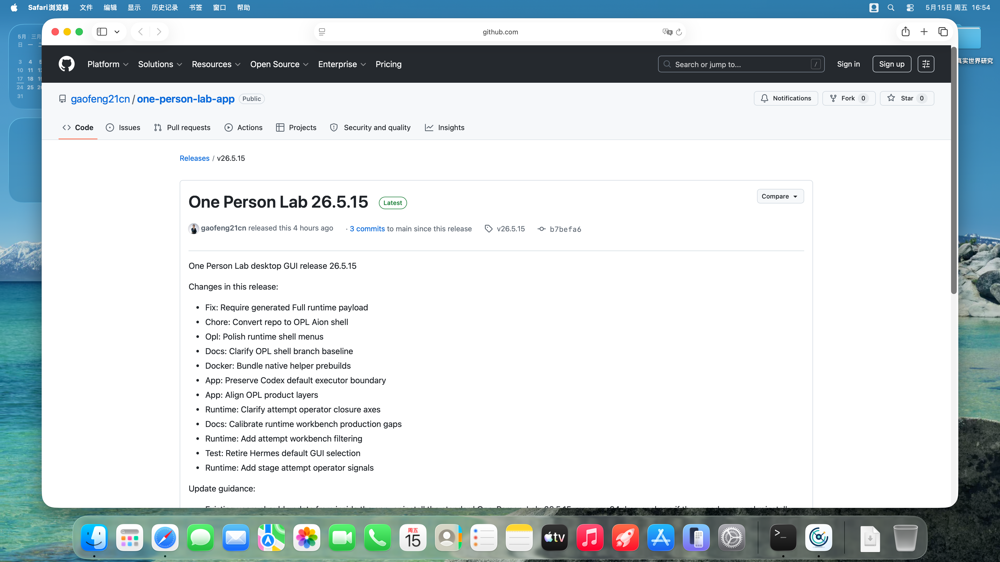
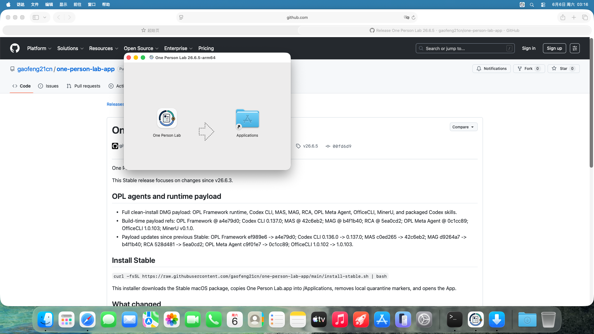
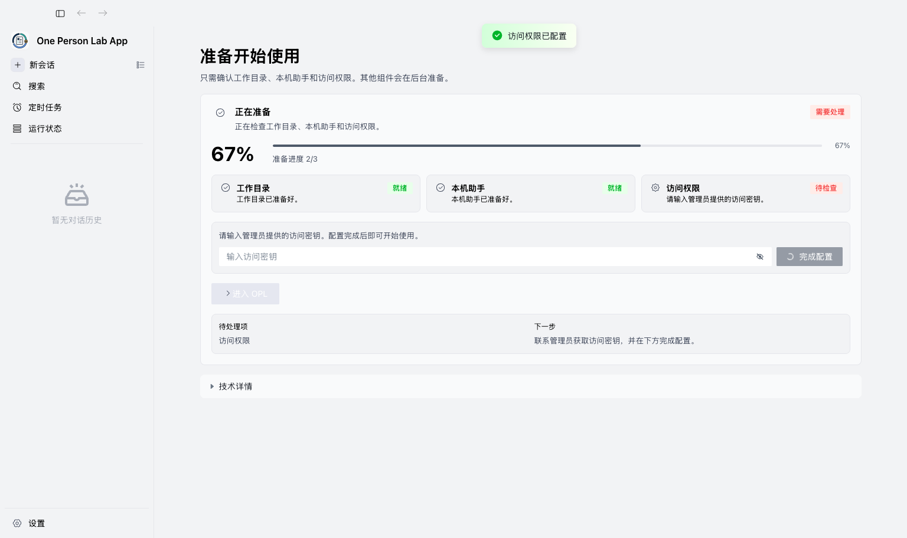
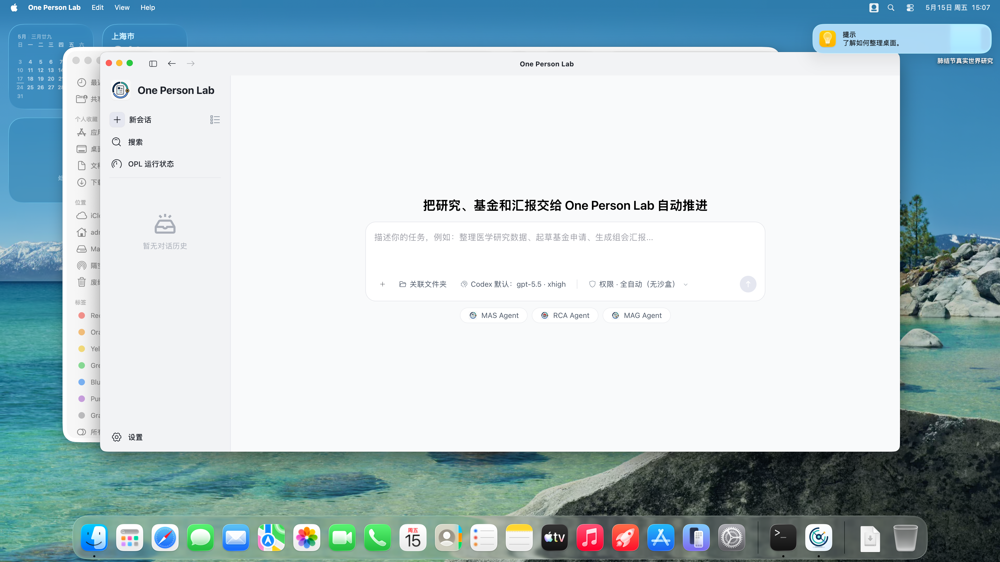

# OPL + MAS 新手首次启动图文教程

Owner: `one-person-lab-app`
Purpose: `macos_app_install_user_guide_pdf_source`
State: `active`
Machine boundary: Human-readable user guide. Release contracts, workflows, VM smoke artifacts, and App release metadata remain the machine truth.

适用对象：医生、PI、课题负责人；不要求计算机基础。本文以 macOS App 首次启动为主线，说明如何下载、安装、配置 One Person Lab，并通过 Research Foundry / Med Auto Science 发起首次科研任务。

当前示例 Release：https://github.com/gaofeng21cn/one-person-lab-app/releases/tag/v26.5.15

> 涉及 Codex API Key 或 Codex 权限配置时，请联系 gflabtoken 管理员开通。不要自行购买、复制来源不明的密钥，或把密钥写入研究数据目录。

## 准备清单

- 一台 Apple Silicon Mac 或可运行 macOS App 的 Mac。
- 稳定网络，用于下载 One Person Lab 和完成首次环境检查。
- gflabtoken 开通状态；涉及 Codex 权限时请联系 gflabtoken 管理员。
- 本地研究数据文件夹，数据需完成脱敏并符合本机构数据管理要求。
- 变量说明、纳排标准、终点定义、统计计划、参考文献或已有草稿；可以先放入专病 workspace 的 `raw_data/`。

## 1. 下载 One Person Lab

访问 One Person Lab App 最新 Release 页面，下载 macOS Apple Silicon DMG。首次安装或干净机器建议选择 Full 版 DMG。

- 最新版本页面：https://github.com/gaofeng21cn/one-person-lab-app/releases/latest
- Full 版 DMG 是首次安装资产，包含 OPL Framework runtime、MAS/MAG/RCA、officecli、mineru-open-api 与推荐 skills 等 payload。
- 标准 mac-arm64 DMG 体积更小，适合已经安装过 One Person Lab App 的用户和后续自动更新。

## 2. 安装 App

打开 DMG，将 One Person Lab 拖入 Applications。首次打开如出现 macOS 安全提示，按系统提示确认。

- 安装完成后从 Applications 启动 App。
- 不要长期在 DMG 挂载窗口内运行 App。

## 3. 配置 Codex 权限

首次启动如果要求 API Key 或 Codex 权限，统一联系 gflabtoken 管理员开通。

- 管理员开通后，按管理员给出的方式完成配置。
- 不要把密钥截图、转发或写入研究数据目录。

## 4. 等待首次环境检查

OPL 会检查 Codex、模块、skills 和本机运行环境。等待状态进入可继续阶段。

- 首启准备可能需要几分钟。
- 遇到阻塞时先阅读界面提示，再联系技术支持处理。

## 5. 进入科研入口

准备完成后，在主界面选择科研入口，进入 Research Foundry / Med Auto Science 工作流。

- MAS 通过 OPL 内的 Research Foundry / Med Auto Science 入口使用。
- 用户不需要另行获取 MAS 分发资产。

## 6. 准备研究数据目录

建议按一个病种或稳定研究主题新建本地 workspace，把原始或脱敏材料集中放入 raw_data/。

- 新手首启阶段不需要手工建立 MAS 内部目录结构。
- 患者数据需先脱敏，并遵守本机构数据管理要求。

## 7. 发起首次科研任务

第一条任务可直接用自然语言描述，让 MAS 先判断研究方向、证据缺口和下一步。

- 示例提示词：我有一批肺结节随访数据，专病 workspace 在“肺结节真实世界研究”，原始材料在 raw_data/，请先判断最值得推进的研究问题，并说明还缺哪些证据，目标是形成一篇可投稿论文。

## 8. 查看进度与结果

任务启动后，重点查看当前阶段、阻塞项、下一步和产物位置。

- 看到需要人工确认的项目时，由研究者或 PI 判断是否继续。
- 投稿前最终科学判断、伦理合规和署名安排仍由研究团队负责。

## 常见问题

- 下载失败：换网络后重试，或请技术支持人员确认 GitHub Release 是否可访问。
- 打不开 App：确认已拖入 Applications，并按 macOS 安全提示允许打开。
- Codex 未配置：联系 gflabtoken 管理员开通。
- 模块未就绪：在 App 的环境管理中重新检查，确认 OPL 完整安装资产与本机网络状态。
- 数据路径看不到：确认选择的是本机可访问的专病 workspace，或能看到其中的 `raw_data/`。
- 任务启动后不知道看哪里：查看运行状态页的当前阶段、下一步和需要人工确认的项目。

## 截图与验证来源

- 截图来自中文 macOS VM，逻辑桌面 1920x1080，Retina 输出 3840x2160。
- VM smoke 使用真实 DMG 安装到 `/Applications/One Person Lab.app`，Codex 配置向导出现并提交，最终看到 `opl-guid-entry`。
- Release、DMG、首启日志和模块状态以 App repo contracts / workflow / VM smoke artifacts 为机器真相。
