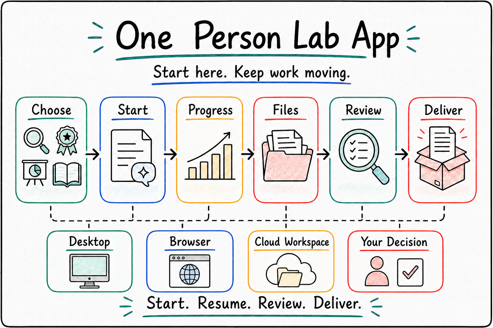

# OPL App 白皮书

> 让复杂知识工作拥有一个本地优先、结果可复查、可以持续推进的专业工作台

<!-- Owner: `one-person-lab-app`; Purpose: `public_app_whitepaper_body_source`; State: `active_public_source`; Machine boundary: Human-readable whitepaper body source. Generated PDF and verification JSON are derived artifacts. App release, runtime, domain, quality, owner receipt, production, and currentness truth stay in contracts, source, release artifacts, runtime readback, domain owner surfaces, and evidence records. -->

发布日期：2026-07-13

最近修订：2026-08-10

适用对象：希望理解 OPL App 为什么这样设计，以及这些设计怎样帮助自己完成研究、基金、演示和书稿等复杂知识工作的用户、合作者、早期采用者和技术决策者。

核心判断：一个专业 AI 产品的好用，体现在用户能从真实目标出发，得到有来路的成果，知道何时继续、何时判断，并在工作环境变化后仍能接着做。

## OPL App 把一次问答变成持续工作

AI 已经很擅长回答问题、生成文字和修改文件。真正困难的是把这些能力放进一项会持续数天、数周甚至数月的正式工作。

一篇论文会经历材料整理、研究问题收敛、分析、作图、写作、审阅和修订；一份基金申请会反复调整创新点、技术路线和论证；一套演示要让数据、故事线、视觉和导出结果彼此一致；一本书更需要跨章节保持结构、风格和事实连续。

在这些工作里，用户需要一套贯穿全程的答案：

- 我现在应该从哪里开始？
- 当前成果由哪些材料、分析和审阅支持？
- 工作推进到了哪里，下一步可以自动继续还是需要我决定？
- 离开几天后回来，是否还能接住之前的上下文？
- 换到浏览器、服务器或云端时，是否仍在同一条工作线上？

OPL App 是 One Person Lab 面向用户的专业工作台：让目标、对话、材料、阶段、产物、审阅、回执和下一步形成一条可以继续的工作线。



## 设计一：从工作目的开始

用户打开 OPL App，首先表达“我要完成什么”，系统随后按工作目标配置仓库、provider、shell 等内部选择。

当前官方 profile 默认提供四个高频工作目的：

| 用户看到的入口 | 用户想完成的事 | 默认专业 Package |
| --- | --- | --- |
| 科研 | 从问题、材料和数据走向分析、证据与论文交付 | MAS |
| 基金 | 形成有说服力的选题、论证、申请书与修订 | MAG |
| 演示 | 把内容、数据和故事线变成可审阅的视觉交付 | RCA |
| 写书 | 组织大纲、章节、风格、修订与出版交接 | OBF |

这四个目的入口与 OPL Meta Agent（OMA）的“元智能体”入口，共同构成当前官方 profile 的五个默认起点。这是 profile 默认值，不是 App 内置的固定清单：实际首页由已安装的 standard-agent projection（标准 Agent 投影）与用户快捷入口偏好动态决定。此前未知但符合同一规则的 Package 也可以显示，App 不维护另一份 Agent 清单。用户可以安装、发现和管理更多合规 Package，并决定哪些快捷入口出现在首页；OMA 也可在“智能体”设置中关闭或调整顺序。

这样的设计有两个好处：新用户可以直接从工作目的开始，熟练用户可以自由扩展快捷入口。产品可以不断增加专业能力，首屏始终回答一个问题：你今天要完成什么？

## 设计二：成果必须带着来路

正式知识工作的结果需要同时包含成果与来路。一个结论、一张图、一页演示或一个章节，能够回到它所依赖的材料、过程和审阅，才值得被继续使用。

OPL App 把工作表达为一条可以复查的链：

```text
目标 -> 材料与资源 -> 阶段推进 -> 产物 -> 审阅与检查 -> 回执 -> 下一步
```

“结果有来路”意味着优先呈现与判断有关的信息：当前产物在哪里，哪些内容已经检查，哪里仍有质量债，下一步是继续修订、补充材料、等待资源，还是由人作决定。路径、标识、原始回执和运行细节在排查问题时进入诊断层。

这条原则让用户既能判断最终文件是否可信，也能在首屏聚焦真正要做的事；完整内部证据则按需展开。

OPL App 负责把已有事实翻译成用户能采取行动的状态，并沿用各 owner 持有的唯一事实。运行状态来自 OPL Base；Package identity 与 publication 来自对应 owner，物理 lifecycle 与 installed readback 来自配置的平台原生 carrier，Framework 只聚合完整 Package 的 installed/callable 状态与通用 actions；研究、基金、视觉和书稿质量来自对应专业 Agent 与人工 owner。界面说明“发生了什么”和“下一步是什么”，ready 结论仍由对应 owner 给出。

## 设计三：状态必须指向行动

复杂产品很容易把设置页变成内部结构目录：运行时、集成、技能、缓存、路径、回执和 provider 各占一栏。这样的界面看似完整，却把理解系统的成本转嫁给用户。

OPL App 采用相反的组织方式。设置首先围绕用户要做的决定：

- 当前环境是否可以开始工作，需要我做什么？
- App、Base 或 Package 是否需要安装、更新或修复？
- 哪些 Agent Packages 已可用，哪些显示在首页？
- 浏览器访问、远端资源或账号能力是否需要配置？
- 哪些数据由本机持有，清理或迁移会影响什么？

默认层只显示目的、状态、影响和主动作。Package id、manifest、路径、缓存、底层回执和完整 ledger 等信息折叠到“高级诊断”，供需要排障的人按需展开。

这种信息架构建立了一条稳定规则：**正常状态保持安静，异常状态说清影响，所有状态都给出合法下一步。** 普通用户也能知道该继续工作、等待后台完成、批准资源，还是进入修复。

## 设计四：工作位置变化，工作语言保持连续

OPL App 是本地优先的。用户可以先在自己的设备上选择工作目录，让敏感材料、早期草稿和个人项目留在自己的环境里。工作位置变化时，用户面对的是几种并列载体，而不是必须逐级迁移的路径：

```text
同一套 OPL 产品语言
  |-- OPL Desktop：macOS / Linux / Windows
  |     `-- macOS / Linux Desktop 可通过自带 WebUI 在浏览器中访问
  |-- Docker WebUI：独立的容器产品线
  `-- Hosted Workspace：条件启用的托管工作环境
```

手机可以通过上述 WebUI 访问同一工作台；微信只作为内部传输通道，不创建第二套控制面或会话历史。绑定成功后，OPL 只显示一个 canonical task；临时会话在用户未指定项目前按“无项目”呈现。如果无法唯一确认对应关系，产品会保留原入口，不隐藏或误合并任务。

项目、任务、阶段、产物、审阅、阻塞、回执和下一步组成一套连续的工作语言。但行为连续不等于不同载体在当前版本已经功能相等，也不自动证明真实数据已经连续、稳定版本已经发布或环境已经 ready。Desktop 各平台、Docker WebUI 和 Hosted Workspace 的具体发布与可用状态，分别以 release artifact、运行回读、端到端 evidence 和 owner acceptance 为准。

## 一个完整场景：从本机研究到团队审阅

设想一位研究者准备一篇需要重新分析数据的论文。

**从目标开始。** 她在本机打开 OPL App，选择自己的项目目录和“科研”入口，用普通语言说明研究问题、数据位置和希望形成的交付物。App 将任务交给已安装的 MAS Package，由 OPL 与 MAS 协同组织所需模型、技能和命令。

**让过程可见。** MAS 围绕问题、数据、分析、图表、论断和稿件推进。App 持续呈现当前阶段、最新产物、需要补充的材料和等待她决定的问题。她可以打开结果，也可以回到支持结果的材料和审阅意见。

**在正确的时刻让人判断。** 如果分析已经形成可消费的增量，但某张图仍需重画，工作可以带着清楚标注的质量债继续；如果要声称结果达到投稿标准，则必须回到 MAS 的质量门和负责人确认。App 准确区分“有进展”与“已就绪”。

**按需改变工作位置。** 当本机资源不足时，她可以批准使用服务器或云端资源；需要合作者参与时，可以在有相应运行与发布证据的浏览器或 Workspace 环境继续。项目仍以相同方式呈现任务、产物、审阅和下一步，而资源绑定、账号和组织策略留在对应管理面。

**把下一轮接住。** 一周后回来，她直接看到当前稿件、最近一次审阅、未关闭的问题和可以继续的动作。产品为专业判断准备材料、上下文和清楚的交接点，最终学术判断仍由她作出。

这个场景也适用于基金、演示和书稿：专业内容不同，可信工作的结构相同。

## 只维护三个软件对象

用户只需认识三个软件对象，就能完成日常安装、更新和修复：

| 对象 | 用户应如何理解 |
| --- | --- |
| OPL Base | 后台运行基础，负责让任务、阶段、Package 和回执可靠工作 |
| OPL App | 用户看到和操作的工作台，负责入口、交互、状态翻译与产品体验 |
| OPL Packages | 可安装和管理的专业 Agent、能力与工作流，决定“能完成哪类专业工作” |

运行时、Codex 投影、工作流 profile、companion tools 和底层集成统一归入这三个对象。用户数据与产物拥有独立的存储、保留和清理边界，软件更新对象始终保持为三类。

这个模型让维护动作更容易理解：App、Base 和 Packages 各自遵循独立更新边界；每个 Package 通过自己的平台生命周期独立安装、更新、修复和卸载；界面展示聚合维护状态，Framework 只汇总完整 Package 的 fresh installed/callable readback 与运行事实。平台提供的高级恢复能力仍可使用，但 OPL 不再为普通 Package 复制一套 lock、receipt 或 rollback 状态机。

## 清楚的分工带来可信的产品

OPL App 通过清楚分工建立专业性：

```text
用户目标
  -> OPL App：入口、交互、状态与下一步
      -> OPL Base：阶段运行、恢复、投影与回执
          -> OPL Packages：领域判断、审阅与交付
              -> Workspace / Cloud：按需提供托管、资源与组织能力
```

App 持有入口、交互、状态翻译和下一步；Framework 持有运行真相；MAS、MAG、RCA、OBF 或 OMA 持有领域质量裁决；云端管理面持有账号、资源和组织策略。App 把这些 owner 已经持有的事实组织成一个普通用户可以理解和操作的工作台。

清楚边界直接建立用户信任：跨界面的状态保持一致，专业结论按权威路径给出，资源和权限变化始终经过用户知情与授权。

## 本文边界

本文聚焦 OPL App 的设计理念和用户价值。安装说明、设置手册、功能清单、发布证明、运行状态证明和领域质量证明分别由下述权威来源提供。

当前安装和使用方式以 App 的公开 README 与用户指南为准；版本、签名、更新通道和 release readiness 以 release artifacts、updater metadata、CI evidence 与 owner decision 为准；运行状态以 OPL Framework 的 CLI/API 和 runtime readback 为准；领域质量以对应专业 Agent 和人工 owner 为准。

## 结语

OPL App 希望让一个人拥有类似专业团队的工作界面，并让复杂系统保持易于维护。

它让用户从真实目的开始，让成果带着来路，让状态指向下一步，让设置围绕用户决策组织；它允许工作从本机走向浏览器和云端，同时清楚区分设计目标与发布事实；它把能力放进可扩展 Packages，让日常维护只保留 Base、App 和 Packages 三个对象。

产品通过把复杂性放在正确的位置而变得好用。用户看到目标、成果和决定，专业 Agent 保留判断权，运行系统保留事实，诊断细节在需要时出现。这就是 OPL App 的设计选择，也是它值得被信任的原因。
